# 📊 DIAGRAMAS DE FLUJOS - COMPLICESCONECTA v3.6.3

**Fecha:** 08 Noviembre 2025  
**Versión:** 3.6.3  
**Estado:** ✅ Documentación Actualizada

---

## 🔄 FLUJO COMPLETO DE USUARIO

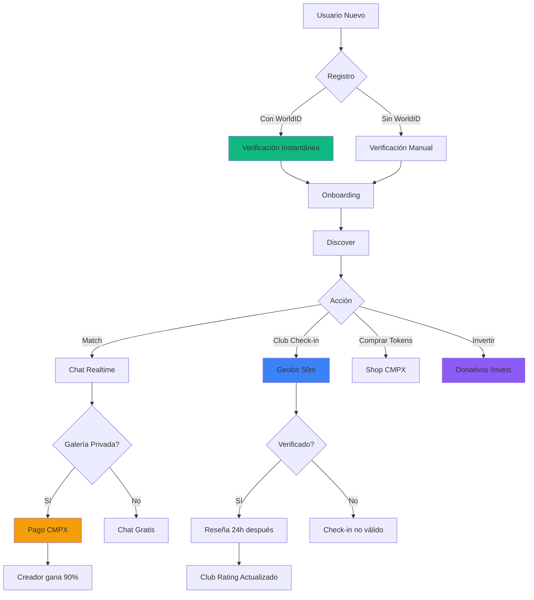

---

## 🏢 FLUJO DE VERIFICACIÓN DE CLUB

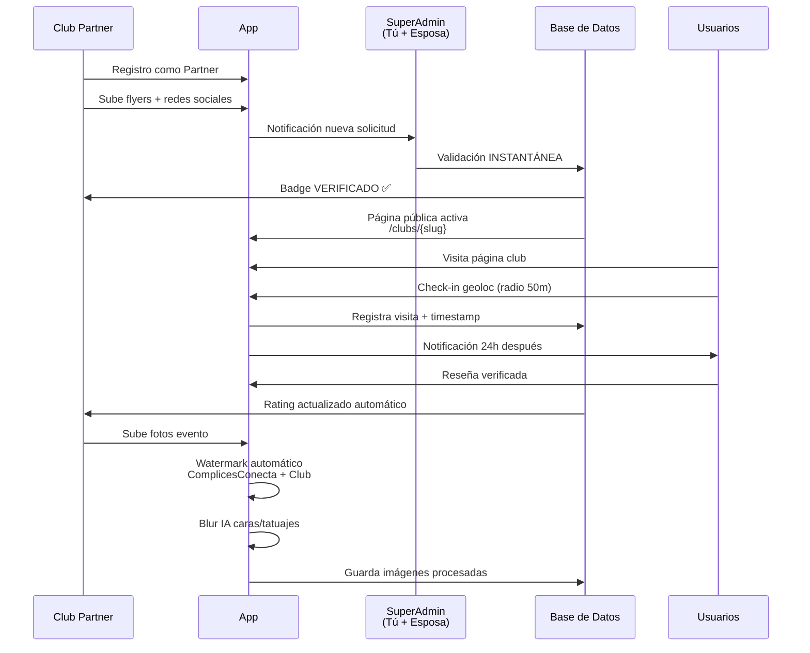

---

## 🛡️ FLUJO DE MODERACIÓN COMPLETO

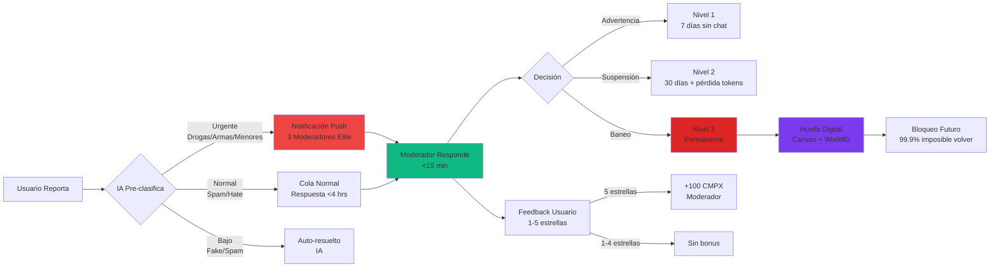

---

## 💎 FLUJO DE COMPRA Y USO DE TOKENS CMPX

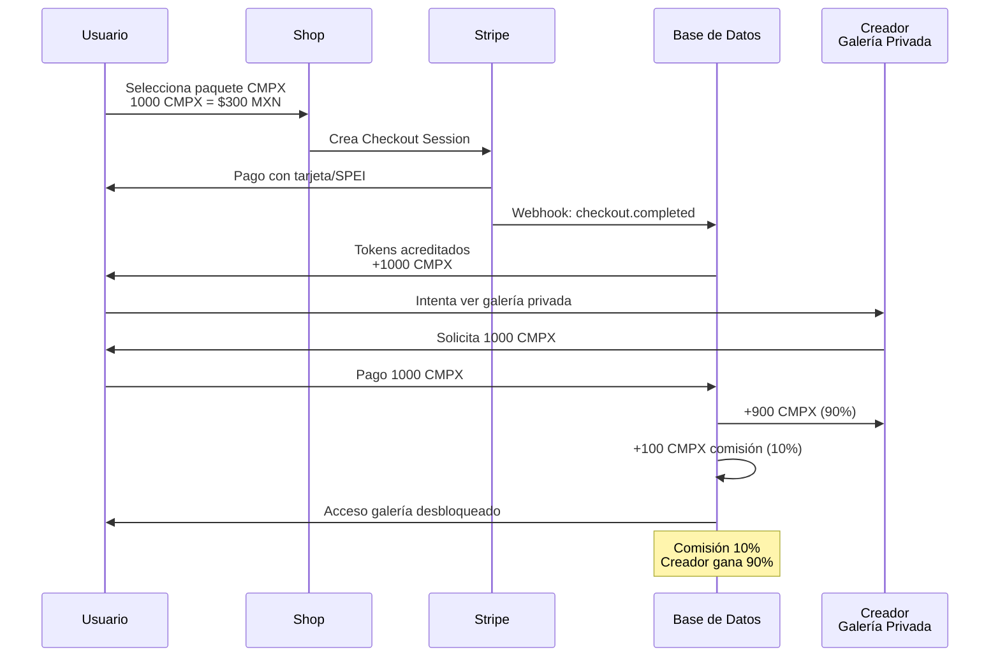

---

## 💰 FLUJO DE DONATIVOS/INVERSIÓN

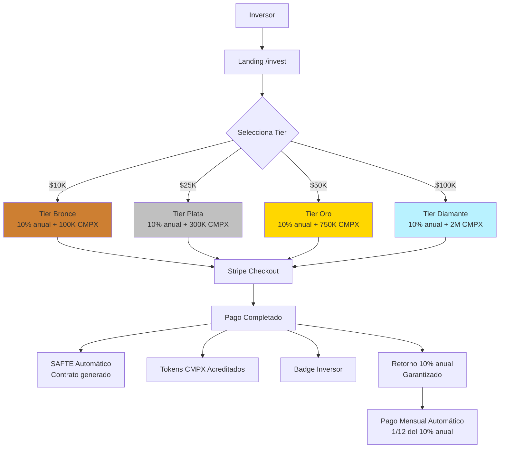

---

## 🤖 FLUJO DE IA COMPLICE (ASISTENTE PERSONAL)

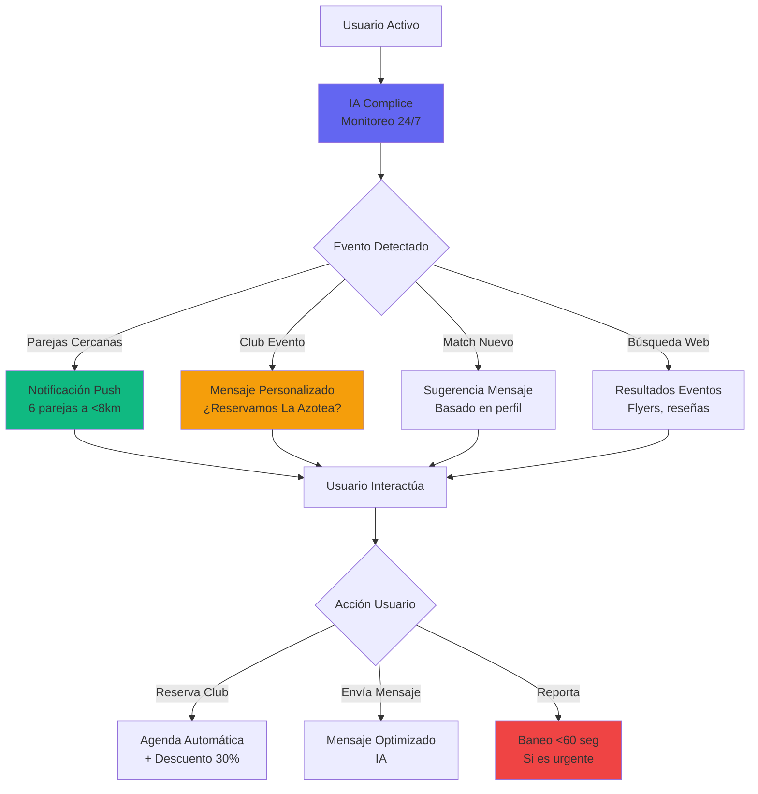

---

## 🔐 FLUJO DE BANEO PERMANENTE

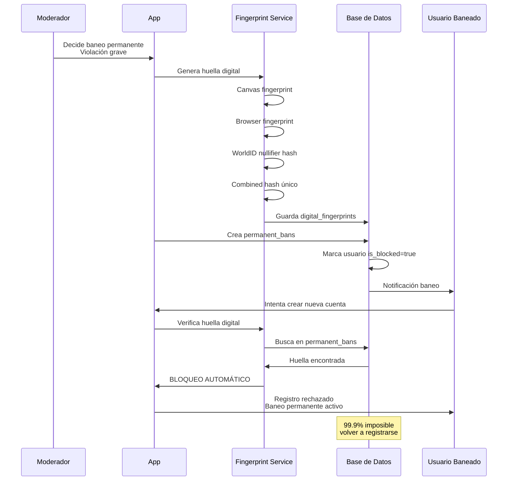

---

## 📊 FLUJO DE PAGOS AUTOMÁTICOS MODERADORES

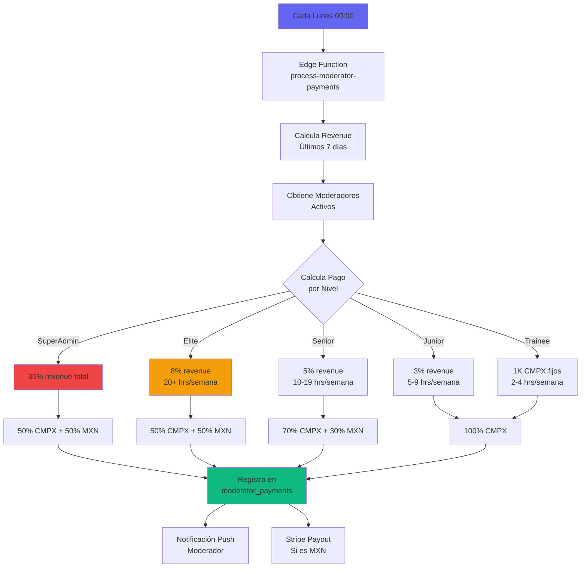

---

## 🏪 FLUJO DE PUBLICIDAD CLUBS

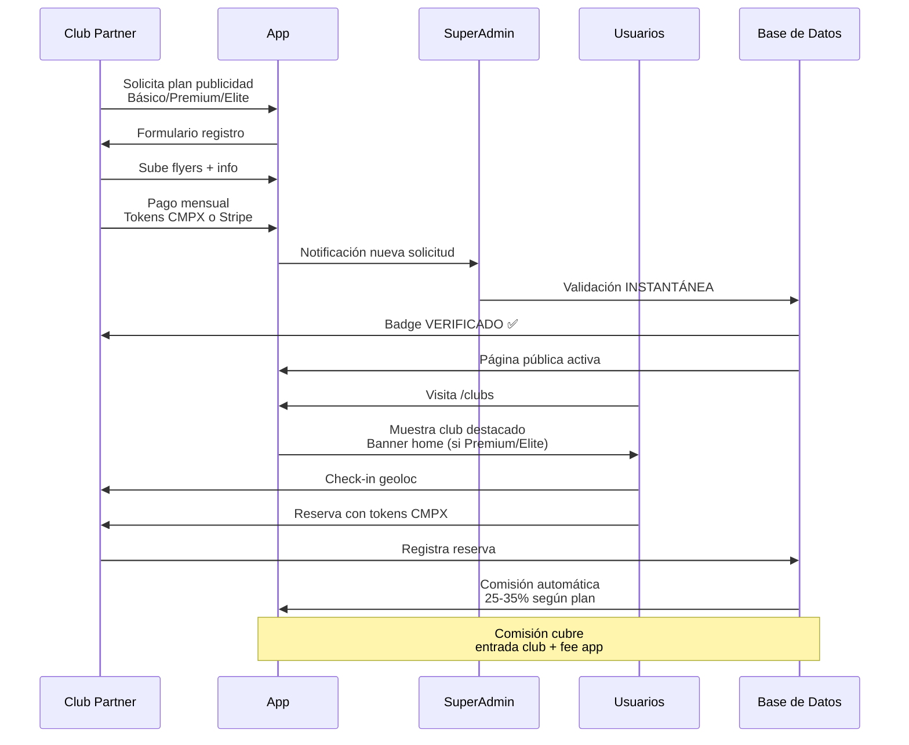

---

## 📈 FLUJO DE CRECIMIENTO ORGÁNICO

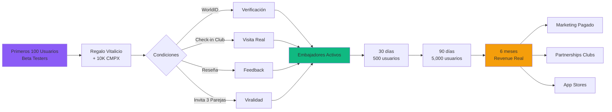

---

## 🔄 FLUJO DE STAKING CMPX

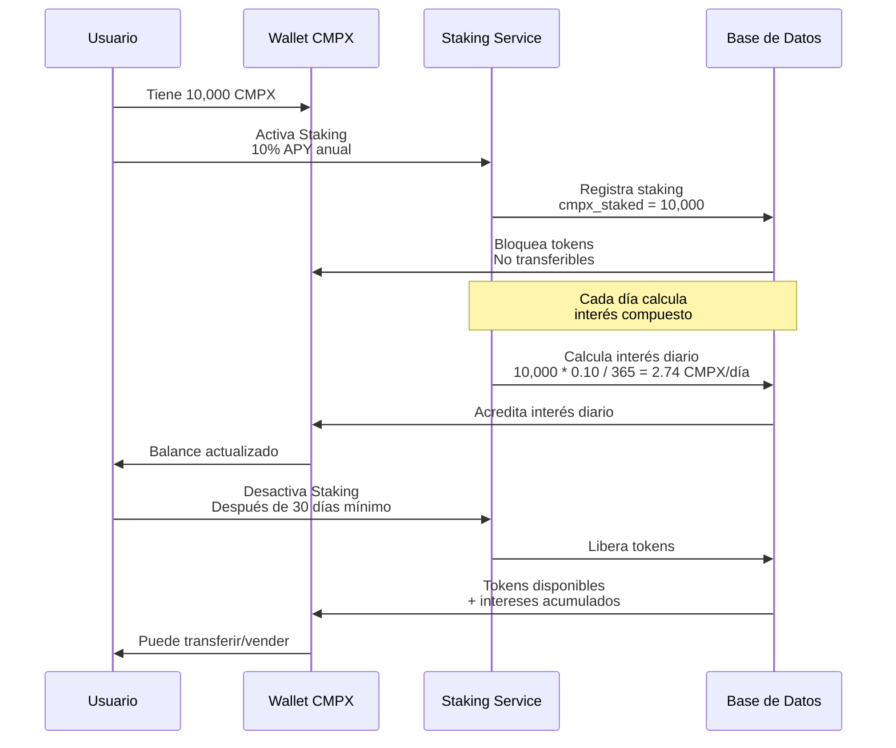

---

---

## 🔄 FLUJO DE ALINEACIÓN DE BASE DE DATOS v3.6.3

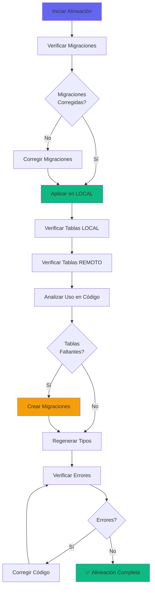

---

**Documento creado:** 06 Noviembre 2025  
**Última actualización:** 08 Noviembre 2025  
**Versión:** 1.1

