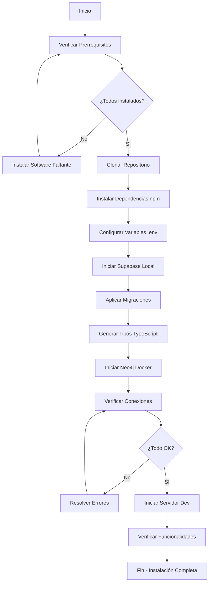
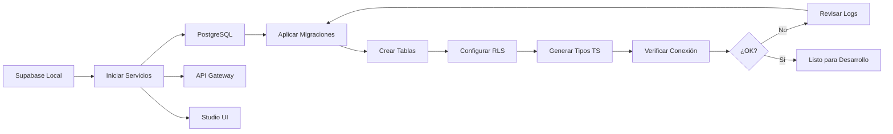
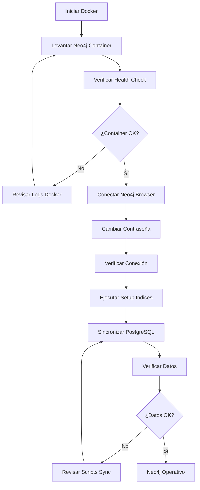
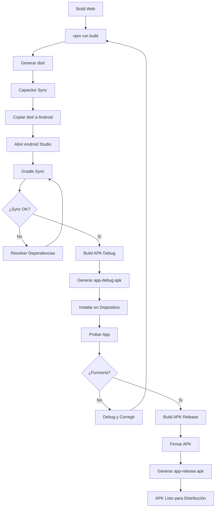
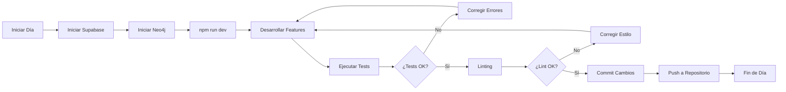

# 🔧 GUÍA DE INSTALACIÓN Y CONFIGURACIÓN - ComplicesConecta v3.5.0

**Fecha:** 05 de Noviembre, 2025  
**Versión:** 3.5.0  
**Estado:** ✅ GUÍA COMPLETA DE INSTALACIÓN Y CONFIGURACIÓN

> **📚 Para documentación maestra completa, consulta [DOCUMENTACION_MAESTRA_UNIFICADA_v3.5.0.md](./DOCUMENTACION_MAESTRA_UNIFICADA_v3.5.0.md)**  
> **📚 Para memorias de sesiones, consulta [MEMORIAS_SESIONES_UNIFICADAS_v3.5.0.md](./MEMORIAS_SESIONES_UNIFICADAS_v3.5.0.md)**

---

## 📋 ÍNDICE

1. [Prerrequisitos](#prerrequisitos)
2. [Instalación de Dependencias](#instalación-de-dependencias)
3. [Configuración de Variables de Entorno](#configuración-de-variables-de-entorno)
4. [Configuración de Base de Datos](#configuración-de-base-de-datos)
5. [Configuración de Docker](#configuración-de-docker)
6. [Configuración de Android](#configuración-de-android)
7. [Verificación de Instalación](#verificación-de-instalación)
8. [Troubleshooting](#troubleshooting)
9. [Diagramas de Flujo](#diagramas-de-flujo)

---

## 📦 PRERREQUISITOS

### Software Requerido

| Software | Versión Mínima | Versión Recomendada | Descripción |
|----------|---------------|---------------------|-------------|
| **Node.js** | 18.0.0 | 20.x | Runtime de JavaScript |
| **npm** | 9.0.0 | 10.x | Gestor de paquetes (incluido con Node.js) |
| **Git** | 2.30.0 | 2.42.x | Control de versiones |
| **Docker** | 20.10.0 | 24.x | Contenedores (para Neo4j) |
| **Docker Compose** | 2.0.0 | 2.23.x | Orquestación de contenedores |
| **Supabase CLI** | 1.100.0 | 1.123.x | CLI de Supabase |

### Software Opcional

| Software | Versión | Descripción |
|----------|---------|-------------|
| **Android Studio** | 2023.1+ | Para desarrollo Android |
| **Java JDK** | 17+ | Para compilar Android (incluido en Android Studio) |
| **Bun** | 1.0.0+ | Alternativa a npm (opcional) |

### Verificación de Prerrequisitos

```bash
# Verificar Node.js
node --version  # Debe ser >= 18.0.0

# Verificar npm
npm --version  # Debe ser >= 9.0.0

# Verificar Git
git --version  # Debe ser >= 2.30.0

# Verificar Docker
docker --version  # Debe ser >= 20.10.0

# Verificar Docker Compose
docker-compose --version  # Debe ser >= 2.0.0

# Verificar Supabase CLI
supabase --version  # Debe ser >= 1.100.0
```

---

## 📥 INSTALACIÓN DE DEPENDENCIAS

### Paso 1: Clonar el Repositorio

```bash
# Clonar el repositorio
git clone https://github.com/ComplicesConectaSw/ComplicesConecta.git
cd ComplicesConecta

# Verificar que estás en la rama correcta
git checkout master  # o la rama que corresponda
```

### Paso 2: Instalar Dependencias con npm

```bash
# Instalar todas las dependencias
npm install

# Si hay conflictos de peer dependencies, usar:
npm install --legacy-peer-deps
```

### Paso 3: Instalar Dependencias con Bun (Opcional)

```bash
# Si prefieres usar Bun en lugar de npm
bun install
```

### Verificación de Instalación

```bash
# Verificar que todas las dependencias se instalaron correctamente
npm list --depth=0

# Verificar que no hay vulnerabilidades críticas
npm audit --audit-level=moderate
```

---

## 🔐 CONFIGURACIÓN DE VARIABLES DE ENTORNO

### Paso 1: Crear Archivo .env

```bash
# Copiar el archivo de ejemplo
cp .env.example .env

# Editar el archivo .env con tus credenciales
# Usar tu editor preferido (nano, vim, code, etc.)
nano .env  # o code .env, vim .env, etc.
```

### Paso 2: Variables de Entorno Requeridas

Agregar las siguientes variables a tu archivo `.env`:

```bash
# ============================================
# SUPABASE CONFIGURATION
# ============================================
VITE_SUPABASE_URL=https://axtvqnozatbmllvwzuim.supabase.co
VITE_SUPABASE_ANON_KEY=your_anon_key_here
SUPABASE_SERVICE_ROLE_KEY=your_service_role_key_here

# ============================================
# NEO4J GRAPH DATABASE CONFIGURATION
# ============================================
VITE_NEO4J_ENABLED=true
VITE_NEO4J_URI=bolt://localhost:7687
VITE_NEO4J_USER=neo4j
VITE_NEO4J_PASSWORD=complices2025
VITE_NEO4J_DATABASE=neo4j

# ============================================
# AI/ML CONFIGURATION (Optional)
# ============================================
VITE_AI_NATIVE_ENABLED=true
VITE_AI_CHAT_SUMMARIES_ENABLED=true
VITE_HUGGINGFACE_API_KEY=your_huggingface_key_here  # Opcional, para BART

# ============================================
# SENTRY ERROR TRACKING (Optional)
# ============================================
VITE_SENTRY_DSN=your_sentry_dsn_here
SENTRY_ORG=your_org
SENTRY_PROJECT=your_project
SENTRY_AUTH_TOKEN=your_auth_token_here

# ============================================
# DATADOG RUM (Optional)
# ============================================
VITE_DATADOG_CLIENT_TOKEN=your_datadog_client_token
VITE_DATADOG_APP_ID=your_datadog_app_id

# ============================================
# NEW RELIC APM (Optional)
# ============================================
NEW_RELIC_LICENSE_KEY=your_newrelic_license_key
NEW_RELIC_APP_NAME=ComplicesConecta

# ============================================
# WORLDCOIN VERIFICATION (Optional)
# ============================================
VITE_WORLD_ID_APP_ID=your_worldcoin_app_id
VITE_WORLD_ID_ACTION=your_worldcoin_action

# ============================================
# APP CONFIGURATION
# ============================================
VITE_APP_VERSION=3.5.0
VITE_APP_ENV=development  # development, staging, production
```

### Paso 3: Obtener Credenciales

#### Supabase
1. Ve a [Supabase Dashboard](https://supabase.com/dashboard)
2. Selecciona tu proyecto
3. Ve a **Settings** → **API**
4. Copia `Project URL` → `VITE_SUPABASE_URL`
5. Copia `anon public` key → `VITE_SUPABASE_ANON_KEY`
6. Copia `service_role` key → `SUPABASE_SERVICE_ROLE_KEY`

#### Neo4j
- Las credenciales por defecto están en `docker-compose.yml`
- Cambiar contraseña en producción es **OBLIGATORIO**

#### Servicios Opcionales
- **Sentry**: https://sentry.io → Create Project → Get DSN
- **Datadog**: https://app.datadoghq.com → RUM → Create Application
- **New Relic**: https://one.newrelic.com → Account Settings → API Keys
- **HuggingFace**: https://huggingface.co → Settings → Access Tokens

---

## 🗄️ CONFIGURACIÓN DE BASE DE DATOS

### Opción A: Supabase Local (Recomendado para Desarrollo)

```bash
# Iniciar Supabase localmente
supabase start

# Esto iniciará:
# - PostgreSQL en localhost:54322
# - Supabase Studio en http://localhost:54323
# - API Gateway en http://localhost:54321
```

### Opción B: Supabase Remoto (Producción)

```bash
# Vincular con proyecto remoto
supabase link --project-ref axtvqnozatbmllvwzuim

# Aplicar migraciones remotas
supabase db push
```

### Paso 1: Aplicar Migraciones

```bash
# Aplicar todas las migraciones locales
supabase migration up --local

# O aplicar migraciones remotas
supabase db push
```

### Paso 2: Generar Tipos TypeScript

```bash
# Generar tipos desde Supabase local
supabase gen types typescript --local > src/types/supabase.ts

# O generar tipos desde Supabase remoto
supabase gen types typescript --linked > src/types/supabase.ts
```

### Paso 3: Verificar Base de Datos

```bash
# Verificar que las tablas estén creadas
supabase db inspect --local

# O conectarse a Supabase Studio
# Abrir http://localhost:54323 en el navegador
```

---

## 🐳 CONFIGURACIÓN DE DOCKER

### Paso 1: Verificar Docker

```bash
# Verificar que Docker esté corriendo
docker ps

# Verificar que Docker Compose esté disponible
docker-compose --version
```

### Paso 2: Iniciar Neo4j

```bash
# Iniciar Neo4j con Docker Compose
docker-compose up -d neo4j

# Verificar que esté corriendo
docker-compose ps

# Ver logs
docker-compose logs -f neo4j
```

### Paso 3: Acceder a Neo4j Browser

1. Abrir navegador en: http://localhost:7474
2. Usuario: `neo4j`
3. Contraseña: `complices2025` (cambiar en producción)
4. **Importante**: Al primer inicio, Neo4j pedirá cambiar la contraseña

### Paso 4: Verificar Conexión Neo4j

```bash
# Ejecutar script de verificación
npm run verify:neo4j

# Debe mostrar:
# ✅ Conexión exitosa a Neo4j
# ✅ Estadísticas del grafo
```

### Paso 5: Sincronizar Datos Iniciales

```bash
# Sincronizar usuarios, matches y likes desde PostgreSQL a Neo4j
npm run sync:neo4j

# Configurar índices para optimización
npm run setup:neo4j-indexes
```

### Otros Servicios Docker (Opcional)

```bash
# Si necesitas otros servicios, editar docker-compose.yml
# Por ejemplo, para agregar Redis:
docker-compose up -d redis
```

---

## 📱 CONFIGURACIÓN DE ANDROID

### Paso 1: Instalar Android Studio

1. Descargar Android Studio desde: https://developer.android.com/studio
2. Instalar Android Studio con todas las dependencias
3. Asegurar que Android SDK esté instalado (API Level 33+)

### Paso 2: Configurar Variables de Entorno Android

```bash
# Agregar a .env o configurar en sistema:
ANDROID_HOME=/path/to/android/sdk
JAVA_HOME=/path/to/java/jdk

# En Windows:
# ANDROID_HOME=C:\Users\YourUser\AppData\Local\Android\Sdk
# JAVA_HOME=C:\Program Files\Android\Android Studio\jbr
```

### Paso 3: Instalar Capacitor CLI

```bash
# Instalar Capacitor CLI globalmente
npm install -g @capacitor/cli

# Verificar instalación
npx cap --version
```

### Paso 4: Sincronizar Proyecto Android

```bash
# Construir proyecto web primero
npm run build

# Sincronizar con Android
npx cap sync android

# Abrir en Android Studio
npx cap open android
```

### Paso 5: Configurar Android Studio

1. Abrir Android Studio
2. Abrir proyecto en `android/`
3. Esperar a que Gradle sincronice
4. Configurar signing keys para release (opcional)

### Paso 6: Build APK

```bash
# Desde Android Studio:
# Build → Build Bundle(s) / APK(s) → Build APK(s)

# O desde línea de comandos:
cd android
./gradlew assembleDebug     # APK de debug
./gradlew assembleRelease   # APK de release (requiere signing)
```

### Paso 7: Ubicación de APKs

```
android/app/build/outputs/apk/
├── debug/
│   └── app-debug.apk
└── release/
    └── app-release.apk
```

---

## ✅ VERIFICACIÓN DE INSTALACIÓN

### Checklist de Verificación

```bash
# 1. Verificar dependencias instaladas
npm list --depth=0

# 2. Verificar variables de entorno
node -e "console.log(process.env.VITE_SUPABASE_URL)"

# 3. Verificar Supabase local
supabase status

# 4. Verificar Neo4j
docker-compose ps neo4j
npm run verify:neo4j

# 5. Verificar build
npm run build

# 6. Verificar tests
npm test

# 7. Verificar linting
npm run lint

# 8. Verificar TypeScript
npm run type-check
```

### Iniciar Servidor de Desarrollo

```bash
# Iniciar servidor de desarrollo
npm run dev

# Debe abrirse en: http://localhost:5173
# O el puerto que Vite asigne
```

### Verificar Funcionalidades

1. **Autenticación**: Probar login/registro
2. **Base de Datos**: Verificar que se puedan crear perfiles
3. **Neo4j**: Verificar que se sincronicen usuarios
4. **Chat**: Probar chat en tiempo real
5. **Matching**: Verificar que funcione el matching

---

## 🔧 TROUBLESHOOTING

### Error: "Cannot find module"

```bash
# Limpiar node_modules y reinstalar
rm -rf node_modules package-lock.json
npm install
```

### Error: "Supabase connection failed"

```bash
# Verificar que Supabase esté corriendo
supabase status

# Si no está corriendo:
supabase start

# Verificar variables de entorno
cat .env | grep SUPABASE
```

### Error: "Neo4j connection failed"

```bash
# Verificar que Docker esté corriendo
docker ps

# Verificar que Neo4j esté corriendo
docker-compose ps neo4j

# Si no está corriendo:
docker-compose up -d neo4j

# Ver logs de Neo4j
docker-compose logs neo4j
```

### Error: "Android build failed"

```bash
# Limpiar build de Android
cd android
./gradlew clean

# Re-sincronizar Capacitor
cd ..
npx cap sync android

# Verificar que Android Studio esté configurado correctamente
```

### Error: "Port already in use"

```bash
# Encontrar proceso usando el puerto
# En Windows:
netstat -ano | findstr :5173

# En Linux/Mac:
lsof -i :5173

# Matar proceso
# En Windows:
taskkill /PID <PID> /F

# En Linux/Mac:
kill -9 <PID>
```

### Error: "TypeScript errors"

```bash
# Regenerar tipos de Supabase
supabase gen types typescript --local > src/types/supabase.ts

# Verificar que no haya errores de sintaxis
npm run type-check
```

---

## 📊 DIAGRAMAS DE FLUJO

### Flujo de Instalación Completa



### Flujo de Configuración de Base de Datos



### Flujo de Configuración Neo4j



### Flujo de Build Android



### Flujo de Desarrollo Diario



---

## 📚 RECURSOS ADICIONALES

### Documentación Relacionada

- **[README.md](./README.md)** - Documentación principal del proyecto
- **[README_DEVOPS.md](./README_DEVOPS.md)** - Guía de DevOps y deployment
- **[README_IA.md](./README_IA.md)** - Estrategia de desarrollo con IA
- **[GUIA_COMPLETA_NEO4J_v3.5.0.md](./GUIA_COMPLETA_NEO4J_v3.5.0.md)** - Guía completa de Neo4j

### Enlaces Útiles

- **Supabase Docs**: https://supabase.com/docs
- **Neo4j Docs**: https://neo4j.com/docs
- **Capacitor Docs**: https://capacitorjs.com/docs
- **Vite Docs**: https://vitejs.dev
- **React Docs**: https://react.dev

---

## ✅ CHECKLIST DE INSTALACIÓN

### Pre-Instalación
- [ ] Node.js 20+ instalado
- [ ] npm 10+ instalado
- [ ] Git 2.30+ instalado
- [ ] Docker 24+ instalado
- [ ] Docker Compose 2.23+ instalado
- [ ] Supabase CLI 1.123+ instalado

### Instalación
- [ ] Repositorio clonado
- [ ] Dependencias instaladas (`npm install`)
- [ ] Archivo `.env` creado desde `.env.example`
- [ ] Variables de entorno configuradas

### Base de Datos
- [ ] Supabase local iniciado (`supabase start`)
- [ ] Migraciones aplicadas (`supabase migration up --local`)
- [ ] Tipos TypeScript generados (`supabase gen types`)
- [ ] Conexión verificada

### Neo4j
- [ ] Neo4j iniciado (`docker-compose up -d neo4j`)
- [ ] Conexión verificada (`npm run verify:neo4j`)
- [ ] Índices configurados (`npm run setup:neo4j-indexes`)
- [ ] Datos sincronizados (`npm run sync:neo4j`)

### Android (Opcional)
- [ ] Android Studio instalado
- [ ] Capacitor instalado (`npm install -g @capacitor/cli`)
- [ ] Proyecto sincronizado (`npx cap sync android`)
- [ ] APK generado exitosamente

### Verificación Final
- [ ] Servidor de desarrollo inicia (`npm run dev`)
- [ ] Build exitoso (`npm run build`)
- [ ] Tests pasan (`npm test`)
- [ ] Linting sin errores (`npm run lint`)
- [ ] TypeScript sin errores (`npm run type-check`)

---

**Estado Final:** ✅ **INSTALACIÓN COMPLETA**  
**Fecha de Última Actualización:** 05 de Noviembre, 2025  
**Versión:** 3.5.0

