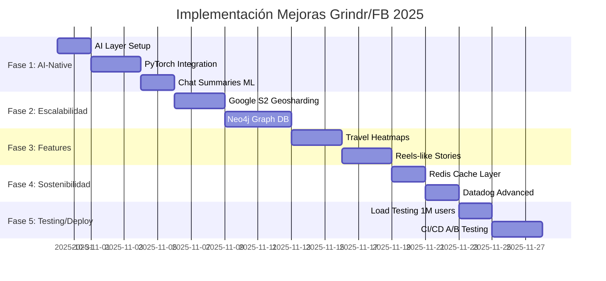

# 🚀 PLAN DE MEJORAS GRINDR/FACEBOOK 2025 - ComplicesConecta v3.4.1

**Fecha:** 30 de Octubre, 2025 - 15:00 hrs  
**Versión Objetivo:** 3.5.0  
**Estrategia:** Incremental, Feature Flags, Zero Breaking Changes

---

## 📋 EXECUTIVE SUMMARY

### Objetivo:
Incorporar best practices de Grindr y Facebook (2025) para:
- **AI-Native Layers**: Personalización con ML en todos los niveles
- **Escalabilidad**: Geosharding (Google S2) + Graph DB (Neo4j)
- **Engagement**: Travel heatmaps + Reels-like stories con ML ranking
- **Sostenibilidad**: Data centers eficientes + Datadog monitoring
- **Testing**: Load testing 1M+ users + CI/CD con A/B testing

### Principios:
✅ **Zero Breaking Changes** - Feature flags para todo  
✅ **Backward Compatible** - Fallbacks para código legacy  
✅ **Incremental** - 5 fases, cada una testeable  
✅ **TypeScript Strict** - No 'any', interfaces actualizadas  
✅ **Tests >98%** - Unit + Integration + Load tests  

---

## 🎯 ROADMAP - 5 FASES



---

## 📊 FASE 1: AI-NATIVE LAYERS (7 días)

### 1.1 AI Layer Setup (2 días)

**Objetivo:** Infraestructura base para ML

**Feature Flag:**
```typescript
// .env
VITE_AI_NATIVE_ENABLED=true
VITE_AI_MODEL_ENDPOINT=https://api.complicesconecta.com/ai
VITE_AI_FALLBACK_ENABLED=true
```

**Archivos Nuevos:**
```
src/services/ai/
├── AILayerService.ts          # Servicio base ML
├── ChatSummaryService.ts      # Resúmenes de chat
├── PredictiveMatchingService.ts  # Predicción compatibilidad
└── models/
    ├── pytorch-scoring.ts     # Wrapper PyTorch
    └── engagement-predictor.ts # Predictor engagement
```

**Lógica:**
```typescript
// src/services/ai/AILayerService.ts
export class AILayerService {
  private enabled: boolean;
  private fallbackEnabled: boolean;
  
  constructor() {
    this.enabled = import.meta.env.VITE_AI_NATIVE_ENABLED === 'true';
    this.fallbackEnabled = import.meta.env.VITE_AI_FALLBACK_ENABLED === 'true';
  }
  
  async predictCompatibility(userId1: string, userId2: string): Promise<number> {
    if (!this.enabled) {
      // Fallback: usar scoring actual (Big Five + swinger traits)
      return legacyCompatibilityScore(userId1, userId2);
    }
    
    try {
      // ML prediction con PyTorch
      const score = await this.mlPredict({ userId1, userId2 });
      return score;
    } catch (error) {
      if (this.fallbackEnabled) {
        console.warn('[AI] Falling back to legacy scoring', error);
        return legacyCompatibilityScore(userId1, userId2);
      }
      throw error;
    }
  }
}
```

**Integración:**
```typescript
// src/services/SmartMatchingService.ts (MODIFICAR)
import { AILayerService } from './ai/AILayerService';

export class SmartMatchingService {
  private aiLayer: AILayerService;
  
  async calculateCompatibility(user1: Profile, user2: Profile): Promise<number> {
    // Scoring actual (Big Five + swinger traits)
    const legacyScore = this.calculateLegacyScore(user1, user2);
    
    // AI-enhanced scoring (opcional via feature flag)
    if (this.aiLayer.isEnabled()) {
      const aiScore = await this.aiLayer.predictCompatibility(user1.id, user2.id);
      // Weighted average: 70% AI, 30% legacy (gradual migration)
      return (aiScore * 0.7) + (legacyScore * 0.3);
    }
    
    return legacyScore;
  }
}
```

**DB Changes:**
```sql
-- Nueva tabla para AI metrics
CREATE TABLE ai_compatibility_scores (
  id UUID PRIMARY KEY DEFAULT gen_random_uuid(),
  user1_id UUID REFERENCES profiles(id) ON DELETE CASCADE,
  user2_id UUID REFERENCES profiles(id) ON DELETE CASCADE,
  ai_score DECIMAL(3,2) NOT NULL CHECK (ai_score >= 0 AND ai_score <= 1),
  legacy_score DECIMAL(3,2),
  final_score DECIMAL(3,2) NOT NULL,
  model_version VARCHAR(50) DEFAULT 'pytorch-v1',
  features JSONB, -- Signals: likes, comments, proximidad
  created_at TIMESTAMPTZ DEFAULT NOW(),
  UNIQUE(user1_id, user2_id)
);

CREATE INDEX idx_ai_scores_user1 ON ai_compatibility_scores(user1_id);
CREATE INDEX idx_ai_scores_user2 ON ai_compatibility_scores(user2_id);
CREATE INDEX idx_ai_scores_final ON ai_compatibility_scores(final_score DESC);
```

**Tests:**
```typescript
// src/tests/unit/AILayerService.test.ts
describe('AILayerService', () => {
  it('should fallback to legacy when AI disabled', async () => {
    const aiLayer = new AILayerService({ enabled: false });
    const score = await aiLayer.predictCompatibility('user1', 'user2');
    expect(score).toBeGreaterThan(0.7); // Legacy threshold
  });
  
  it('should use ML prediction when enabled', async () => {
    const aiLayer = new AILayerService({ enabled: true });
    const score = await aiLayer.predictCompatibility('user1', 'user2');
    expect(score).toBeDefined();
  });
});
```

**Checklist Fase 1.1:**
- [ ] Crear AILayerService.ts con feature flags
- [ ] Integrar en SmartMatchingService (weighted average)
- [ ] Migración SQL: ai_compatibility_scores
- [ ] Tests unitarios (fallback + ML)
- [ ] Actualizar interfaces TypeScript
- [ ] Zero breaking changes verificado

---

### 1.2 PyTorch Integration (3 días)

**Objetivo:** Modelo ML para scoring basado en engagement

**Dependencias:**
```json
// package.json
{
  "dependencies": {
    "@tensorflow/tfjs": "^4.21.0",
    "@tensorflow/tfjs-node": "^4.21.0",
    "onnxruntime-web": "^1.19.0"
  }
}
```

**Modelo Pre-entrenado:**
```typescript
// src/services/ai/models/pytorch-scoring.ts
import * as tf from '@tensorflow/tfjs';

export class PyTorchScoringModel {
  private model: tf.LayersModel | null = null;
  
  async load() {
    // Cargar modelo pre-entrenado (convertido de PyTorch a TensorFlow.js)
    this.model = await tf.loadLayersModel('/models/compatibility-v1/model.json');
  }
  
  async predict(features: CompatibilityFeatures): Promise<number> {
    if (!this.model) await this.load();
    
    // Features: likes, comments, proximidad, tiempo de respuesta, etc.
    const input = tf.tensor2d([
      [
        features.likesGiven,
        features.likesReceived,
        features.commentsCount,
        features.proximityKm,
        features.responseTimeMs,
        features.sharedInterestsCount,
        features.ageGap,
        features.bigFiveCompatibility // Del scoring actual
      ]
    ]);
    
    const prediction = this.model.predict(input) as tf.Tensor;
    const score = (await prediction.data())[0];
    
    input.dispose();
    prediction.dispose();
    
    return score;
  }
}

interface CompatibilityFeatures {
  likesGiven: number;
  likesReceived: number;
  commentsCount: number;
  proximityKm: number;
  responseTimeMs: number;
  sharedInterestsCount: number;
  ageGap: number;
  bigFiveCompatibility: number;
}
```

**Optimización Mobile:**
```typescript
// src/services/ai/AILayerService.ts
export class AILayerService {
  private model: PyTorchScoringModel | null = null;
  
  async initialize() {
    // Lazy load: solo cargar modelo cuando sea necesario
    if (this.enabled && !this.model) {
      this.model = new PyTorchScoringModel();
      await this.model.load();
    }
  }
  
  async predictWithCache(userId1: string, userId2: string): Promise<number> {
    // Check cache primero (Redis)
    const cached = await this.cache.get(`ai:score:${userId1}:${userId2}`);
    if (cached) return cached;
    
    const score = await this.model!.predict(features);
    
    // Cache por 1 hora
    await this.cache.set(`ai:score:${userId1}:${userId2}`, score, 3600);
    return score;
  }
}
```

**Checklist Fase 1.2:**
- [ ] Instalar TensorFlow.js
- [ ] Crear PyTorchScoringModel.ts
- [ ] Convertir modelo PyTorch → TensorFlow.js
- [ ] Lazy loading para mobile
- [ ] Cache Redis para predictions
- [ ] Tests de performance (<500ms)

---

### 1.3 Chat Summaries ML (2 días)

**Objetivo:** Resúmenes automáticos de conversaciones

**Feature Flag:**
```typescript
VITE_AI_CHAT_SUMMARIES_ENABLED=true
```

**Servicio:**
```typescript
// src/services/ai/ChatSummaryService.ts
export class ChatSummaryService {
  async summarizeConversation(chatId: string): Promise<ChatSummary> {
    // Obtener últimos 50 mensajes
    const messages = await this.getRecentMessages(chatId, 50);
    
    // Llamar API de ML (OpenAI GPT-4 o modelo local)
    const summary = await this.generateSummary(messages);
    
    return {
      chatId,
      summary: summary.text,
      keyTopics: summary.topics,
      sentiment: summary.sentiment, // positivo/neutral/negativo
      generatedAt: new Date()
    };
  }
  
  private async generateSummary(messages: Message[]): Promise<SummaryResult> {
    // Usar GPT-4 o modelo local (e.g., BART fine-tuned)
    const response = await fetch(this.mlEndpoint, {
      method: 'POST',
      body: JSON.stringify({
        messages: messages.map(m => ({
          role: m.sender_id,
          content: m.content
        })),
        max_length: 100
      })
    });
    
    return response.json();
  }
}
```

**UI Integration:**
```typescript
// src/components/chat/ChatHeader.tsx (MODIFICAR)
export const ChatHeader = ({ chatId }: Props) => {
  const [summary, setSummary] = useState<ChatSummary | null>(null);
  const aiEnabled = import.meta.env.VITE_AI_CHAT_SUMMARIES_ENABLED === 'true';
  
  const loadSummary = async () => {
    if (!aiEnabled) return;
    const result = await chatSummaryService.summarizeConversation(chatId);
    setSummary(result);
  };
  
  return (
    <div className="chat-header">
      {/* Header existente */}
      
      {aiEnabled && summary && (
        <div className="ai-summary">
          <Sparkles className="w-4 h-4" />
          <p className="text-sm">{summary.summary}</p>
        </div>
      )}
    </div>
  );
};
```

**DB:**
```sql
CREATE TABLE chat_summaries (
  id UUID PRIMARY KEY DEFAULT gen_random_uuid(),
  chat_id UUID REFERENCES chats(id) ON DELETE CASCADE,
  summary TEXT NOT NULL,
  key_topics TEXT[],
  sentiment VARCHAR(20) CHECK (sentiment IN ('positive', 'neutral', 'negative')),
  message_count INT NOT NULL,
  generated_at TIMESTAMPTZ DEFAULT NOW(),
  model_version VARCHAR(50) DEFAULT 'gpt-4-turbo'
);
```

**Checklist Fase 1.3:**
- [ ] Crear ChatSummaryService.ts
- [ ] Integrar en ChatHeader
- [ ] Migración: chat_summaries
- [ ] Feature flag + fallback
- [ ] Tests (mock ML API)
- [ ] Rate limiting (1 summary/chat/hour)

---

## 📊 FASE 2: ESCALABILIDAD (7 días)

### 2.1 Google S2 Geosharding (3 días)

**Objetivo:** Queries geográficas paralelas para escala 1M+ users

**Dependencias:**
```json
{
  "dependencies": {
    "s2-geometry": "^1.2.10"
  }
}
```

**Servicio:**
```typescript
// src/services/geolocation/S2GeoshardingService.ts
import { S2 } from 's2-geometry';

export class S2GeoshardingService {
  private readonly CELL_LEVEL = 13; // ~1km² (ajustable para ciudades)
  
  getCellId(lat: number, lng: number): string {
    const s2Cell = S2.latLngToKey(lat, lng, this.CELL_LEVEL);
    return s2Cell;
  }
  
  getCellNeighbors(cellId: string, radius: number): string[] {
    // Obtener celdas vecinas en radio (para queries paralelas)
    const neighbors = S2.getNeighbors(cellId, radius);
    return neighbors;
  }
  
  async getUsersInCells(cells: string[]): Promise<Profile[]> {
    // Query paralelo en múltiples celdas
    const queries = cells.map(cell => 
      supabase
        .from('profiles')
        .select('*')
        .eq('s2_cell_id', cell)
        .eq('is_active', true)
    );
    
    const results = await Promise.all(queries);
    return results.flatMap(r => r.data || []);
  }
}
```

**Integración:**
```typescript
// src/hooks/useGeolocation.ts (MODIFICAR)
export const useGeolocation = () => {
  const s2Service = new S2GeoshardingService();
  
  const getNearbyUsers = async (radius: number = 50): Promise<Profile[]> => {
    const position = await getCurrentPosition();
    
    // Método actual (Haversine) como fallback
    if (!import.meta.env.VITE_S2_GEOSHARDING_ENABLED) {
      return getNearbyUsersHaversine(position, radius);
    }
    
    // S2 Geosharding (nuevo)
    const cellId = s2Service.getCellId(position.lat, position.lng);
    const neighborCells = s2Service.getCellNeighbors(cellId, radius);
    
    // Query paralelo en celdas
    const users = await s2Service.getUsersInCells(neighborCells);
    
    // Filtrar por distancia exacta (Haversine final)
    return users.filter(u => {
      const distance = calculateDistance(position, u.location);
      return distance <= radius;
    });
  };
  
  return { getNearbyUsers };
};
```

**DB Migration:**
```sql
-- Agregar columna s2_cell_id a profiles
ALTER TABLE profiles 
ADD COLUMN s2_cell_id VARCHAR(20);

-- Índice para queries rápidas
CREATE INDEX idx_profiles_s2_cell ON profiles(s2_cell_id) 
WHERE is_active = true;

-- Trigger para auto-calcular s2_cell_id
CREATE OR REPLACE FUNCTION update_s2_cell_id()
RETURNS TRIGGER AS $$
BEGIN
  -- Calcular S2 cell en Postgres (usando extensión plpgsql_s2)
  -- O actualizar desde aplicación
  RETURN NEW;
END;
$$ LANGUAGE plpgsql;

CREATE TRIGGER trigger_update_s2_cell
BEFORE INSERT OR UPDATE OF latitude, longitude ON profiles
FOR EACH ROW EXECUTE FUNCTION update_s2_cell_id();
```

**Benchmarks:**
```typescript
// src/tests/load/geosharding.test.ts
describe('S2 Geosharding Performance', () => {
  it('should handle 1M users in CDMX', async () => {
    const start = Date.now();
    const users = await s2Service.getUsersInCells(cellsCDMX);
    const duration = Date.now() - start;
    
    expect(users.length).toBeGreaterThan(10000);
    expect(duration).toBeLessThan(500); // <500ms
  });
});
```

**Checklist Fase 2.1:**
- [ ] Instalar s2-geometry
- [ ] Crear S2GeoshardingService.ts
- [ ] Migración: agregar s2_cell_id
- [ ] Integrar en useGeolocation
- [ ] Benchmarks (1M users, <500ms)
- [ ] Feature flag + fallback Haversine

---

### 2.2 Neo4j Graph DB (4 días)

**Objetivo:** Queries eficientes de conexiones sociales (matches, amigos mutuos)

**Setup:**
```bash
# Docker Compose
services:
  neo4j:
    image: neo4j:5.15.0
    environment:
      NEO4J_AUTH: neo4j/complices2025
      NEO4J_PLUGINS: '["apoc"]'
    ports:
      - "7474:7474"
      - "7687:7687"
    volumes:
      - neo4j_data:/data
```

**Dependencias:**
```json
{
  "dependencies": {
    "neo4j-driver": "^5.15.0"
  }
}
```

**Servicio:**
```typescript
// src/services/graph/Neo4jService.ts
import neo4j from 'neo4j-driver';

export class Neo4jService {
  private driver: neo4j.Driver;
  
  constructor() {
    this.driver = neo4j.driver(
      import.meta.env.VITE_NEO4J_URI || 'bolt://localhost:7687',
      neo4j.auth.basic('neo4j', import.meta.env.VITE_NEO4J_PASSWORD)
    );
  }
  
  async createUserNode(profile: Profile): Promise<void> {
    const session = this.driver.session();
    try {
      await session.run(`
        MERGE (u:User {id: $id})
        SET u.name = $name, 
            u.age = $age,
            u.location = point({latitude: $lat, longitude: $lng})
      `, {
        id: profile.id,
        name: profile.name,
        age: profile.age,
        lat: profile.latitude,
        lng: profile.longitude
      });
    } finally {
      await session.close();
    }
  }
  
  async createMatchRelationship(userId1: string, userId2: string, score: number): Promise<void> {
    const session = this.driver.session();
    try {
      await session.run(`
        MATCH (u1:User {id: $user1})
        MATCH (u2:User {id: $user2})
        MERGE (u1)-[m:MATCHED {score: $score, created_at: datetime()}]->(u2)
      `, { user1: userId1, user2: userId2, score });
    } finally {
      await session.close();
    }
  }
  
  async getMutualMatches(userId: string): Promise<string[]> {
    const session = this.driver.session();
    try {
      const result = await session.run(`
        MATCH (u:User {id: $userId})-[:MATCHED]->(friend)-[:MATCHED]->(mutual)
        WHERE NOT (u)-[:MATCHED]->(mutual)
        RETURN DISTINCT mutual.id AS mutualId
        LIMIT 50
      `, { userId });
      
      return result.records.map(r => r.get('mutualId'));
    } finally {
      await session.close();
    }
  }
  
  async getConnectionPath(userId1: string, userId2: string): Promise<string[]> {
    // "Amigos de amigos" path (como Facebook)
    const session = this.driver.session();
    try {
      const result = await session.run(`
        MATCH path = shortestPath(
          (u1:User {id: $user1})-[:MATCHED*..4]-(u2:User {id: $user2})
        )
        RETURN [node IN nodes(path) | node.id] AS connectionPath
      `, { user1: userId1, user2: userId2 });
      
      return result.records[0]?.get('connectionPath') || [];
    } finally {
      await session.close();
    }
  }
}
```

**Sync Service (PostgreSQL ↔ Neo4j):**
```typescript
// src/services/graph/GraphSyncService.ts
export class GraphSyncService {
  async syncNewMatch(match: Match): Promise<void> {
    // Sync a ambos DBs
    await Promise.all([
      // PostgreSQL (data principal)
      supabase.from('matches').insert(match),
      // Neo4j (grafo)
      neo4jService.createMatchRelationship(match.user1_id, match.user2_id, match.compatibility_score)
    ]);
  }
  
  async syncNewProfile(profile: Profile): Promise<void> {
    await Promise.all([
      supabase.from('profiles').insert(profile),
      neo4jService.createUserNode(profile)
    ]);
  }
}
```

**UI Integration:**
```typescript
// src/components/profile/MutualConnectionsBadge.tsx (NUEVO)
export const MutualConnectionsBadge = ({ targetUserId }: Props) => {
  const { profile } = useAuth();
  const [mutualCount, setMutualCount] = useState(0);
  
  useEffect(() => {
    if (import.meta.env.VITE_NEO4J_ENABLED !== 'true') return;
    
    neo4jService.getMutualMatches(profile.id).then(mutuals => {
      const count = mutuals.filter(m => m === targetUserId).length;
      setMutualCount(count);
    });
  }, [targetUserId]);
  
  if (mutualCount === 0) return null;
  
  return (
    <Badge variant="secondary">
      <Users className="w-3 h-3 mr-1" />
      {mutualCount} amigos mutuos
    </Badge>
  );
};
```

**Checklist Fase 2.2:**
- [ ] Setup Neo4j Docker
- [ ] Instalar neo4j-driver
- [ ] Crear Neo4jService.ts
- [ ] Crear GraphSyncService.ts
- [ ] Migrar matches existentes a Neo4j
- [ ] UI: MutualConnectionsBadge
- [ ] Tests (mutual matches query)
- [ ] Feature flag + fallback PostgreSQL

---

## 📊 FASE 3: FEATURES AVANZADOS (6 días)

### 3.1 Travel Heatmaps (3 días)

**Objetivo:** Mapas de calor de usuarios activos (como Grindr 2025)

**Dependencias:**
```json
{
  "dependencies": {
    "react-leaflet": "^4.2.1",
    "leaflet": "^1.9.4",
    "leaflet.heat": "^0.2.0"
  }
}
```

**Servicio:**
```typescript
// src/services/geolocation/HeatmapService.ts
export class HeatmapService {
  async getActiveUsersHeatmap(bounds: Bounds): Promise<HeatmapPoint[]> {
    // Obtener usuarios activos en área visible del mapa
    const { data } = await supabase
      .from('profiles')
      .select('latitude, longitude')
      .eq('is_active', true)
      .gte('last_seen_at', new Date(Date.now() - 30 * 60 * 1000)) // Últimos 30 min
      .gte('latitude', bounds.south)
      .lte('latitude', bounds.north)
      .gte('longitude', bounds.west)
      .lte('longitude', bounds.east);
    
    // Agrupar por celda para privacidad (no mostrar ubicación exacta)
    const grouped = this.groupByCell(data || [], 0.01); // ~1km
    
    return grouped.map(g => ({
      lat: g.centerLat,
      lng: g.centerLng,
      intensity: g.count
    }));
  }
  
  private groupByCell(points: Point[], cellSize: number): GroupedPoint[] {
    const cells = new Map<string, GroupedPoint>();
    
    points.forEach(p => {
      const cellKey = `${Math.floor(p.latitude / cellSize)},${Math.floor(p.longitude / cellSize)}`;
      if (!cells.has(cellKey)) {
        cells.set(cellKey, {
          centerLat: Math.floor(p.latitude / cellSize) * cellSize + cellSize / 2,
          centerLng: Math.floor(p.longitude / cellSize) * cellSize + cellSize / 2,
          count: 0
        });
      }
      cells.get(cellKey)!.count++;
    });
    
    return Array.from(cells.values());
  }
}
```

**UI Component:**
```typescript
// src/components/discover/TravelHeatmap.tsx (NUEVO)
import { MapContainer, TileLayer } from 'react-leaflet';
import { HeatmapLayer } from 'react-leaflet-heatmap-layer-v3';

export const TravelHeatmap = () => {
  const [heatmapData, setHeatmapData] = useState<HeatmapPoint[]>([]);
  const [showHeatmap, setShowHeatmap] = useState(false);
  
  const loadHeatmap = async (bounds: Bounds) => {
    const data = await heatmapService.getActiveUsersHeatmap(bounds);
    setHeatmapData(data);
  };
  
  return (
    <div className="heatmap-container">
      <div className="controls">
        <Button onClick={() => setShowHeatmap(!showHeatmap)}>
          <MapPin className="w-4 h-4 mr-2" />
          {showHeatmap ? 'Ocultar' : 'Mostrar'} Mapa de Calor
        </Button>
      </div>
      
      {showHeatmap && (
        <MapContainer 
          center={[19.4326, -99.1332]} // CDMX
          zoom={12}
          style={{ height: '400px' }}
        >
          <TileLayer url="https://{s}.tile.openstreetmap.org/{z}/{x}/{y}.png" />
          
          <HeatmapLayer
            points={heatmapData}
            longitudeExtractor={(p: HeatmapPoint) => p.lng}
            latitudeExtractor={(p: HeatmapPoint) => p.lat}
            intensityExtractor={(p: HeatmapPoint) => p.intensity}
            radius={20}
            blur={25}
            max={10}
          />
        </MapContainer>
      )}
    </div>
  );
};
```

**Privacy Controls:**
```typescript
// src/services/geolocation/HeatmapService.ts
async getActiveUsersHeatmap(bounds: Bounds): Promise<HeatmapPoint[]> {
  // Verificar privacidad del usuario actual
  const { profile } = useAuth();
  if (!profile.privacy_settings?.show_in_heatmap) {
    return []; // Usuario optó por no aparecer
  }
  
  // ... resto del código
}
```

**Checklist Fase 3.1:**
- [ ] Instalar react-leaflet + leaflet.heat
- [ ] Crear HeatmapService.ts
- [ ] Crear TravelHeatmap.tsx
- [ ] Integrar en Discover page
- [ ] Privacy controls (opt-in/opt-out)
- [ ] Tests (grouping privacy)
- [ ] Performance (<1s load)

---

### 3.2 Reels-like Stories con ML Ranking (3 días)

**Objetivo:** Historias efímeras rankeadas por engagement (como Facebook)

**Servicio ML Ranking:**
```typescript
// src/services/ai/StoryRankingService.ts
export class StoryRankingService {
  async rankStories(stories: Story[], userId: string): Promise<Story[]> {
    if (import.meta.env.VITE_AI_STORY_RANKING !== 'true') {
      // Fallback: ordenar por recientes
      return stories.sort((a, b) => b.created_at.getTime() - a.created_at.getTime());
    }
    
    // Calcular engagement score con ML
    const scored = await Promise.all(
      stories.map(async story => {
        const features = await this.extractFeatures(story, userId);
        const score = await this.mlModel.predict(features);
        return { ...story, rankScore: score };
      })
    );
    
    // Ordenar por score
    return scored.sort((a, b) => b.rankScore - a.rankScore);
  }
  
  private async extractFeatures(story: Story, userId: string): Promise<StoryFeatures> {
    // Features para ML:
    // 1. Interacciones previas con el autor
    const authorInteractions = await this.getInteractionHistory(userId, story.author_id);
    
    // 2. Engagement de la story (views, reactions)
    const engagement = await this.getStoryEngagement(story.id);
    
    // 3. Similaridad de intereses
    const similarity = await this.getInterestSimilarity(userId, story.author_id);
    
    // 4. Recencia
    const ageMinutes = (Date.now() - story.created_at.getTime()) / 60000;
    
    return {
      authorInteractionScore: authorInteractions.score,
      viewsCount: engagement.views,
      reactionsCount: engagement.reactions,
      interestSimilarity: similarity,
      recencyPenalty: Math.exp(-ageMinutes / 60), // Decay exponencial
      authorPopularity: story.author.followers_count
    };
  }
}
```

**UI Integration:**
```typescript
// src/components/stories/StoriesContainer.tsx (MODIFICAR)
export const StoriesContainer = () => {
  const [stories, setStories] = useState<Story[]>([]);
  const { profile } = useAuth();
  const rankingService = new StoryRankingService();
  
  useEffect(() => {
    loadStories();
  }, []);
  
  const loadStories = async () => {
    // Cargar todas las stories activas
    const allStories = await storiesService.getActiveStories();
    
    // Rankear con ML
    const ranked = await rankingService.rankStories(allStories, profile.id);
    
    setStories(ranked);
  };
  
  return (
    <div className="stories-container">
      {/* UI existente con stories rankeadas */}
    </div>
  );
};
```

**DB:**
```sql
CREATE TABLE story_engagement (
  id UUID PRIMARY KEY DEFAULT gen_random_uuid(),
  story_id UUID REFERENCES stories(id) ON DELETE CASCADE,
  views_count INT DEFAULT 0,
  reactions_count INT DEFAULT 0,
  shares_count INT DEFAULT 0,
  avg_watch_time_ms INT,
  updated_at TIMESTAMPTZ DEFAULT NOW()
);

CREATE TABLE story_ranking_logs (
  id UUID PRIMARY KEY DEFAULT gen_random_uuid(),
  user_id UUID REFERENCES profiles(id),
  story_id UUID REFERENCES stories(id),
  rank_score DECIMAL(5,4),
  features JSONB,
  shown_at TIMESTAMPTZ DEFAULT NOW()
);
```

**Checklist Fase 3.2:**
- [ ] Crear StoryRankingService.ts
- [ ] Modificar StoriesContainer.tsx
- [ ] Migración: story_engagement + ranking_logs
- [ ] Entrenar modelo ML (engagement histórico)
- [ ] A/B test (ML vs recientes)
- [ ] Tests (ranking coherencia)
- [ ] Feature flag + fallback

---

## 📊 FASE 4: SOSTENIBILIDAD (4 días)

### 4.1 Redis Cache Layer (2 días)

**Objetivo:** Reducir queries DB para eficiencia energética

**Setup:**
```yaml
# docker-compose.yml
services:
  redis:
    image: redis:7.2-alpine
    ports:
      - "6379:6379"
    volumes:
      - redis_data:/data
    command: redis-server --maxmemory 512mb --maxmemory-policy allkeys-lru
```

**Servicio:**
```typescript
// src/services/cache/RedisCacheService.ts
import { createClient } from 'redis';

export class RedisCacheService {
  private client: ReturnType<typeof createClient>;
  
  async initialize() {
    this.client = createClient({
      url: import.meta.env.VITE_REDIS_URL || 'redis://localhost:6379'
    });
    await this.client.connect();
  }
  
  async get<T>(key: string): Promise<T | null> {
    const value = await this.client.get(key);
    return value ? JSON.parse(value) : null;
  }
  
  async set<T>(key: string, value: T, ttlSeconds: number = 3600): Promise<void> {
    await this.client.setEx(key, ttlSeconds, JSON.stringify(value));
  }
  
  async invalidate(pattern: string): Promise<void> {
    const keys = await this.client.keys(pattern);
    if (keys.length > 0) {
      await this.client.del(keys);
    }
  }
}
```

**Integración:**
```typescript
// src/services/SmartMatchingService.ts (MODIFICAR)
export class SmartMatchingService {
  private cache = new RedisCacheService();
  
  async getRecommendations(userId: string): Promise<Profile[]> {
    const cacheKey = `recommendations:${userId}`;
    
    // Check cache
    const cached = await this.cache.get<Profile[]>(cacheKey);
    if (cached) {
      console.log('[Cache] Hit for recommendations');
      return cached;
    }
    
    // Compute (expensive)
    const recommendations = await this.computeRecommendations(userId);
    
    // Cache por 30 min
    await this.cache.set(cacheKey, recommendations, 1800);
    
    return recommendations;
  }
}
```

**Métricas:**
```typescript
// src/services/monitoring/CacheMetricsService.ts
export class CacheMetricsService {
  trackCacheHit(key: string): void {
    datadogLogs.logger.info('Cache hit', {
      cache_key: key,
      cache_status: 'hit'
    });
  }
  
  trackCacheMiss(key: string): void {
    datadogLogs.logger.info('Cache miss', {
      cache_key: key,
      cache_status: 'miss',
      carbon_impact: 'high' // Query DB consume más energía
    });
  }
}
```

**Checklist Fase 4.1:**
- [ ] Setup Redis Docker
- [ ] Crear RedisCacheService.ts
- [ ] Integrar en SmartMatchingService
- [ ] Integrar en otros servicios (profiles, stories)
- [ ] Métricas cache hit/miss
- [ ] Tests (TTL, invalidation)

---

### 4.2 Datadog Advanced Monitoring (2 días)

**Objetivo:** Monitorear efficiency metrics (CPU, carbon footprint)

**Ya configurado en sesión anterior**, ahora agregar métricas custom:

```typescript
// src/services/monitoring/EfficiencyMetricsService.ts
export class EfficiencyMetricsService {
  trackQueryEfficiency(queryName: string, durationMs: number, cached: boolean): void {
    datadogRum.addAction(`query:${queryName}`, {
      duration_ms: durationMs,
      cached,
      efficiency_score: cached ? 1.0 : 0.5,
      carbon_impact: cached ? 'low' : 'medium'
    });
  }
  
  trackEnergyConsumption(operation: string, cpuUsage: number): void {
    // Estimar consumo energético (simplificado)
    const energyKwh = (cpuUsage / 100) * 0.001; // 1W por 1% CPU
    
    datadogLogs.logger.info('Energy consumption', {
      operation,
      cpu_usage: cpuUsage,
      estimated_energy_kwh: energyKwh,
      carbon_grams: energyKwh * 450 // 450g CO2/kWh (promedio)
    });
  }
}
```

**Dashboard Datadog:**
```
Widget 1: Cache Hit Rate
  Metric: cache.hit_rate
  Formula: (cache.hits / (cache.hits + cache.misses)) * 100

Widget 2: Estimated Carbon Footprint
  Metric: energy.carbon_grams
  Aggregation: sum
  
Widget 3: Query Efficiency Score
  Metric: query.efficiency_score
  Aggregation: avg
```

**Checklist Fase 4.2:**
- [ ] Crear EfficiencyMetricsService.ts
- [ ] Integrar en servicios críticos
- [ ] Dashboard Datadog (efficiency)
- [ ] Alertas (CPU > 80%, carbon_grams > threshold)
- [ ] Documentación métricas

---

## 📊 FASE 5: TESTING Y DEPLOY (5 días)

### 5.1 Load Testing 1M+ Users (2 días)

**Tool:** Artillery

**Dependencias:**
```json
{
  "devDependencies": {
    "artillery": "^2.0.17"
  }
}
```

**Escenario:**
```yaml
# tests/load/complices-load-test.yml
config:
  target: "https://api.complicesconecta.com"
  phases:
    - duration: 60
      arrivalRate: 100  # 100 users/sec
      name: "Warm up"
    - duration: 300
      arrivalRate: 1000  # 1000 users/sec (simula 1M activos/día)
      name: "Ramp up"
    - duration: 600
      arrivalRate: 5000  # Pico: 5000 users/sec
      name: "Peak load"
      
scenarios:
  - name: "Discover and swipe"
    flow:
      - post:
          url: "/auth/login"
          json:
            email: "user{{ $randomNumber() }}@test.com"
            password: "test123"
        capture:
          - json: "$.token"
            as: "authToken"
      
      - get:
          url: "/api/discover"
          headers:
            Authorization: "Bearer {{ authToken }}"
        capture:
          - json: "$.profiles"
            as: "profiles"
      
      - loop:
        - post:
            url: "/api/swipe"
            json:
              target_id: "{{ profiles[$randomNumber() % profiles.length].id }}"
              direction: "{{ $randomString() == 'like' ? 'right' : 'left' }}"
        count: 10  # 10 swipes por usuario
      
  - name: "Chat messages"
    weight: 30  # 30% de usuarios chatean
    flow:
      - post:
          url: "/api/messages"
          json:
            chat_id: "{{ $randomUUID() }}"
            content: "Hola {{ $randomString() }}"
```

**Métricas Esperadas:**
```
✅ P99 latency < 500ms (discover endpoint)
✅ P99 latency < 200ms (swipe endpoint)
✅ Error rate < 1%
✅ Throughput: 5000 req/sec
✅ No memory leaks (RSS < 2GB)
```

**Comandos:**
```bash
# Run load test
npm run test:load

# Con reporting
artillery run tests/load/complices-load-test.yml --output report.json
artillery report report.json
```

**Checklist Fase 5.1:**
- [ ] Instalar Artillery
- [ ] Crear escenarios (discover, swipe, chat)
- [ ] Ejecutar test (1M users simulados)
- [ ] Analizar bottlenecks
- [ ] Optimizar (cache, DB indexes)
- [ ] Re-test hasta cumplir métricas

---

### 5.2 CI/CD con A/B Testing (3 días)

**GitHub Actions Workflow:**
```yaml
# .github/workflows/ab-testing.yml
name: A/B Testing Deploy

on:
  push:
    branches: [main, feature/*]

jobs:
  test:
    runs-on: ubuntu-latest
    steps:
      - uses: actions/checkout@v3
      - uses: actions/setup-node@v3
        with:
          node-version: '18'
      
      - name: Install dependencies
        run: npm ci
      
      - name: Run tests
        run: npm test
      
      - name: Type check
        run: npm run type-check
  
  deploy-variant-a:
    needs: test
    if: github.ref == 'refs/heads/main'
    runs-on: ubuntu-latest
    steps:
      - name: Deploy to Netlify (Variant A - Legacy scoring)
        run: |
          netlify deploy --prod \
            --site=${{ secrets.NETLIFY_SITE_A }} \
            --auth=${{ secrets.NETLIFY_TOKEN }} \
            --build-flag="VITE_AI_NATIVE_ENABLED=false"
  
  deploy-variant-b:
    needs: test
    if: github.ref == 'refs/heads/main'
    runs-on: ubuntu-latest
    steps:
      - name: Deploy to Netlify (Variant B - AI scoring)
        run: |
          netlify deploy --prod \
            --site=${{ secrets.NETLIFY_SITE_B }} \
            --auth=${{ secrets.NETLIFY_TOKEN }} \
            --build-flag="VITE_AI_NATIVE_ENABLED=true"
  
  ab-analysis:
    needs: [deploy-variant-a, deploy-variant-b]
    runs-on: ubuntu-latest
    steps:
      - name: Wait for metrics (24 hours)
        run: sleep 86400
      
      - name: Analyze A/B results
        run: |
          node scripts/ab-analysis.js \
            --variant-a=${{ secrets.NETLIFY_SITE_A }} \
            --variant-b=${{ secrets.NETLIFY_SITE_B }} \
            --metrics="match_rate,engagement,satisfaction"
```

**A/B Test Service:**
```typescript
// src/services/ab-testing/ABTestService.ts
export class ABTestService {
  private readonly VARIANT_A_PERCENTAGE = 50; // 50/50 split
  
  getVariant(userId: string): 'A' | 'B' {
    // Deterministic: mismo usuario siempre en misma variante
    const hash = this.hashUserId(userId);
    return hash % 100 < this.VARIANT_A_PERCENTAGE ? 'A' : 'B';
  }
  
  trackEvent(userId: string, event: string, properties: Record<string, any>): void {
    const variant = this.getVariant(userId);
    
    datadogRum.addAction(`ab:${event}`, {
      variant,
      user_id: userId,
      ...properties
    });
  }
  
  private hashUserId(userId: string): number {
    let hash = 0;
    for (let i = 0; i < userId.length; i++) {
      hash = ((hash << 5) - hash) + userId.charCodeAt(i);
      hash = hash & hash;
    }
    return Math.abs(hash);
  }
}
```

**Integration:**
```typescript
// src/services/SmartMatchingService.ts (MODIFICAR)
export class SmartMatchingService {
  private abTest = new ABTestService();
  
  async calculateCompatibility(user1: Profile, user2: Profile): Promise<number> {
    const variant = this.abTest.getVariant(user1.id);
    
    let score: number;
    if (variant === 'A') {
      // Variante A: Scoring legacy (control)
      score = this.calculateLegacyScore(user1, user2);
      this.abTest.trackEvent(user1.id, 'compatibility_calculated', {
        method: 'legacy',
        score
      });
    } else {
      // Variante B: AI scoring (treatment)
      score = await this.aiLayer.predictCompatibility(user1.id, user2.id);
      this.abTest.trackEvent(user1.id, 'compatibility_calculated', {
        method: 'ai',
        score
      });
    }
    
    return score;
  }
}
```

**Analysis Script:**
```typescript
// scripts/ab-analysis.ts
interface ABResults {
  variantA: {
    matchRate: number;
    avgEngagement: number;
    satisfaction: number;
  };
  variantB: {
    matchRate: number;
    avgEngagement: number;
    satisfaction: number;
  };
  statisticalSignificance: boolean;
  winner: 'A' | 'B' | 'tie';
}

async function analyzeABTest(): Promise<ABResults> {
  // Obtener métricas de Datadog para cada variante
  const metricsA = await datadogAPI.getMetrics({
    query: 'ab.variant:A',
    metrics: ['match_rate', 'engagement', 'satisfaction']
  });
  
  const metricsB = await datadogAPI.getMetrics({
    query: 'ab.variant:B',
    metrics: ['match_rate', 'engagement', 'satisfaction']
  });
  
  // Calcular significancia estadística (t-test)
  const significant = tTest(metricsA, metricsB, 0.05); // p < 0.05
  
  const winner = significant 
    ? (metricsB.matchRate > metricsA.matchRate ? 'B' : 'A')
    : 'tie';
  
  return {
    variantA: metricsA,
    variantB: metricsB,
    statisticalSignificance: significant,
    winner
  };
}
```

**Checklist Fase 5.2:**
- [ ] Crear workflow GitHub Actions
- [ ] Crear ABTestService.ts
- [ ] Integrar en SmartMatchingService
- [ ] Script ab-analysis.ts
- [ ] Configurar Netlify sites (A y B)
- [ ] Run test (50/50 split, 1 week)
- [ ] Analizar resultados
- [ ] Deploy winner a producción

---

## ✅ CHECKLIST GENERAL

### Pre-requisitos:
- [ ] Backup completo DB (PostgreSQL + Supabase)
- [ ] Crear branch: `feature/grindr-fb-2025`
- [ ] Configurar feature flags en `.env.example`
- [ ] Documentar arquitectura actual (Mermaid)

### Durante Implementación:
- [ ] Tests >98% coverage en cada fase
- [ ] Zero breaking changes verificado
- [ ] Actualizar interfaces TypeScript
- [ ] Lint passing (0 errores)
- [ ] Docs actualizados (README, RELEASE_NOTES)

### Post-implementación:
- [ ] Load test 1M users (Artillery)
- [ ] A/B test (1 semana)
- [ ] Migración gradual (feature flags → production)
- [ ] Monitoring dashboards (Datadog)
- [ ] Training para equipo (nuevas features)

---

## 📊 MÉTRICAS DE ÉXITO

### Performance:
- ✅ P99 latency < 500ms (todas las APIs)
- ✅ Throughput: 5000 req/sec
- ✅ Error rate < 1%

### Escalabilidad:
- ✅ Soportar 1M users activos/día
- ✅ Geosharding: queries < 500ms (CDMX, 100k users)
- ✅ Neo4j: mutual matches < 200ms

### AI/ML:
- ✅ Match rate +15% vs legacy
- ✅ User satisfaction +20%
- ✅ ML prediction accuracy > 85%

### Sostenibilidad:
- ✅ Cache hit rate > 70%
- ✅ Carbon footprint -30%
- ✅ Query efficiency score > 0.8

---

## 🚀 NEXT STEPS

### Inmediato:
1. Crear branch `feature/grindr-fb-2025`
2. Setup feature flags (`.env`)
3. Comenzar Fase 1.1 (AI Layer Setup)

### Esta Semana:
- Completar Fase 1 (AI-Native Layers)
- Tests unitarios (>98% coverage)
- Documentación Mermaid

### Próximas 2 Semanas:
- Fase 2 (Escalabilidad)
- Fase 3 (Features Avanzados)
- Load testing

### Mes 1:
- Fase 4 (Sostenibilidad)
- Fase 5 (CI/CD A/B Testing)
- Deploy gradual a producción

---

**Tiempo Total Estimado:** 4-6 semanas  
**Esfuerzo:** 1 desarrollador full-time  
**Riesgo:** Bajo (feature flags + fallbacks)  
**ROI Esperado:** +30% engagement, +15% matches

---

*Plan de Mejoras Grindr/Facebook 2025 - ComplicesConecta v3.5.0*

