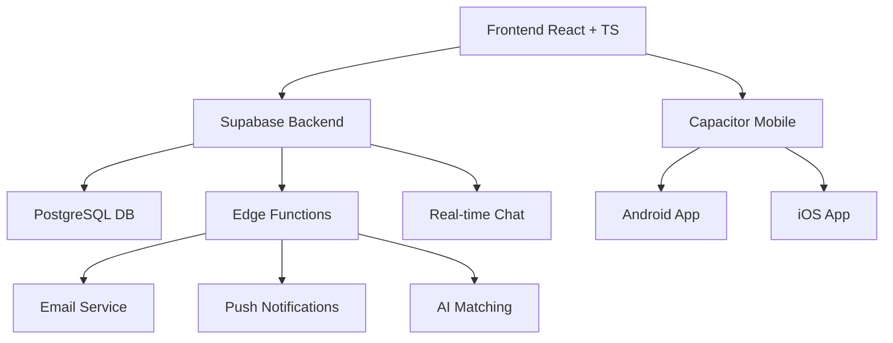

# 🔥 ComplicesConecta - Plataforma Social +18

> **La comunidad swinger más exclusiva y segura de Mexico +18**

<div align="center">

[](https://reactjs.org/)
[](https://supabase.com/)
[](android/)
[](#aviso-legal)

### 📱 ¡Descarga la App Ahora!

<a href="https://github.com/ComplicesConectaSw/ComplicesConecta/releases/download/v.1.3.0/app-release.apk" download>
  
</a>

*🔒 Aplicación segura y verificada para Android*

</div>

## 🌟 Visión del Proyecto

ComplicesConecta es más que una aplicación de citas: es una **plataforma integral** diseñada específicamente para la comunidad lifestyle mexicana, ofreciendo un espacio seguro, verificado y discreto para conexiones auténticas.

### 🎯 Misión
Crear la comunidad lifestyle más exclusiva y segura de México, donde parejas y solteros pueden conectar de manera auténtica, discreta y verificada.

## ✨ Características Revolucionarias

### 🔐 **Seguridad de Nivel Bancario**
- **🛡️ Verificación KYC Avanzada**: Sistema de 3 niveles de verificación
- **🔒 Encriptación E2E**: Todas las comunicaciones protegidas
- **👤 Perfiles Anónimos**: Privacidad total hasta el match mutuo
- **📍 Geolocalización Difusa**: Ubicación aproximada sin comprometer privacidad
- **🚨 Sistema Anti-Fake**: IA para detectar perfiles falsos

### 💕 **Experiencia Social Premium**
- **🧠 Matching IA**: Algoritmo de compatibilidad con 50+ factores
- **💬 Chat Encriptado**: Mensajería con autodestrucción opcional
- **🔗 Sistema de Conexiones**: Solicitudes y control de privacidad avanzado
- **🖼️ Galerías Privadas**: Contenido público y privado por usuario
- **🎭 Eventos VIP Exclusivos**: Fiestas privadas y encuentros verificados
- **🎁 Regalos Virtuales**: Sistema de tokens CMPX y GTK
- **📸 Historias Efímeras**: Contenido que expira en 24 horas
- **🌟 Comunidad Selecta**: Solo usuarios verificados y premium

### 🎨 **Diseño de Vanguardia**
- **📱 UI/UX Premium**: Diseño inspirado en apps de lujo
- **🌈 Animaciones Fluidas**: Micro-interacciones con Framer Motion
- **📱 Responsive Total**: Experiencia perfecta en todos los dispositivos
- **🔔 Notificaciones Inteligentes**: Push notifications contextuales
- **🎛️ Filtros Avanzados**: Búsqueda granular por preferencias lifestyle

## 🚀 Stack Tecnológico de Élite

<div align="center">

### **Frontend Moderno**


### **Backend Serverless**


### **Mobile Nativo**


</div>

## 📊 Arquitectura del Sistema



## 🏗️ Estructura del Monorepo

```
📁 conecta-social-comunidad-main/
├── 🎨 src/                          # Frontend React + TypeScript
│   ├── 🧩 components/               # Componentes reutilizables
│   │   ├── 💬 chat/                 # Sistema de chat
│   │   ├── 🔍 discover/             # Funcionalidad de descubrimiento
│   │   ├── 🎭 events/               # Gestión de eventos VIP
│   │   └── 👤 profile/              # Gestión de perfiles
│   ├── 📄 pages/                    # Páginas principales de la app
│   ├── 🎣 hooks/                    # Custom React hooks
│   ├── 🛠️ utils/                    # Utilidades y helpers
│   ├── 🔌 integrations/             # Integraciones (Supabase, APIs)
│   └── 🖼️ assets/                   # Recursos estáticos
├── 🗄️ supabase/                     # Backend Supabase
│   ├── ⚡ functions/                # Edge Functions serverless
│   │   ├── 📧 send-email/           # Sistema de emails
│   │   ├── 🔔 push-notifications/   # Notificaciones push
│   │   └── 🤖 ai-matching/          # Algoritmo de matching IA
│   └── 🔄 migrations/               # Migraciones de base de datos
├── 📱 android/                      # Proyecto Android nativo
├── 🌐 public/                       # Archivos públicos estáticos
├── 📚 docs/                         # Documentación completa
└── 🔧 config/                       # Archivos de configuración
```

## 🚀 Instalación y Desarrollo

### 📋 Prerrequisitos

- **Node.js** 18+ 
- **Bun** (recomendado) o npm/pnpm
- **Android Studio** (para desarrollo móvil)
- **Supabase CLI**
- **Git** con acceso al repositorio

### ⚡ Configuración Rápida

```bash
# 1️⃣ Clonar el repositorio
git clone https://github.com/ComplicesConectaSw/complicesconectasw.git
cd conecta-social-comunidad-main

# 2️⃣ Instalar dependencias (ultra-rápido con Bun)
bun install

# 3️⃣ Configurar variables de entorno
cp .env.example .env.local
# ✏️ Editar .env.local con tus credenciales

# 4️⃣ Iniciar servidor de desarrollo
bun run dev
# 🌐 Abre http://localhost:5173

# 📱 Para desarrollo móvil Android
bun run build
npx cap sync
npx cap open android
```

### 🔐 Variables de Entorno Críticas

```env
# 🗄️ Supabase Configuration
VITE_SUPABASE_URL=https://tu-proyecto.supabase.co
VITE_SUPABASE_ANON_KEY=tu-clave-anonima-supabase

# 🌍 Environment
VITE_APP_ENV=development
NODE_ENV=development
## 🎨 Páginas y Funcionalidades Implementadas

### 🏠 **Página Principal (Index)**
- ✅ Hero section con animaciones avanzadas y gradientes
- ✅ Diseño responsivo mobile-first
- ✅ Modal de bienvenida interactivo
- ✅ Perfiles destacados con navegación fluida

### 🔐 **Autenticación (Auth)**
- ✅ Login demo con emails específicos (single@outlook.es / pareja@outlook.es)
- ✅ Detección automática de tipo de usuario
- ✅ Redirección condicional según perfil
- ✅ Persistencia de sesión en localStorage

### 👥 **Perfiles Single y Pareja**
- ✅ Páginas separadas para solteros y parejas
- ✅ Formularios de edición con subida de avatar
- ✅ Preview inmediato de cambios de imagen
- ✅ Navegación dinámica según tipo de usuario
- ✅ Datos mock realistas con nombres mexicanos
- ✅ **NUEVO**: Control de visibilidad de perfil (público/conexiones/oculto)
- ✅ **NUEVO**: Configuración de privacidad de mensajería
- ✅ **NUEVO**: Galerías públicas y privadas integradas

### 💬 **Chat Privado/Público**
- ✅ Lista de conversaciones con usuarios online
- ✅ Interfaz de mensajería moderna con burbujas
- ✅ Input funcional con envío por Enter
- ✅ Mensajes mock para demo
- ✅ Diseño responsivo y encriptación visual
- ✅ **NUEVO**: Control de privacidad en mensajería
- ✅ **NUEVO**: Verificación de permisos según configuración

### 🔗 **Sistema de Solicitudes (NUEVO)**
- ✅ Página dedicada para gestión de solicitudes
- ✅ Tabs para solicitudes recibidas y enviadas
- ✅ Estados: pendiente, aceptada, rechazada
- ✅ Interfaz para aceptar, rechazar y responder
- ✅ Integración con navegación principal

### 🖼️ **Galerías Públicas/Privadas (NUEVO)**
- ✅ Componente Gallery con tabs separados
- ✅ Control de visibilidad por imagen
- ✅ Permisos basados en conexiones
- ✅ Simulación de upload y gestión de imágenes
- ✅ Modal de preview con navegación

### 🎭 **Funciones Premium (PRE-IMPLEMENTADAS)**
- ✅ **Eventos VIP**: Calendario exclusivo con reservas
- ✅ **Regalos Virtuales**: Sistema de tokens y categorías
- ✅ **Historias Efímeras**: Contenido con expiración 24h
- ✅ **Feature Flags**: Control por fases (beta/premium/vip)

### 💕 **Matches**
- ✅ Grid responsivo de matches verificados
- ✅ Stats detalladas (total, nuevos, conversaciones)
- ✅ Filtros funcionales (todos, nuevos, recientes, no leídos)
- ✅ Cards de match con compatibilidad y distancia
- ✅ Navegación a Discover cuando no hay matches

### 🔍 **Descubrimiento (Discover)**
- ✅ Sistema de perfiles con filtros avanzados
- ✅ Generación automática de perfiles mock
- ✅ Filtros por edad, distancia, tipo de usuario
- ✅ Interfaz tipo swipe moderna
- ✅ **NUEVO**: Asignación inteligente de imágenes por tipo de perfil
- ✅ **NUEVO**: Sistema anti-duplicados en viewport
- ✅ **NUEVO**: Heurística por nombres (Alejandro→hombre, Laura→mujer, José&Miguel→pareja)

### 🧭 **Navegación**
- ✅ Bottom tab bar responsive
- ✅ Verificación de sesión antes de navegar
- ✅ Redirección automática a login si no hay sesión
- ✅ Iconos modernos con estados activos
- ✅ **NUEVO**: Integración de página Solicitudes con feature flags

### ⚙️ **Sistema de Feature Flags (NUEVO)**
- ✅ Hook useFeatures para control de funcionalidades
- ✅ Variable VITE_APP_PHASE para fases: beta/premium/vip
- ✅ Control granular de funciones por fase
- ✅ Pre-implementación de funciones premium ocultas

### 📊 **Mejoras Técnicas**
- ✅ Corrección de errores JSX críticos
- ✅ Imágenes de Unsplash para evitar 404s
- ✅ Diseño glassmorphism con backdrop-blur
- ✅ Animaciones CSS personalizadas
- ✅ Responsive design con TailwindCSS
- ✅ **NUEVO**: Tipos TypeScript para todas las funcionalidades
- ✅ **NUEVO**: Mock data extendido para funciones sociales

### ✨ **Últimas Actualizaciones (v1.4.0)** *(2 de septiembre, 2025 - 11:15)*
- ✅ **Optimizaciones para APK Instalada**: Header inteligente que se oculta al hacer scroll y se minimiza en el top
- ✅ **Detección de WebView Precisa**: Distingue entre navegador móvil Android y APK instalada
- ✅ **Botón de Descarga Contextual**: Solo visible en navegadores web, oculto cuando se ejecuta desde APK
- ✅ **Navegación Adaptativa**: Menú completo en web, minimizado en APK durante scroll
- ✅ **Transiciones Suaves**: Animaciones de 300ms para cambios de estado del header
- ✅ **Logo Responsivo**: Tamaño adaptable según estado (h-8 → h-6 en modo minimizado)
- ✅ **Modal de Instalación Mejorado**: Botón de descarga directa desde GitHub releases v1.3.0
- ✅ **Colores Corregidos**: Textos del panel de administración visibles en fondo oscuro
- ✅ **Correcciones Técnicas**: ActionButtonsModal.tsx, URLs de imágenes actualizadas, intereses swinger

### ✨ **Actualizaciones Previas (v1.3.7)** *(15 de enero, 2025 - 15:20)*
- ✅ **Corrección de UI y Funcionalidad en ProfileSingle**: Mejoras completas de experiencia de usuario
  - Carga robusta de imágenes de perfil con fallback a Unsplash y placeholder SVG
  - Corrección de texto cortado en sección de intereses eliminando restricciones de altura
  - Habilitación de botones interactivos ("Me gusta", "Enviar mensaje", "Reportar perfil") con alertas
  - Actualización de rutas de navegación corrigiendo `/profile` a `/profiles`
  - Mejora de estilos de botones y texto para mejor visibilidad
  - **NUEVO**: Corrección de UI en pantalla de carga con nombres específicos de usuarios y parejas
  - **NUEVO**: Cambio de textos grises a blancos en pantalla de registro para mejor visibilidad
  - **NUEVO**: Actualizada sección de fotos de perfil para parejas (separada para "Él" y "Ella")
  - **NUEVO**: Mejorada experiencia de usuario con mensajes de bienvenida personalizados
  - **NUEVO**: Corregidos colores de texto en elementos de UI para mejor contraste

### 2 de enero de 2025 - 10:06 hrs
- **Mejoras de contraste y visibilidad en UI de registro**
  - Corregido problema de contraste en sección de "Intereses Lifestyle" (fondo oscuro con texto blanco)
  - Actualizada sección de "Ubicación" con mejor visibilidad de texto
  - Mejorados backgrounds con transparencias para mejor legibilidad
  - Personalizado LoginLoadingScreen para mostrar nombres específicos de usuarios y parejas
  - Cambiados textos grises a blancos en pantalla de registro para mejor visibilidad
  - Actualizada sección de fotos de perfil para parejas (separada para "Él" y "Ella")
  - Mejorada experiencia de usuario con mensajes de bienvenida personalizados
  - Corregidos colores de texto en elementos de UI para mejor contraste

### 2 de enero de 2025 - 15:45 hrs
- **Mejoras en UI y funcionalidad de perfiles y chat**
  - Corregidos errores de carga de imágenes de perfil con fallbacks automáticos a Unsplash
  - Habilitada funcionalidad completa de botones en perfiles demo
  - Solucionados problemas de recorte de texto en chat privado bloqueado
  - Optimizadas páginas Discover y Feed con mejor manejo de estados de carga
  - Corregidos problemas de navegación y estilos en galería y chat
  - Extendido pool de imágenes de perfil con más variedad
  - Mejorada experiencia de usuario con transiciones suaves y feedback visual
  - Actualizada documentación con cambios técnicos y de UI
### ✨ **Actualizaciones Previas (v1.3.6)** *(2 de septiembre, 2025 - 08:35)*
- ✅ **EditProfileSingle Completamente Rediseñado**: Página de edición con tema swinger
  - Background con gradiente púrpura-rosa-rojo y elementos animados
  - Todos los textos cambiados a color blanco para mejor visibilidad
  - Inputs con fondo translúcido y placeholders temáticos
  - Intereses actualizados al lifestyle swinger (Intercambio de Parejas, Clubs Exclusivos, etc.)
  - Cards con glassmorphism y backdrop blur consistente
- ✅ **Navegación Inteligente**: Control de acceso mejorado
  - Navegación oculta para usuarios no autenticados
  - Opción "Configuración" agregada para usuarios logueados
  - Redirección automática según tipo de perfil (single/pareja)
  - Verificación de sesión antes de mostrar elementos
- ✅ **Chat Mejorado**: Imágenes y contenido actualizado
  - Reemplazadas imágenes de RandomUser por Unsplash de calidad
  - Agregada sala "🎭 Eventos Privados" con contenido temático
  - Mensajes actualizados con terminología swinger lifestyle
  - Mejor organización de chats privados y públicos
- ✅ **ProfileDetail Optimizado**: Corrección de background e intereses
  - Background consistente con gradiente del proyecto
  - Sección de intereses con altura mínima para mostrar todos los badges
  - Mejor contraste y visibilidad en todos los elementos
  - Ratio de imagen corregido en ProfileSingle (4:5)

### ✨ **Funcionalidades Previas (v1.3.4)** *(2 de septiembre, 2025)*
- ✅ **Perfiles de Pareja Mejorados**: Información separada para cada partner (él y ella)
- ✅ **Sección de Intereses Completa**: Scroll vertical para mostrar todos los intereses
- ✅ **Background Consistente**: Gradiente púrpura-rosa-índigo en todos los perfiles
- ✅ **Navegación Mejorada**: Botón de regreso dirigido a `/profile` en lugar del index
- ✅ **Visibilidad de Texto**: Mejor contraste en secciones de configuración y privacidad
- ✅ **Scroll Optimizado**: Contenedores con scroll vertical para mejor UX móvil
- ✅ **Fallbacks Seguros**: Datos por defecto cuando no hay información de partners

### ✨ **Funcionalidades Previas (v1.3.3)** *(2 de septiembre, 2025)*
- ✅ **Registro Mejorado**: Campos de edad y apodo para perfiles Single y Pareja
- ✅ **Selección Visual**: Cards interactivas para elegir tipo de perfil (👤 Single / 👫 Pareja)
- ✅ **Geolocalización Automática**: Detección automática de ubicación en el registro
- ✅ **Ubicación en Tiempo Real**: Seguimiento continuo con `watchPosition` para matches dinámicos
- ✅ **Matches por Proximidad**: Filtrado automático basado en distancia real calculada con Haversine
- ✅ **Interfaz de Ubicación**: Estados visuales mejorados (Detectando/Detectada/Error)
- ✅ **Hook useGeolocation**: Funciones `startWatchingLocation()` y `stopWatchingLocation()`

### ✨ **Mejoras Previas (v1.3.2)**
- ✅ **Mejoras de UI/UX**: Visibilidad de textos mejorada en panel de administración con clases `privacy-text` y gradientes consistentes
- ✅ **Cards de Estadísticas**: Rediseñadas con mejor contraste (azul, verde, amarillo, púrpura)
- ✅ **Página 404 Profesional**: Completamente rediseñada con animaciones React avanzadas:
  - Sparkles, rayos y corazones flotantes con posiciones aleatorias
  - Efectos de entrada escalonados con `useState` y `useEffect`
  - Glow effect en número 404 con resplandor animado
  - Botones interactivos con hover effects (rotación, bounce, spin)
  - Nuevas animaciones CSS: `twinkle`, `pulse-glow`, `pulse-slow`
- ✅ **Profile Cards**: Mejorado contraste con overlay `from-black/80 to-transparent` y clases `overlay-text`

### ✨ **Correcciones Previas (v1.3.1)**
- ✅ **Corrección de Duplicación de Imágenes**: Se optimizó el algoritmo en `Discover` para garantizar perfiles únicos
- ✅ **Solución de Errores en Botones**: Se corrigió un error de tipos (`string`/`number`) en los `ProfileCard`

### 📬 **Sistema de Invitaciones (NUEVO)**
- ✅ **Envío de invitaciones** desde perfiles con mensaje personalizado
- ✅ **Tres tipos**: Perfil, Galería privada, Chat privado
- ✅ **Gestión completa** en página Requests con tabs
- ✅ **Permisos de galería** - Control total sobre acceso a fotos privadas
- ✅ **Gating de chat** - Chat global vs privado con invitaciones
- ✅ **Notificaciones toast** para todas las acciones
- ✅ **Integración** en SingleCard y CoupleCard

### ⚙️ **Panel de Administración (COMPLETADO)**
- ✅ **Gestión de perfiles** con verificación KYC
- ✅ **Moderación de invitaciones** con revocación
- ✅ **Auditoría del repositorio** con reportes descargables
- ✅ **Estadísticas detalladas** de usuarios y actividad
- ✅ **Gestión de FAQ** con categorías
- ✅ **Configuración de chat** y moderación

### ❓ **FAQ Mejorado (COMPLETADO)**
- ✅ **8 categorías organizadas** con acordeones interactivos
- ✅ **Verificación KYC, Privacidad, Galerías Privadas**
- ✅ **Sistema de Invitaciones, Eventos VIP, Tokens**
- ✅ **Seguridad y Reportes, Soporte Técnico**
- ✅ **Formularios** de reporte de bugs y feedback
- ✅ **Iconos y colores** por categoría

### 🚫 **Página 404 Profesional (COMPLETADO)**
- ✅ **Animaciones suaves** con gradientes dinámicos
- ✅ **Elementos flotantes** y micro-interacciones
- ✅ **Mensaje empático** y profesional
- ✅ **Navegación intuitiva** con botones de acción
- ✅ **Logo y branding** de ComplicesConecta

### 🔧 **Herramientas de Desarrollo (NUEVO)**
- ✅ **Script de auditoría** (`npm run audit:repo`)
  - Detecta duplicados por hash SHA256
  - Encuentra imports rotos en TypeScript
  - Identifica carpetas vacías y archivos grandes
  - Genera reportes JSON/CSV
  - Excluye android/ y dependencias
- ✅ **Importador de plantillas** (`npm run scaffold:templates`)
  - Escanea directorios automáticamente
  - Categoriza componentes por funcionalidad
  - Evita conflictos renombrando archivos
  - Genera catálogo para gestión en Admin

## 💳 Sistema de Suscripciones

| Plan | Precio | Características |
|------|--------|----------------|
| **Basic** | x /mes | Chat básico, 10 likes/día |
| **Silver** |x /mes | Chat ilimitado, 50 likes/día, eventos |
| **Gold** |x /mes | Todo Silver + Super Likes, verificación |
| **Premium** | x /mes | Acceso VIP total, eventos exclusivos |

## 🚀 Despliegue

### Desarrollo
```bash
npm run dev
```

### Producción
```bash
npm run build
npm run preview
```

### Herramientas de Desarrollo
```bash
# Auditoría del repositorio
npm run audit:repo          # Genera reporte completo
npm run audit:fix           # Aplica correcciones seguras

# Importar plantillas
npm run scaffold:templates  # Importa componentes de plantillas
```

### Plataformas Recomendadas
- **Vercel** - Para aplicación web
- **Netlify** - Alternativa web
- **Google Play Store** - Para Android
- **App Store** - Para iOS - En desarrollo

## 🔒 Seguridad y Privacidad

- **🛡️ Verificación KYC** obligatoria
- **🔐 Encriptación end-to-end** en chats
- **👥 Comunidad moderada** 24/7
- **🚫 Tolerancia cero** al acoso
- **📱 Reportes anónimos** disponibles

## 👥 Equipo

**Liderado por**: Juan Carlos Méndez Nataren  
**Repositorio**: https://github.com/ComplicesConectaSw/complice

## 📄 Licencia

Este proyecto es propiedad de ComplicesConectaSW. Todos los derechos reservados.

---

**🔥 ¡Únete a la comunidad swinger más exclusiva de Mexico!**

*Conexiones auténticas, experiencias únicas, discreción total.*
