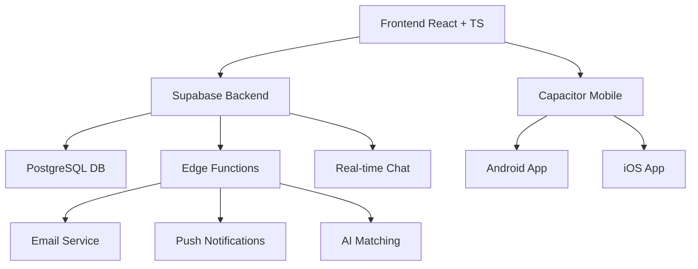

# 🔥 ComplicesConecta - Plataforma Social +18

> **La comunidad swinger más exclusiva y segura de Mexico +18**

<div align="center">

[](https://reactjs.org/)
[](https://supabase.com/)
[](android/)
[](#aviso-legal)

### 📱 ¡Descarga la App Ahora!

<a href="https://github.com/ComplicesConectaSw/complicesconectasw/releases/download/v.1.1/app-release.apk" download>
  
</a>

*🔒 Aplicación segura y verificada para Android*

</div>

## 🌟 Visión del Proyecto

ComplicesConecta es más que una aplicación de citas: es una **plataforma integral** diseñada específicamente para la comunidad lifestyle mexicana, ofreciendo un espacio seguro, verificado y discreto para conexiones auténticas.

### 🎯 Misión
Crear la comunidad lifestyle más exclusiva y segura de México, donde parejas y solteros pueden conectar de manera auténtica, discreta y verificada.

## ✨ Características Revolucionarias

### 🔐 **Seguridad de Nivel Bancario**
- **🛡️ Verificación KYC Avanzada**: Sistema de 3 niveles de verificación
- **🔒 Encriptación E2E**: Todas las comunicaciones protegidas
- **👤 Perfiles Anónimos**: Privacidad total hasta el match mutuo
- **📍 Geolocalización Difusa**: Ubicación aproximada sin comprometer privacidad
- **🚨 Sistema Anti-Fake**: IA para detectar perfiles falsos

### 💕 **Experiencia Social Premium**
- **🧠 Matching IA**: Algoritmo de compatibilidad con 50+ factores
- **💬 Chat Encriptado**: Mensajería con autodestrucción opcional
- **🎭 Eventos VIP Exclusivos**: Fiestas privadas y encuentros verificados
- **🌟 Comunidad Selecta**: Solo usuarios verificados y premium
- **🎁 Sistema de Tokens**: CMPX y GTK para economía interna

### 🎨 **Diseño de Vanguardia**
- **📱 UI/UX Premium**: Diseño inspirado en apps de lujo
- **🌈 Animaciones Fluidas**: Micro-interacciones con Framer Motion
- **📱 Responsive Total**: Experiencia perfecta en todos los dispositivos
- **🔔 Notificaciones Inteligentes**: Push notifications contextuales
- **🎛️ Filtros Avanzados**: Búsqueda granular por preferencias lifestyle

## 🚀 Stack Tecnológico de Élite

<div align="center">

### **Frontend Moderno**


### **Backend Serverless**


### **Mobile Nativo**


</div>

## 📊 Arquitectura del Sistema



## 🏗️ Estructura del Monorepo

```
📁 conecta-social-comunidad-main/
├── 🎨 src/                          # Frontend React + TypeScript
│   ├── 🧩 components/               # Componentes reutilizables
│   │   ├── 💬 chat/                 # Sistema de chat
│   │   ├── 🔍 discover/             # Funcionalidad de descubrimiento
│   │   ├── 🎭 events/               # Gestión de eventos VIP
│   │   └── 👤 profile/              # Gestión de perfiles
│   ├── 📄 pages/                    # Páginas principales de la app
│   ├── 🎣 hooks/                    # Custom React hooks
│   ├── 🛠️ utils/                    # Utilidades y helpers
│   ├── 🔌 integrations/             # Integraciones (Supabase, APIs)
│   └── 🖼️ assets/                   # Recursos estáticos
├── 🗄️ supabase/                     # Backend Supabase
│   ├── ⚡ functions/                # Edge Functions serverless
│   │   ├── 📧 send-email/           # Sistema de emails
│   │   ├── 🔔 push-notifications/   # Notificaciones push
│   │   └── 🤖 ai-matching/          # Algoritmo de matching IA
│   └── 🔄 migrations/               # Migraciones de base de datos
├── 📱 android/                      # Proyecto Android nativo
├── 🌐 public/                       # Archivos públicos estáticos
├── 📚 docs/                         # Documentación completa
└── 🔧 config/                       # Archivos de configuración
```

## 🚀 Instalación y Desarrollo

### 📋 Prerrequisitos

- **Node.js** 18+ 
- **Bun** (recomendado) o npm/pnpm
- **Android Studio** (para desarrollo móvil)
- **Supabase CLI**
- **Git** con acceso al repositorio

### ⚡ Configuración Rápida

```bash
# 1️⃣ Clonar el repositorio
git clone https://github.com/ComplicesConectaSw/complicesconectasw.git
cd conecta-social-comunidad-main

# 2️⃣ Instalar dependencias (ultra-rápido con Bun)
bun install

# 3️⃣ Configurar variables de entorno
cp .env.example .env.local
# ✏️ Editar .env.local con tus credenciales

# 4️⃣ Iniciar servidor de desarrollo
bun run dev
# 🌐 Abre http://localhost:5173

# 📱 Para desarrollo móvil Android
bun run build
npx cap sync
npx cap open android
```

### 🔐 Variables de Entorno Críticas

```env
# 🗄️ Supabase Configuration
VITE_SUPABASE_URL=https://tu-proyecto.supabase.co
VITE_SUPABASE_ANON_KEY=tu-clave-anonima-supabase

# 🌍 Environment
VITE_APP_ENV=development
NODE_ENV=development
## 🎨 Páginas y Funcionalidades Implementadas

### 🏠 **Página Principal (Index)**
- ✅ Hero section con animaciones avanzadas y gradientes
- ✅ Diseño responsivo mobile-first
- ✅ Modal de bienvenida interactivo
- ✅ Perfiles destacados con navegación fluida

### 🔐 **Autenticación (Auth)**
- ✅ Login demo con emails específicos (single@outlook.es / pareja@outlook.es)
- ✅ Detección automática de tipo de usuario
- ✅ Redirección condicional según perfil
- ✅ Persistencia de sesión en localStorage

### 👥 **Perfiles Single y Pareja**
- ✅ Páginas separadas para solteros y parejas
- ✅ Formularios de edición con subida de avatar
- ✅ Preview inmediato de cambios de imagen
- ✅ Navegación dinámica según tipo de usuario
- ✅ Datos mock realistas con nombres mexicanos

### 💬 **Chat Privado**
- ✅ Lista de conversaciones con usuarios online
- ✅ Interfaz de mensajería moderna con burbujas
- ✅ Input funcional con envío por Enter
- ✅ Mensajes mock para demo
- ✅ Diseño responsivo y encriptación visual

### 💕 **Matches**
- ✅ Grid responsivo de matches verificados
- ✅ Stats detalladas (total, nuevos, conversaciones)
- ✅ Filtros funcionales (todos, nuevos, recientes, no leídos)
- ✅ Cards de match con compatibilidad y distancia
- ✅ Navegación a Discover cuando no hay matches

### 🔍 **Descubrimiento (Discover)**
- ✅ Sistema de perfiles con filtros avanzados
- ✅ Generación automática de perfiles mock
- ✅ Filtros por edad, distancia, tipo de usuario
- ✅ Interfaz tipo swipe moderna

### 🧭 **Navegación**
- ✅ Bottom tab bar responsive
- ✅ Verificación de sesión antes de navegar
- ✅ Redirección automática a login si no hay sesión
- ✅ Iconos modernos con estados activos

### 📊 **Mejoras Técnicas**
- ✅ Corrección de errores JSX críticos
- ✅ Imágenes de Unsplash para evitar 404s
- ✅ Diseño glassmorphism con backdrop-blur
- ✅ Animaciones CSS personalizadas
- ✅ Responsive design con TailwindCSS

## 💳 Sistema de Suscripciones

| Plan | Precio | Características |
|------|--------|----------------|
| **Basic** | €9.99/mes | Chat básico, 10 likes/día |
| **Silver** | €19.99/mes | Chat ilimitado, 50 likes/día, eventos |
| **Gold** | €29.99/mes | Todo Silver + Super Likes, verificación |
| **Premium** | €49.99/mes | Acceso VIP total, eventos exclusivos |

## 🚀 Despliegue

### Desarrollo
```bash
npm run dev
```

### Producción
```bash
npm run build
npm run preview
```

### Plataformas Recomendadas
- **Vercel** - Para aplicación web
- **Netlify** - Alternativa web
- **Google Play Store** - Para Android
- **App Store** - Para iOS

## 🔒 Seguridad y Privacidad

- **🛡️ Verificación KYC** obligatoria
- **🔐 Encriptación end-to-end** en chats
- **👥 Comunidad moderada** 24/7
- **🚫 Tolerancia cero** al acoso
- **📱 Reportes anónimos** disponibles

## 👥 Equipo

**Liderado por**: Juan Carlos Méndez Nataren  
**Repositorio**: https://github.com/ComplicesConectaSw/complice

## 📄 Licencia

Este proyecto es propiedad de ComplicesConectaSW. Todos los derechos reservados.

---

**🔥 ¡Únete a la comunidad swinger más exclusiva de España!**

*Conexiones auténticas, experiencias únicas, discreción total.*
