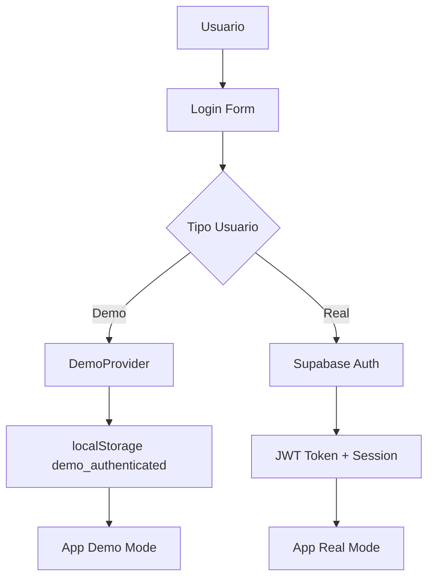

# ⚙️ Detalles Técnicos - ComplicesConecta v2.9.3

**Última Actualización**: 17 de Septiembre, 2025 - 23:58 hrs  
**Contexto**: Plataforma Swinger Mexicana + Sistema de Tokens CMPX/GTK  
**Estado**: Producción - Audit Completo + Optimizaciones UI/UX + Android Ready  

## 🏗️ Stack Tecnológico

### Frontend
- **React 18**: Framework principal con Hooks y Context API
- **TypeScript 5.x**: Tipado estático y mejor DX
- **Vite 5.x**: Build tool y dev server ultrarrápido
- **TailwindCSS 3.x**: Framework CSS utility-first con tema swinger
- **Framer Motion**: Animaciones y transiciones fluidas
- **shadcn/ui**: Componentes UI modernos y accesibles
- **Lucide React**: Iconografía moderna y consistente

### Backend & Database
- **Supabase**: Backend-as-a-Service completo
- **PostgreSQL**: Base de datos relacional
- **Row Level Security (RLS)**: Seguridad granular
- **Edge Functions**: Funciones serverless
- **Real-time**: Subscripciones en tiempo real

### Mobile & Tokens
- **Capacitor 6.x**: Framework híbrido multiplataforma
- **Android SDK**: Compilación nativa Android (Ready)
- **iOS SDK**: Compilación nativa iOS (macOS)
- **Sistema CMPX/GTK**: Tokens premium y staking
- **TokenChatBot**: Asistente de tokens integrado

### Testing & Quality
- **Vitest**: Testing framework ultrarrápido (107/107 tests pasando)
- **Playwright**: Tests end-to-end
- **ESLint**: Linting y análisis estático
- **TypeScript Compiler**: Verificación de tipos sin errores
- **React Query**: Gestión de estado y caché optimizada
- **Supabase Storage**: Gestión de archivos e imágenes

## 🎯 Arquitectura de la Aplicación

### Patrón de Diseño - Plataforma Swinger
```
┌─────────────────┐
│   Presentation  │ ← React Components + Pages (Contexto Swinger)
├─────────────────┤
│    Business     │ ← Custom Hooks + Services (Lifestyle Logic)
├─────────────────┤
│   Data Access   │ ← Supabase Client + Queries (Perfiles Swinger)
├─────────────────┤
│   Infrastructure│ ← Supabase Backend + Storage (Datos México)
└─────────────────┘
```

### Contexto Swinger Mexicano
- **Terminología**: Hotwife, Bull, Unicornio, Intercambio, Tríos
- **Localización**: Ciudad de México, Guadalajara, Monterrey
- **Filtros**: Intereses lifestyle específicos del ambiente swinger
- **Perfiles**: Diferenciación por género (masculino, femenino, parejas)

### Separación Demo vs Real - Contexto Swinger
```typescript
// AppFactory.tsx - Factory Pattern con datos swinger
const AppFactory = () => {
  const isDemoMode = localStorage.getItem('demo_authenticated') === 'true';
  
  // Demo incluye perfiles swinger mexicanos con terminología explícita
  return isDemoMode ? <DemoProvider /> : <RealProvider />;
};

// demoData.ts - Perfiles swinger demo
export const demoProfiles = [
  {
    interests: ['hotwife', 'bull', 'intercambio_parejas', 'trios', 'orgias'],
    location: 'Ciudad de México, México',
    bio: 'Hombre experimentado del lifestyle mexicano...'
  }
];
```

## 🔐 Sistema de Autenticación

### Flujo de Autenticación


### Implementación
```typescript
// useAuth.ts
export const useAuth = () => {
  const [user, setUser] = useState<User | null>(null);
  const [session, setSession] = useState<Session | null>(null);
  
  // Demo authentication
  const loginDemo = () => {
    localStorage.setItem('demo_authenticated', 'true');
    setUser(demoUser);
  };
  
  // Real authentication
  const loginReal = async (email: string, password: string) => {
    const { data, error } = await supabase.auth.signInWithPassword({
      email, password
    });
    if (data.session) setSession(data.session);
  };
};
```

## 🗄️ Esquema de Base de Datos - Plataforma Swinger

### Tablas Principales
```sql
-- Usuarios y Perfiles Swinger
CREATE TABLE profiles (
  id UUID PRIMARY KEY REFERENCES auth.users(id),
  email TEXT UNIQUE NOT NULL,
  name TEXT NOT NULL,
  user_type user_type_enum NOT NULL, -- 'single', 'couple'
  age INTEGER CHECK (age >= 18), -- Validación +18
  location TEXT, -- Ciudades mexicanas
  bio TEXT, -- Biografía lifestyle
  avatar_url TEXT,
  interests TEXT[], -- Intereses swinger específicos
  lifestyle_experience TEXT, -- 'principiante', 'intermedio', 'experimentado'
  is_verified BOOLEAN DEFAULT false,
  is_premium BOOLEAN DEFAULT false,
  created_at TIMESTAMPTZ DEFAULT NOW(),
  updated_at TIMESTAMPTZ DEFAULT NOW()
);

-- Sistema de Matching Swinger
CREATE TABLE invitations (
  id UUID PRIMARY KEY DEFAULT gen_random_uuid(),
  from_profile_id UUID REFERENCES profiles(id),
  to_profile_id UUID REFERENCES profiles(id),
  invitation_type invitation_type_enum NOT NULL, -- 'match', 'event', 'gallery'
  status invitation_status_enum DEFAULT 'pending',
  message TEXT, -- Mensaje personalizado lifestyle
  mutual_interests TEXT[], -- Intereses compartidos
  compatibility_score INTEGER, -- Score de compatibilidad
  created_at TIMESTAMPTZ DEFAULT NOW()
);

-- Eventos Lifestyle
CREATE TABLE events (
  id UUID PRIMARY KEY DEFAULT gen_random_uuid(),
  title TEXT NOT NULL, -- 'Encuentro Privado del Lifestyle'
  description TEXT, -- Descripción del evento swinger
  location TEXT, -- Ubicación en México
  event_date TIMESTAMPTZ NOT NULL,
  organizer_id UUID REFERENCES profiles(id),
  max_attendees INTEGER,
  is_premium BOOLEAN DEFAULT false,
  event_type TEXT, -- 'fiesta_privada', 'club_swinger', 'encuentro_parejas'
  created_at TIMESTAMPTZ DEFAULT NOW()
);

-- Chat en Tiempo Real
CREATE TABLE messages (
  id UUID PRIMARY KEY DEFAULT gen_random_uuid(),
  room_id UUID REFERENCES chat_rooms(id),
  sender_id UUID REFERENCES profiles(id),
  content TEXT NOT NULL,
  message_type message_type_enum DEFAULT 'text',
  created_at TIMESTAMPTZ DEFAULT NOW()
);
```

### Políticas RLS
```sql
-- Solo el propietario puede ver/editar su perfil
CREATE POLICY "Users can view own profile" ON profiles
  FOR SELECT USING (auth.uid() = id);

CREATE POLICY "Users can update own profile" ON profiles
  FOR UPDATE USING (auth.uid() = id);

-- Invitaciones: solo emisor y receptor
CREATE POLICY "Users can view relevant invitations" ON invitations
  FOR SELECT USING (
    auth.uid() = from_profile_id OR 
    auth.uid() = to_profile_id
  );
```

## 🎨 Sistema de Temas - Lifestyle Swinger

### Configuración TailwindCSS
```typescript
// tailwind.config.ts - Tema swinger mexicano
export default {
  theme: {
    extend: {
      colors: {
        primary: {
          50: '#fef2f2',
          500: '#ef4444', // Rojo pasión
          900: '#7f1d1d',
        },
        couple: {
          primary: '#ec4899', // Rosa sensual para parejas
          secondary: '#f97316', // Naranja cálido
        },
        single: {
          primary: '#3b82f6', // Azul confianza para singles
          secondary: '#10b981', // Verde éxito
        },
        lifestyle: {
          passion: '#dc2626', // Rojo intenso
          sensual: '#be185d', // Rosa profundo
          mystery: '#7c3aed', // Púrpura misterioso
        }
      },
      backgroundImage: {
        'hero-gradient': 'linear-gradient(135deg, #667eea 0%, #764ba2 100%)',
        'swinger-gradient': 'linear-gradient(45deg, #ff6b6b, #ee5a24)',
      }
    }
  }
};
```

### Hook de Tema Swinger
```typescript
// useProfileTheme.ts - Temas por tipo de perfil swinger
export const useProfileTheme = () => {
  const { user } = useAuth();
  
  const getTheme = () => {
    if (!user) return 'default';
    
    // Temas específicos para el lifestyle
    switch (user.user_type) {
      case 'couple':
        return 'couple'; // Rosa/naranja para parejas
      case 'single':
        return user.gender === 'female' ? 'single-female' : 'single-male';
      default:
        return 'lifestyle'; // Tema general swinger
    }
  };
  
  const getLifestyleColors = () => ({
    passion: '#dc2626',
    sensual: '#be185d',
    mystery: '#7c3aed'
  });
  
  return { 
    theme: getTheme(),
    colors: getLifestyleColors()
  };
};
```

## 📱 Configuración Mobile

### Capacitor Config
```typescript
// capacitor.config.ts
const config: CapacitorConfig = {
  appId: 'com.complicesconecta.app',
  appName: 'ComplicesConecta',
  webDir: 'dist',
  server: {
    hostname: '127.0.0.1',
    cleartext: true,
    allowNavigation: ['*']
  },
  plugins: {
    SplashScreen: {
      launchShowDuration: 2000,
      backgroundColor: '#ffffff'
    }
  }
};
```

## 🔄 Estado Global

### Context Providers
```typescript
// DemoProvider.tsx
export const DemoProvider = ({ children }: PropsWithChildren) => {
  const [profiles] = useState(demoProfiles);
  const [events] = useState(demoEvents);
  
  return (
    <DemoContext.Provider value={{ profiles, events }}>
      {children}
    </DemoContext.Provider>
  );
};

// RealProvider.tsx
export const RealProvider = ({ children }: PropsWithChildren) => {
  const [profiles, setProfiles] = useState([]);
  
  useEffect(() => {
    fetchRealProfiles().then(setProfiles);
  }, []);
  
  return (
    <RealContext.Provider value={{ profiles }}>
      {children}
    </RealContext.Provider>
  );
};
```

## 🔍 Filtros y Búsqueda Swinger

### Sistema de Intereses Lifestyle
```typescript
// lifestyle-interests.ts - Intereses swinger mexicanos
export const lifestyleInterests = [
  // Términos suaves
  "Lifestyle Swinger", "Intercambio de Parejas", "Encuentros Casuales",
  "Fiestas Temáticas", "Clubs Privados", "Eventos Lifestyle",
  
  // Términos explícitos (demo y producción)
  "Hotwife", "Bull", "Unicornio", "Cuckold", "Tríos", "Orgías",
  "Gangbang", "Creampie", "Anal", "MILF", "Cougar", "BDSM"
];

// Categorización por experiencia
export const interestCategories = {
  principiante: ["Mentalidad Abierta", "Comunicación Abierta"],
  intermedio: ["Hotwife", "Bull", "Tríos", "Voyeurismo"],
  experimentado: ["Orgías", "Gangbang", "BDSM", "Sexo Grupal"]
};
```

### Filtros de Búsqueda
```typescript
// ProfileFilters.tsx - Filtros específicos swinger
const interestOptions = [
  "Lifestyle", "Intercambio de parejas", "Parejas liberales",
  "Swinger", "Hotwife", "Bull", "Unicornio", "Cuckold",
  "Tríos", "Orgías", "Gangbang", "MILF", "Cougar"
];

const locations = [
  "Ciudad de México", "Guadalajara", "Monterrey", 
  "Puebla", "Tijuana", "León", "Cancún", "Mérida"
];
```

## 🧪 Testing Strategy

### Tests Unitarios
```typescript
// auth.test.ts
describe('useAuth Hook', () => {
  it('should login demo user', () => {
    const { result } = renderHook(() => useAuth());
    
    act(() => {
      result.current.loginDemo();
    });
    
    expect(localStorage.getItem('demo_authenticated')).toBe('true');
  });
});
```

### Tests E2E
```typescript
// auth-flow.spec.ts
test('demo login flow', async ({ page }) => {
  await page.goto('/');
  await page.click('[data-testid="demo-login"]');
  await expect(page).toHaveURL('/profile-single');
});
```

## 🚀 Performance

### Build Optimization
```typescript
// vite.config.ts
export default defineConfig({
  build: {
    rollupOptions: {
      output: {
        manualChunks: {
          vendor: ['react', 'react-dom'],
          supabase: ['@supabase/supabase-js'],
          ui: ['framer-motion', 'lucide-react']
        }
      }
    }
  }
});
```

### Lazy Loading
```typescript
// App.tsx
const Discover = lazy(() => import('./pages/Discover'));
const Events = lazy(() => import('./pages/Events'));
const Matches = lazy(() => import('./pages/Matches'));

// Suspense wrapper
<Suspense fallback={<LoadingSpinner />}>
  <Routes>
    <Route path="/discover" element={<Discover />} />
  </Routes>
</Suspense>
```

## 🔒 Seguridad

### Sanitización de Datos
```typescript
// utils.ts
export const sanitizeInput = (input: string): string => {
  return input
    .trim()
    .replace(/<script\b[^<]*(?:(?!<\/script>)<[^<]*)*<\/script>/gi, '')
    .replace(/[<>]/g, '');
};
```

### Validación de Imágenes
```typescript
// SafeImage.tsx
export const SafeImage = ({ src, alt, fallback }: SafeImageProps) => {
  const [error, setError] = useState(false);
  
  const handleError = () => setError(true);
  
  if (error || !src) {
    return ;
  }
  
  return ;
};
```

## 📊 Monitoreo

### Sentry Integration
```typescript
// sentry.ts
Sentry.init({
  dsn: import.meta.env.VITE_SENTRY_DSN,
  environment: import.meta.env.MODE,
  tracesSampleRate: 0.1,
});
```

### Custom Logger
```typescript
// supabase-logger.ts
export const logError = async (error: Error, context: string) => {
  await supabase.from('error_logs').insert({
    error_message: error.message,
    context,
    timestamp: new Date().toISOString()
  });
};
```

## 🔧 Variables de Entorno

### Configuración
```env
# Supabase
VITE_SUPABASE_URL=https://xxx.supabase.co
VITE_SUPABASE_ANON_KEY=eyJhbGciOiJIUzI1NiIsInR5cCI6IkpXVCJ9...

# App
VITE_APP_MODE=development
VITE_APP_PHASE=beta

# Monitoring
VITE_SENTRY_DSN=https://xxx@sentry.io/xxx
```

---

## 🔧 Audit Completo v2.9.3 - Septiembre 2025

### ✅ Correcciones Críticas Implementadas (17/09/2025)

#### **Sistema de Tokens CMPX/GTK**
- ✅ TokenChatBot completamente funcional e integrado
- ✅ Flujo wizard: saludo → balance → reclamos → staking
- ✅ Validaciones de seguridad y límites beta implementados
- ✅ Mock temporal para desarrollo sin backend
- ✅ Páginas legales: Términos, Privacidad, Responsabilidad Legal

#### **Optimizaciones UI/UX**
- ✅ Corregidos problemas de contraste en componentes UI
- ✅ Agregados placeholders SVG para imágenes rotas
- ✅ Mejorada accesibilidad con aria-labels en botones
- ✅ Eliminados CSS inline styles por clases Tailwind
- ✅ Sistema de placeholders elegantes (avatar-placeholder.svg, image-placeholder.svg)

#### **Arquitectura y Testing**
- ✅ Migración completa localStorage → React Query + Supabase
- ✅ Tests unitarios: 107/107 pasando (100%)
- ✅ Compilación TypeScript sin errores
- ✅ Todos los imports migrados a alias @/
- ✅ Sistema de referidos funcional implementado
- ✅ Supabase Storage integrado para gestión de archivos

### ✅ Cambios Previos Implementados (16/09/2025)

1. **Contextualización Completa**:
   - Todos los perfiles, intereses y biografías actualizados al contexto swinger mexicano
   - Terminología auténtica del lifestyle: Hotwife, Bull, Unicornio, etc.
   - Localización 100% mexicana (CDMX, Guadalajara, Monterrey)

2. **Diferenciación por Género**:
   - Perfiles masculinos: Enfoque en respeto y discreción
   - Perfiles femeninos: Independencia y comodidad con ambos géneros
   - Parejas: Experiencias compartidas y conexiones auténticas

3. **Vocabulario Diversificado**:
   - Términos suaves para UI general
   - Términos explícitos para demo y producción
   - Evitación de repeticiones y exceso de explicitud

4. **Componentes Actualizados**:
   - `ProfileFilters.tsx`: 30 opciones de intereses swinger
   - `lifestyle-interests.ts`: Categorización por experiencia
   - `demoData.ts`: Perfiles demo con terminología explícita
   - `ProfileDetail.tsx`, `Matches.tsx`: Contenido contextualizado

### 🎯 Estado Actual v2.9.3
- **Versión**: v2.9.3 - Audit Completo + Sistema de Tokens
- **Contexto**: Plataforma lifestyle mexicana 100% funcional
- **Terminología**: Auténtica del ambiente swinger en español
- **Localización**: México (sin referencias a España u otros países)
- **Testing**: 107/107 tests unitarios pasando
- **TypeScript**: Compilación sin errores
- **Tokens**: Sistema CMPX/GTK operativo
- **Mobile**: Android Ready con Capacitor
- **UI/UX**: Optimizada para accesibilidad y contraste

---

**© 2025 ComplicesConecta** - Plataforma Swinger Mexicana v2.9.3  
**Contexto**: Lifestyle Swinger + Tokens CMPX/GTK - Localización México  
**Actualizado**: 17 de Septiembre, 2025 - 23:58 hrs  
**Estado**: Producción Ready - Audit Completo Finalizado
