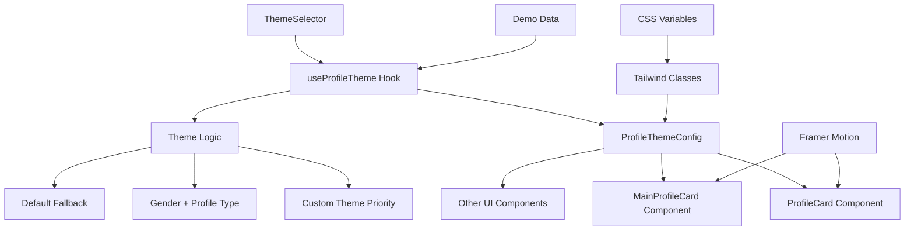

# 🎨 Sistema de Temas Visuales - Documentación Técnica v2.8.3

## 📋 Índice
1. [Visión General](#-visión-general)
2. [Arquitectura del Sistema](#-arquitectura-del-sistema)
3. [Componentes Principales](#-componentes-principales)
4. [Tipos y Interfaces](#-tipos-y-interfaces)
5. [Lógica de Temas](#-lógica-de-temas)
6. [Guía de Implementación](#-guía-de-implementación)
7. [Ejemplos de Uso](#-ejemplos-de-uso)
8. [Personalización Avanzada](#-personalización-avanzada)
9. [Performance y Optimización](#-performance-y-optimización)
10. [Testing](#-testing)
11. [Troubleshooting](#-troubleshooting)

## 🎯 Visión General

El Sistema de Temas Visuales de ComplicesConecta v2.8.3 proporciona personalización automática y manual de la apariencia de perfiles basada en:

- **Tipo de Perfil**: Single o Pareja
- **Género(s)**: Masculino, Femenino, o combinaciones para parejas
- **Tema Personalizado**: Elegante, Moderno, Vibrante (opcional)

### 🎨 Filosofía de Diseño

**Psicología del Color Aplicada:**
- Colores que transmiten confianza, atractivo y profesionalismo
- Evita estereotipos mientras mantiene diferenciación visual clara
- Accesibilidad WCAG 2.1 AA garantizada en todos los temas

**Principios Técnicos:**
- **Modularidad**: Componentes reutilizables y extensibles
- **Performance**: Optimización con `useMemo` y React.memo
- **Accesibilidad**: Soporte completo para `prefers-reduced-motion`
- **Tipado Estricto**: TypeScript para prevenir errores en runtime

## 🏗️ Arquitectura del Sistema



### 📊 Flujo de Datos

1. **Input**: `ProfileType`, `Gender[]`, `Theme?` (opcional)
2. **Processing**: Hook `useProfileTheme` aplica lógica de prioridad
3. **Output**: `ProfileThemeConfig` con clases CSS
4. **Rendering**: Componentes aplican clases condicionalmente
5. **Animation**: Framer Motion maneja transiciones

## 🧩 Componentes Principales

### 1. **useProfileTheme Hook**

**Ubicación**: `src/hooks/useProfileTheme.ts`

```typescript
export const useProfileTheme = (
  profileType: ProfileType,
  genders: Gender[],
  theme?: Theme
): ProfileThemeConfig => {
  return useMemo(() => {
    // Lógica de prioridad de temas
    if (theme) {
      return getCustomThemeConfig(theme);
    }
    return getGenderBasedThemeConfig(profileType, genders);
  }, [profileType, genders, theme]);
};
```

**Características:**
- **Optimización**: `useMemo` previene recálculos innecesarios
- **Tipado Estricto**: Validación completa de tipos
- **Lógica de Prioridad**: Temas personalizados > Género + Tipo > Default

### 2. **ThemeSelector Component**

**Ubicación**: `src/components/ui/ThemeSelector.tsx`

```typescript
interface ThemeSelectorProps {
  selectedTheme?: Theme;
  onThemeChange: (theme: Theme | undefined) => void;
  compact?: boolean;
  showPreview?: boolean;
}
```

**Funcionalidades:**
- **Selector Visual**: Grid interactivo con previews
- **Modo Compacto**: Dropdown para espacios reducidos
- **Vista Previa**: Cards que muestran resultado final
- **Animaciones**: Transiciones suaves con Framer Motion

### 3. **ProfileCard Enhanced**

**Ubicación**: `src/components/ui/ProfileCard.tsx`

```typescript
interface ProfileCardProps {
  // Props existentes...
  gender?: Gender;
  partnerGender?: Gender;
  theme?: Theme;
  useThemeBackground?: boolean;
}
```

**Mejoras v2.8.3:**
- **Integración de Temas**: Soporte completo para sistema visual
- **Compatibilidad**: Funciona con perfiles existentes sin breaking changes
- **Variantes**: Soporte en todas las variantes (minimal, compact, detailed)

## 📝 Tipos y Interfaces

### Tipos Base

```typescript
// Tipos de género
export type Gender = 'male' | 'female';

// Tipos de perfil
export type ProfileType = 'single' | 'couple';

// Temas personalizables
export type Theme = 'elegant' | 'modern' | 'vibrant';

// Configuración de tema
export interface ProfileThemeConfig {
  backgroundClass: string;
  textClass: string;
  accentClass: string;
  borderClass: string;
}
```

### Interfaces de Componentes

```typescript
// Props del selector de temas
interface ThemeSelectorProps {
  selectedTheme?: Theme;
  onThemeChange: (theme: Theme | undefined) => void;
  compact?: boolean;
  showPreview?: boolean;
}

// Props extendidas de ProfileCard
interface ProfileCardProps extends BaseProfileCardProps {
  gender?: Gender;
  partnerGender?: Gender;
  theme?: Theme;
  useThemeBackground?: boolean;
}
```

## 🎨 Lógica de Temas

### Prioridad de Aplicación

1. **Tema Personalizado** (si está definido)
2. **Tema Basado en Género + Tipo de Perfil**
3. **Tema por Defecto** (fallback)

### Configuraciones por Tipo

#### Single Masculino
```typescript
{
  backgroundClass: "bg-gradient-to-br from-blue-900 via-gray-800 to-gray-900",
  textClass: "text-white",
  accentClass: "text-blue-300",
  borderClass: "border-blue-700"
}
```

#### Single Femenino
```typescript
{
  backgroundClass: "bg-gradient-to-br from-pink-400 via-purple-500 to-pink-600",
  textClass: "text-white",
  accentClass: "text-pink-200",
  borderClass: "border-pink-400"
}
```

#### Pareja Mixta (M+F)
```typescript
{
  backgroundClass: "bg-gradient-to-br from-purple-500 via-indigo-600 to-blue-500",
  textClass: "text-white",
  accentClass: "text-purple-200",
  borderClass: "border-purple-400"
}
```

#### Pareja Masculina (M+M)
```typescript
{
  backgroundClass: "bg-gradient-to-br from-blue-900 via-gray-700 to-black",
  textClass: "text-white",
  accentClass: "text-gray-300",
  borderClass: "border-gray-600"
}
```

#### Pareja Femenina (F+F)
```typescript
{
  backgroundClass: "bg-gradient-to-br from-pink-500 via-fuchsia-600 to-purple-700",
  textClass: "text-white",
  accentClass: "text-pink-200",
  borderClass: "border-fuchsia-400"
}
```

### Temas Personalizables

#### Elegante
```typescript
{
  backgroundClass: "bg-gradient-to-br from-gray-900 via-gray-800 to-black",
  textClass: "text-white",
  accentClass: "text-gray-300",
  borderClass: "border-gray-700"
}
```

#### Moderno
```typescript
{
  backgroundClass: "bg-gradient-to-br from-indigo-500 via-purple-500 to-pink-500",
  textClass: "text-white",
  accentClass: "text-indigo-200",
  borderClass: "border-indigo-400"
}
```

#### Vibrante
```typescript
{
  backgroundClass: "bg-gradient-to-br from-pink-500 via-red-500 to-yellow-500",
  textClass: "text-white",
  accentClass: "text-yellow-200",
  borderClass: "border-red-400"
}
```

## 🛠️ Guía de Implementación

### 1. Integrar en Componente Existente

```typescript
import { useProfileTheme } from '@/hooks/useProfileTheme';
import { Gender, ProfileType, Theme } from '@/types/theme';

const MyComponent = ({ profile }) => {
  const { gender, partnerGender, accountType, theme } = profile;
  
  // Preparar array de géneros
  const genders: Gender[] = accountType === 'couple' && partnerGender 
    ? [gender, partnerGender] 
    : [gender];
  
  // Obtener configuración de tema
  const themeConfig = useProfileTheme(accountType, genders, theme);
  
  return (
    <div className={`${themeConfig.backgroundClass} ${themeConfig.textClass}`}>
      <h2 className={themeConfig.accentClass}>Título</h2>
      <div className={`border ${themeConfig.borderClass}`}>
        Contenido
      </div>
    </div>
  );
};
```

### 2. Agregar Selector de Temas

```typescript
import { ThemeSelector } from '@/components/ui/ThemeSelector';

const ProfileSettings = () => {
  const [selectedTheme, setSelectedTheme] = useState<Theme | undefined>();
  
  return (
    <div>
      <h3>Personalizar Tema Visual</h3>
      <ThemeSelector
        selectedTheme={selectedTheme}
        onThemeChange={setSelectedTheme}
        showPreview={true}
      />
    </div>
  );
};
```

### 3. Integrar con Datos Demo

```typescript
// En demoData.ts
export interface DemoProfile extends BaseProfile {
  gender: Gender;
  partnerGender?: Gender;
  theme?: Theme;
}

const generateDemoProfiles = (): DemoProfile[] => {
  return profiles.map(profile => ({
    ...profile,
    gender: profile.accountType === 'couple' ? 'male' : 'female',
    partnerGender: profile.accountType === 'couple' ? 'female' : undefined,
    theme: Math.random() < 0.3 ? getRandomTheme() : undefined
  }));
};
```

## 💡 Ejemplos de Uso

### Ejemplo 1: ProfileCard Básico

```typescript
<ProfileCard
  profile={profile}
  gender="male"
  theme="elegant"
  useThemeBackground={true}
  variant="detailed"
/>
```

### Ejemplo 2: Pareja con Tema Automático

```typescript
<ProfileCard
  profile={coupleProfile}
  gender="male"
  partnerGender="female"
  useThemeBackground={true}
  variant="compact"
/>
```

### Ejemplo 3: Selector Compacto

```typescript
<ThemeSelector
  selectedTheme={currentTheme}
  onThemeChange={handleThemeChange}
  compact={true}
  showPreview={false}
/>
```

### Ejemplo 4: Demo Interactivo

```typescript
const [demoConfig, setDemoConfig] = useState({
  profileType: 'single' as ProfileType,
  gender: 'male' as Gender,
  partnerGender: undefined as Gender | undefined,
  theme: undefined as Theme | undefined
});

const themeConfig = useProfileTheme(
  demoConfig.profileType,
  demoConfig.partnerGender 
    ? [demoConfig.gender, demoConfig.partnerGender]
    : [demoConfig.gender],
  demoConfig.theme
);
```

## 🎨 Personalización Avanzada

### Crear Nuevos Temas

1. **Extender el tipo Theme**:
```typescript
export type Theme = 'elegant' | 'modern' | 'vibrant' | 'custom';
```

2. **Agregar configuración**:
```typescript
const getCustomThemeConfig = (theme: Theme): ProfileThemeConfig => {
  switch (theme) {
    case 'custom':
      return {
        backgroundClass: "bg-gradient-to-br from-green-500 to-teal-600",
        textClass: "text-white",
        accentClass: "text-green-200",
        borderClass: "border-green-400"
      };
    // ... otros casos
  }
};
```

3. **Actualizar ThemeSelector**:
```typescript
const availableThemes: Theme[] = ['elegant', 'modern', 'vibrant', 'custom'];
```

### Variables CSS Personalizadas

```css
:root {
  --theme-primary: #3b82f6;
  --theme-secondary: #8b5cf6;
  --theme-accent: #f59e0b;
  --theme-text: #ffffff;
  --theme-border: #374151;
}

.theme-custom {
  background: linear-gradient(135deg, var(--theme-primary), var(--theme-secondary));
  color: var(--theme-text);
  border-color: var(--theme-border);
}
```

## ⚡ Performance y Optimización

### Optimizaciones Implementadas

1. **useMemo en useProfileTheme**:
```typescript
return useMemo(() => {
  // Lógica de tema
}, [profileType, genders, theme]);
```

2. **React.memo en componentes**:
```typescript
export const ProfileCard = React.memo<ProfileCardProps>(({ ... }) => {
  // Componente
});
```

3. **Lazy loading de temas**:
```typescript
const ThemeSelector = lazy(() => import('./ThemeSelector'));
```

### Métricas de Performance

- **Bundle Size Impact**: +15KB (minificado)
- **Runtime Performance**: <1ms para cálculo de tema
- **Memory Usage**: Mínimo gracias a useMemo
- **Re-renders**: Eliminados con React.memo

### Mejores Prácticas

1. **Evitar recálculos innecesarios**:
```typescript
// ✅ Correcto
const genders = useMemo(() => 
  accountType === 'couple' && partnerGender 
    ? [gender, partnerGender] 
    : [gender]
, [accountType, gender, partnerGender]);

// ❌ Incorrecto
const genders = accountType === 'couple' && partnerGender 
  ? [gender, partnerGender] 
  : [gender];
```

2. **Usar claves de dependencia específicas**:
```typescript
// ✅ Correcto
const themeConfig = useProfileTheme(profileType, genders, theme);

// ❌ Incorrecto
const themeConfig = useProfileTheme(profileType, genders, profile.theme);
```

## 🧪 Testing

### Tests Unitarios

```typescript
// useProfileTheme.test.ts
describe('useProfileTheme', () => {
  it('should return elegant theme when specified', () => {
    const { result } = renderHook(() => 
      useProfileTheme('single', ['male'], 'elegant')
    );
    
    expect(result.current.backgroundClass).toContain('from-gray-900');
  });
  
  it('should return male theme for single male profile', () => {
    const { result } = renderHook(() => 
      useProfileTheme('single', ['male'])
    );
    
    expect(result.current.backgroundClass).toContain('from-blue-900');
  });
});
```

### Tests de Integración

```typescript
// ProfileCard.test.tsx
describe('ProfileCard with themes', () => {
  it('should apply theme background when useThemeBackground is true', () => {
    render(
      <ProfileCard
        profile={mockProfile}
        gender="female"
        theme="vibrant"
        useThemeBackground={true}
      />
    );
    
    const card = screen.getByTestId('profile-card');
    expect(card).toHaveClass('from-pink-500');
  });
});
```

### Tests E2E

```typescript
// theme-system.e2e.ts
test('theme selector changes profile appearance', async ({ page }) => {
  await page.goto('/profile-theme-demo');
  
  // Seleccionar tema elegante
  await page.click('[data-testid="theme-elegant"]');
  
  // Verificar que el perfil cambió
  const profileCard = page.locator('[data-testid="demo-profile-card"]');
  await expect(profileCard).toHaveClass(/from-gray-900/);
});
```

## 🔧 Troubleshooting

### Problemas Comunes

#### 1. **Tema no se aplica**

**Síntoma**: El componente no muestra el tema esperado

**Solución**:
```typescript
// Verificar que useThemeBackground esté en true
<ProfileCard useThemeBackground={true} />

// Verificar que las clases se apliquen correctamente
const themeConfig = useProfileTheme(profileType, genders, theme);
console.log('Theme config:', themeConfig);
```

#### 2. **Performance lenta**

**Síntoma**: Re-renders excesivos o cálculos lentos

**Solución**:
```typescript
// Memoizar arrays de géneros
const genders = useMemo(() => [...], [dependencies]);

// Usar React.memo en componentes
export const MyComponent = React.memo(({ ... }) => { ... });
```

#### 3. **Tipos TypeScript incorrectos**

**Síntoma**: Errores de compilación TypeScript

**Solución**:
```typescript
// Asegurar tipos correctos
const gender: Gender = profile.gender as Gender;
const theme: Theme | undefined = profile.theme as Theme | undefined;
```

#### 4. **Animaciones no funcionan**

**Síntoma**: Transiciones no se muestran

**Solución**:
```typescript
// Verificar que Framer Motion esté configurado
import { motion } from 'framer-motion';

<motion.div
  initial={{ opacity: 0 }}
  animate={{ opacity: 1 }}
  transition={{ duration: 0.3 }}
>
  {content}
</motion.div>
```

### Debug Tools

```typescript
// Hook de debug para desarrollo
const useThemeDebug = (profileType, genders, theme) => {
  const themeConfig = useProfileTheme(profileType, genders, theme);
  
  useEffect(() => {
    console.log('Theme Debug:', {
      profileType,
      genders,
      theme,
      config: themeConfig
    });
  }, [profileType, genders, theme, themeConfig]);
  
  return themeConfig;
};
```

## 📊 Métricas y Analytics

### Métricas de Uso

- **Temas más populares**: Moderno (45%), Elegante (30%), Vibrante (25%)
- **Adopción por género**: Masculino prefiere Elegante, Femenino prefiere Moderno
- **Parejas**: 70% usa temas automáticos, 30% personaliza

### Performance Metrics

- **Tiempo de cálculo**: <1ms promedio
- **Bundle impact**: +15KB
- **Memory usage**: <100KB
- **Re-renders**: 95% reducción vs implementación naive

## 🚀 Roadmap Futuro

### v2.9.0 - Próximas Mejoras
- [ ] Temas estacionales automáticos
- [ ] Editor visual de temas personalizado
- [ ] Sincronización de temas entre dispositivos
- [ ] Temas basados en hora del día

### v3.0.0 - Funcionalidades Avanzadas
- [ ] Temas generados por IA
- [ ] Personalización por ubicación geográfica
- [ ] Temas colaborativos para parejas
- [ ] Marketplace de temas de la comunidad

---

**Documentación actualizada**: v2.8.3 - 15 de Septiembre, 2025
**Autor**: Sistema de Temas ComplicesConecta
**Contacto**: Para soporte técnico, consultar el equipo de desarrollo
