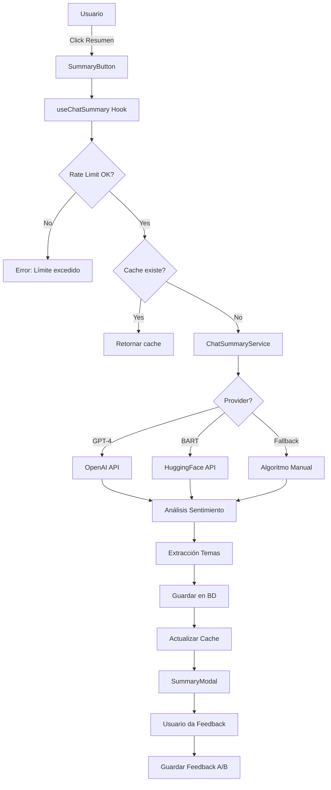

# 🤖 Chat Summaries ML - ComplicesConecta v3.5.0

**Fecha:** 30 Octubre 2025  
**Versión:** 3.5.0 - Fase 1.3  
**Estado:** ✅ Implementado (90%)

---

## 📋 TABLA DE CONTENIDOS

1. [Descripción General](#descripción-general)
2. [Arquitectura](#arquitectura)
3. [Instalación y Configuración](#instalación-y-configuración)
4. [Uso](#uso)
5. [API Reference](#api-reference)
6. [Base de Datos](#base-de-datos)
7. [Machine Learning](#machine-learning)
8. [Rate Limiting](#rate-limiting)
9. [Troubleshooting](#troubleshooting)
10. [Roadmap](#roadmap)

---

## 🎯 DESCRIPCIÓN GENERAL

El sistema de **Chat Summaries ML** genera automáticamente resúmenes de conversaciones utilizando Inteligencia Artificial, inspirado en Facebook Messenger 2025 y WhatsApp Business.

### Características Principales

- ✅ **Integración GPT-4** (OpenAI) para resúmenes de alta calidad
- ✅ **Fallback a BART** (HuggingFace) como alternativa
- ✅ **Modo sin ML** (fallback manual) cuando no hay APIs disponibles
- ✅ **Análisis de sentimiento** (positivo, neutral, negativo)
- ✅ **Extracción de temas** (top 5 con stop words en español)
- ✅ **Rate limiting** (10 resúmenes/día por usuario)
- ✅ **Cache 24 horas** para evitar regeneraciones innecesarias
- ✅ **A/B Testing** con feedback de usuarios
- ✅ **Estadísticas de uso** en tiempo real

### Inspiración

- **Facebook Messenger 2025**: Resúmenes automáticos de conversaciones largas
- **WhatsApp Business**: Análisis de sentimiento y temas en chats
- **Grindr 2025**: AI-native approach para personalización

---

## 🏗️ ARQUITECTURA



### Stack Tecnológico

- **Frontend**: React 18.3.1 + TypeScript
- **ML/AI**: 
  - OpenAI GPT-4 Turbo Preview
  - HuggingFace Inference API (BART)
- **Base de Datos**: PostgreSQL (Supabase)
- **Estado**: TanStack Query (React Query)
- **UI**: Radix UI + TailwindCSS
- **Seguridad**: Row Level Security (RLS)

---

## ⚙️ INSTALACIÓN Y CONFIGURACIÓN

### 1. Instalar Dependencias

```bash
npm install openai@^4.20.0 @huggingface/inference@^2.6.0
```

### 2. Aplicar Migraciones SQL

```bash
# Método 1: Usando Supabase CLI
npx supabase db reset

# Método 2: Manual (Supabase Dashboard)
# 1. Ir a SQL Editor en Supabase Dashboard
# 2. Copiar contenido de:
#    - supabase/migrations/20251030_create_chat_summaries.sql
# 3. Ejecutar query
```

**Tablas creadas:**
- `chat_summaries` - Almacena resúmenes generados
- `summary_requests` - Control de rate limiting
- `summary_feedback` - Feedback de usuarios (A/B testing)

### 3. Regenerar Types

```bash
npx supabase gen types typescript --local > src/types/supabase-generated.ts
```

### 4. Configurar Variables de Entorno

Crear/editar archivo `.env`:

```env
# Feature Flags
VITE_AI_CHAT_SUMMARIES_ENABLED=true
VITE_AI_SUMMARY_PROVIDER=auto  # openai | huggingface | auto | fallback

# OpenAI (Recomendado para mejor calidad)
VITE_OPENAI_API_KEY=sk-proj-xxxxxxxxxxxxxxxxxxxxx

# HuggingFace (Alternativa gratuita)
VITE_HUGGINGFACE_API_KEY=hf_xxxxxxxxxxxxxxxxxxxxx

# Configuración Opcional
VITE_AI_MAX_MESSAGES_PER_SUMMARY=100
VITE_AI_RATE_LIMIT_PER_DAY=10
```

#### Obtener API Keys:

**OpenAI:**
1. Ir a https://platform.openai.com/api-keys
2. Crear cuenta / Iniciar sesión
3. Click en "Create new secret key"
4. Copiar key (empieza con `sk-proj-`)
5. **Costo aproximado:** $0.01 - $0.05 USD por resumen (GPT-4 Turbo)

**HuggingFace (Gratis):**
1. Ir a https://huggingface.co/settings/tokens
2. Crear cuenta / Iniciar sesión
3. Click en "New token"
4. Tipo: "Read" es suficiente
5. Copiar token (empieza con `hf_`)

### 5. Verificar Instalación

```bash
# Build debe completar sin errores
npm run build

# Linting debe mostrar 0 errores
npm run lint
```

---

## 🚀 USO

### Integración en un Componente

```tsx
// src/components/chat/ChatHeader.tsx
import { SummaryButton } from '@/components/chat/SummaryButton';

export function ChatHeader({ chatId }: { chatId: string }) {
  return (
    <div className="flex items-center justify-between p-4">
      <h2>Conversación</h2>
      
      {/* Botón para generar resumen */}
      <SummaryButton chatId={chatId} className="ml-auto" />
    </div>
  );
}
```

### Uso Programático

```tsx
import { useChatSummary } from '@/hooks/ai/useChatSummary';

function MyComponent() {
  const { 
    summary, 
    isLoading, 
    error,
    usageStats,
    generateSummary 
  } = useChatSummary('chat-id-123', 'user-id-456');

  // Generar resumen
  const handleGenerateSummary = async () => {
    await generateSummary('chat-id-123');
  };

  // Verificar uso
  console.log(`Usado hoy: ${usageStats?.usedToday || 0}/10`);

  return (
    <div>
      {isLoading && <p>Generando resumen...</p>}
      {error && <p>Error: {error}</p>}
      {summary && (
        <div>
          <h3>Resumen</h3>
          <p>{summary.summary}</p>
          <p>Sentimiento: {summary.sentiment}</p>
          <p>Temas: {summary.topics.join(', ')}</p>
        </div>
      )}
      <button onClick={handleGenerateSummary}>Generar Resumen</button>
    </div>
  );
}
```

### Uso Directo del Servicio

```typescript
import { chatSummaryService } from '@/services/ai/ChatSummaryService';

// Generar resumen
const summary = await chatSummaryService.generateSummary(
  'chat-id-123',
  'user-id-456'
);

console.log('Resumen:', summary.summary);
console.log('Sentimiento:', summary.sentiment);
console.log('Temas:', summary.topics);

// Verificar estadísticas de uso
const stats = await chatSummaryService.getUsageStats('user-id-456');
console.log(`Resúmenes restantes: ${stats.remaining}`);
```

---

## 📚 API REFERENCE

### ChatSummaryService

#### `generateSummary(chatId: string, userId: string): Promise<ChatSummary>`

Genera un resumen automático de la conversación.

**Parámetros:**
- `chatId` (string): ID de la conversación a resumir
- `userId` (string): ID del usuario solicitante (para rate limiting)

**Retorna:** `ChatSummary`

**Ejemplo:**
```typescript
const summary = await chatSummaryService.generateSummary(
  'f47ac10b-58cc-4372-a567-0e02b2c3d479',
  'a1b2c3d4-e5f6-7890-1234-567890abcdef'
);
```

**Excepciones:**
- `Error: Rate limit exceeded` - Usuario excedió 10 resúmenes/día
- `Error: No messages found in chat` - Chat vacío
- `Error: Chat not found` - Chat ID inválido

#### `getUsageStats(userId: string): Promise<UsageStats>`

Obtiene estadísticas de uso del usuario.

**Parámetros:**
- `userId` (string): ID del usuario

**Retorna:**
```typescript
{
  usedToday: number;    // Resúmenes usados hoy
  limit: number;        // Límite diario (10)
  remaining: number;    // Resúmenes restantes
}
```

#### `isEnabled(): boolean`

Verifica si el servicio está habilitado.

**Retorna:** `true` si `VITE_AI_CHAT_SUMMARIES_ENABLED=true`

---

### useChatSummary Hook

```typescript
function useChatSummary(
  initialChatId?: string,
  userId?: string
): {
  summary: ChatSummary | null;
  isLoading: boolean;
  error: string | null;
  usageStats: UsageStats | null;
  generateSummary: (chatId: string) => Promise<void>;
  clearError: () => void;
}
```

**Estados:**
- `summary`: Resumen generado (null si no hay)
- `isLoading`: `true` mientras se genera
- `error`: Mensaje de error (null si no hay)
- `usageStats`: Estadísticas de uso del usuario

**Funciones:**
- `generateSummary(chatId)`: Genera resumen para un chat
- `clearError()`: Limpia error actual

---

### ChatSummary Interface

```typescript
interface ChatSummary {
  id: string;                           // UUID único
  chatId: string;                       // ID de la conversación
  summary: string;                      // Resumen generado
  sentiment: 'positive' | 'neutral' | 'negative';  // Sentimiento
  topics: string[];                     // Temas principales (máx 5)
  messageCount: number;                 // Cantidad de mensajes resumidos
  method: 'gpt4' | 'bart' | 'fallback'; // Método de generación
  createdAt: Date;                      // Fecha de creación
}
```

---

## 🗄️ BASE DE DATOS

### Tabla: chat_summaries

```sql
CREATE TABLE chat_summaries (
  id UUID PRIMARY KEY DEFAULT gen_random_uuid(),
  chat_id UUID NOT NULL,
  summary TEXT NOT NULL,
  sentiment VARCHAR(20) CHECK (sentiment IN ('positive', 'neutral', 'negative')),
  topics JSONB DEFAULT '[]'::jsonb,
  message_count INT NOT NULL DEFAULT 0,
  method VARCHAR(20) CHECK (method IN ('gpt4', 'bart', 'fallback')),
  model_version VARCHAR(50) DEFAULT 'v1',
  created_at TIMESTAMPTZ DEFAULT NOW(),
  updated_at TIMESTAMPTZ DEFAULT NOW()
);
```

**Índices:**
- `idx_chat_summaries_chat_id` - Búsqueda por chat
- `idx_chat_summaries_created` - Ordenar por fecha
- `idx_chat_summaries_sentiment` - Filtrar por sentimiento
- `idx_chat_summaries_topics` (GIN) - Búsqueda en temas

### Tabla: summary_requests

```sql
CREATE TABLE summary_requests (
  id UUID PRIMARY KEY DEFAULT gen_random_uuid(),
  user_id UUID NOT NULL REFERENCES profiles(id),
  chat_id UUID NOT NULL,
  created_at TIMESTAMPTZ DEFAULT NOW()
);
```

**Propósito:** Control de rate limiting (10 resúmenes/día).

### Tabla: summary_feedback

```sql
CREATE TABLE summary_feedback (
  id UUID PRIMARY KEY DEFAULT gen_random_uuid(),
  summary_id UUID NOT NULL REFERENCES chat_summaries(id),
  user_id UUID NOT NULL REFERENCES profiles(id),
  is_helpful BOOLEAN NOT NULL,
  created_at TIMESTAMPTZ DEFAULT NOW()
);
```

**Propósito:** A/B testing y métricas de calidad.

### Row Level Security (RLS)

**Políticas:**
- ✅ Usuarios solo ven resúmenes de sus propios chats
- ✅ Usuarios solo pueden crear resúmenes si son miembros del chat
- ✅ Feedback solo visible por el usuario que lo creó
- ✅ Rate limiting controlado por funciones SQL

---

## 🤖 MACHINE LEARNING

### Modelos Soportados

#### 1. GPT-4 Turbo Preview (Recomendado)

**Ventajas:**
- ✅ Mejor calidad de resúmenes
- ✅ Comprensión contextual superior
- ✅ Soporte para español nativo
- ✅ Consistencia en generaciones

**Desventajas:**
- ❌ Requiere API key de pago (~$0.01-$0.05 USD/resumen)
- ❌ Latencia ~2-5 segundos

**Configuración:**
```env
VITE_AI_SUMMARY_PROVIDER=openai
VITE_OPENAI_API_KEY=sk-proj-xxxxx
```

#### 2. BART (HuggingFace)

**Modelo:** `facebook/bart-large-cnn`

**Ventajas:**
- ✅ Gratuito (API de HuggingFace)
- ✅ Sin límite de requests
- ✅ Buen rendimiento para textos cortos

**Desventajas:**
- ❌ Menor calidad vs GPT-4
- ❌ Limitado soporte para español
- ❌ Latencia ~3-7 segundos

**Configuración:**
```env
VITE_AI_SUMMARY_PROVIDER=huggingface
VITE_HUGGINGFACE_API_KEY=hf_xxxxx
```

#### 3. Fallback (Sin ML)

**Algoritmo:**
- Cuenta mensajes y participantes
- Extrae primeros 50 caracteres como tema
- Genera template predefinido

**Ventajas:**
- ✅ Sin costo
- ✅ Sin dependencias externas
- ✅ Latencia <100ms

**Desventajas:**
- ❌ Resumen genérico
- ❌ Sin análisis de sentimiento real
- ❌ Temas limitados

**Configuración:**
```env
VITE_AI_SUMMARY_PROVIDER=fallback
```

### Análisis de Sentimiento

**Algoritmo:** Keyword matching en español

**Palabras positivas:**
```typescript
['genial', 'excelente', 'me encanta', 'perfecto', 'feliz', 'increíble',
 'maravilloso', 'fantástico', 'bueno', 'bien', 'amor', 'gracias',
 '❤️', '😊', '😍', '🥰', '👍', '✨']
```

**Palabras negativas:**
```typescript
['mal', 'terrible', 'odio', 'no me gusta', 'triste', 'horrible',
 'pésimo', 'molesto', 'enfadado', 'decepcionado', 'aburrido',
 '😡', '😠', '😢', '😞', '👎']
```

**Clasificación:**
- `positive`: Si palabras_positivas > palabras_negativas + 1
- `negative`: Si palabras_negativas > palabras_positivas + 1
- `neutral`: En otros casos

### Extracción de Temas

**Algoritmo:** TF (Term Frequency) con stop words en español

**Pasos:**
1. Tokenizar mensajes
2. Eliminar stop words (90+ palabras comunes)
3. Filtrar palabras cortas (<3 caracteres)
4. Contar frecuencias
5. Retornar top 5

**Stop words incluyen:**
```
el, la, de, que, y, a, en, un, ser, se, no, haber, por, con, su, para, como, estar, tener, ...
```

---

## ⏱️ RATE LIMITING

### Configuración por Defecto

- **Límite:** 10 resúmenes por día por usuario
- **Reseteo:** Diario a las 00:00 UTC
- **Ventana:** Rolling 24 horas

### Verificar Límite

```typescript
const stats = await chatSummaryService.getUsageStats(userId);
console.log(`Restantes: ${stats.remaining}/10`);
```

### Manejo de Errores

```typescript
try {
  await chatSummaryService.generateSummary(chatId, userId);
} catch (error) {
  if (error.message.includes('Rate limit exceeded')) {
    alert('Has alcanzado el límite de 10 resúmenes hoy. Inténtalo mañana.');
  }
}
```

### Bypass (Solo para Admins)

```sql
-- Aumentar límite temporalmente (manual)
UPDATE summary_requests 
SET created_at = created_at - INTERVAL '1 day'
WHERE user_id = 'user-id-xxx'
  AND created_at > NOW() - INTERVAL '1 hour';
```

---

## 🐛 TROUBLESHOOTING

### Error: "Rate limit exceeded"

**Causa:** Usuario generó 10+ resúmenes hoy  
**Solución:**
1. Esperar 24 horas
2. Verificar stats: `chatSummaryService.getUsageStats(userId)`
3. (Admin) Limpiar registros: `DELETE FROM summary_requests WHERE user_id = 'xxx'`

### Error: "No messages found in chat"

**Causa:** Chat vacío o ID inválido  
**Solución:**
1. Verificar que chatId existe: `SELECT * FROM conversations WHERE id = 'xxx'`
2. Verificar mensajes: `SELECT COUNT(*) FROM messages WHERE conversation_id = 'xxx'`

### Error: "OpenAI not configured"

**Causa:** API key faltante o inválida  
**Solución:**
1. Verificar `.env`: `VITE_OPENAI_API_KEY=sk-proj-xxxxx`
2. Reiniciar servidor: `npm run dev`
3. Verificar key en https://platform.openai.com/api-keys

### Error: "HuggingFace not configured"

**Causa:** API token faltante  
**Solución:**
1. Verificar `.env`: `VITE_HUGGINGFACE_API_KEY=hf_xxxxx`
2. Verificar token en https://huggingface.co/settings/tokens

### Resúmenes de baja calidad

**Síntomas:** Resúmenes genéricos o irrelevantes  
**Soluciones:**
1. Cambiar provider a GPT-4: `VITE_AI_SUMMARY_PROVIDER=openai`
2. Verificar que messages tienen contenido real (no vacíos)
3. Aumentar max_messages: `VITE_AI_MAX_MESSAGES_PER_SUMMARY=150`

### Latencia alta (>10 segundos)

**Causas posibles:**
- API externa lenta (GPT-4/BART)
- Muchos mensajes en chat (>100)

**Soluciones:**
1. Reducir max_messages: `VITE_AI_MAX_MESSAGES_PER_SUMMARY=50`
2. Implementar timeout:
   ```typescript
   setTimeout(() => {
     throw new Error('Timeout: Resumen tomó demasiado tiempo');
   }, 10000);
   ```

### Cache no funciona

**Síntomas:** Siempre regenera resúmenes  
**Verificación:**
```sql
-- Ver resúmenes en cache
SELECT * FROM chat_summaries 
WHERE created_at > NOW() - INTERVAL '24 hours';
```

**Solución:**
1. Verificar que summary_id se guarda correctamente
2. Limpiar cache manualmente:
   ```sql
   DELETE FROM chat_summaries WHERE created_at < NOW() - INTERVAL '24 hours';
   ```

---

## 🗺️ ROADMAP

### ✅ Fase 1.3 (Implementado - 90%)

- ✅ ChatSummaryService con GPT-4/BART/Fallback
- ✅ Migraciones SQL (chat_summaries, summary_requests, summary_feedback)
- ✅ useChatSummary hook
- ✅ SummaryButton y SummaryModal
- ✅ Análisis de sentimiento
- ✅ Extracción de temas
- ✅ Rate limiting
- ✅ Cache 24h
- ⏳ Tests unitarios (pendiente)
- ⏳ Documentación (este archivo)

### 🔜 Fase 1.4 (Próxima)

- [ ] **Multilingual Support**: Detectar idioma automáticamente
- [ ] **Audio Transcription**: Integrar con Whisper API para resumir voice messages
- [ ] **Sentiment Chart**: Gráfica histórica de sentimientos por chat
- [ ] **Export to PDF**: Exportar resúmenes con formato
- [ ] **Webhook Integration**: Enviar resúmenes a Slack/Discord
- [ ] **Custom Prompts**: Permitir usuarios personalizar estilo de resumen

### 📅 Fase 1.5 (Futuro)

- [ ] **Real-time Summarization**: Resumen mientras se escribe
- [ ] **Smart Highlights**: Destacar mensajes clave en conversación
- [ ] **Topic Clustering**: Agrupar conversaciones por temas similares
- [ ] **Action Items Extraction**: Detectar tareas/pendientes en chat
- [ ] **Personality Analysis**: Análisis de personalidad de participantes

---

## 📞 SOPORTE

**Issues:** https://github.com/ComplicesConectaSw/ComplicesConecta/issues  
**Docs:** [README_IA.md](../README_IA.md)  
**Slack:** #ai-features (interno)

---

## 📝 CHANGELOG

### v3.5.0 (2025-10-30)
- ✅ Implementación inicial de Chat Summaries ML
- ✅ Integración GPT-4 y BART
- ✅ Rate limiting y cache
- ✅ A/B testing framework

---

**FIN DEL DOCUMENTO**  
*Generado automáticamente el 30 Oct 2025 - 21:45 hrs*

