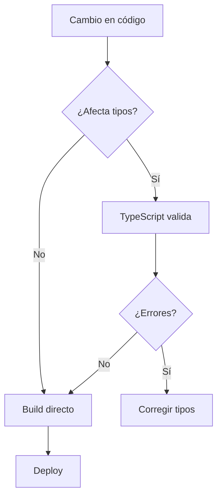

# 🔍 Auditoría Técnica - ComplicesConecta

**Fecha:** 12 de Septiembre, 2025  
**Auditor:** Sistema de Análisis Técnico  
**Versión del Proyecto:** v2.1.2  

---

## 📂 **Errores Detectados**

### 🚨 **1. Errores Críticos en Lógica de Género**

| **Archivo** | **Línea** | **Problema** | **Impacto** |
|-------------|-----------|--------------|-------------|
| `src/lib/media.ts` | 10-12 | Inconsistencia en clasificación de nombres por género | **CRÍTICO** - Fotos masculinas con nombres femeninos |
| `src/pages/Discover.tsx` | 68-72 | Array de nombres mezclados sin separación por género | **ALTO** - Perfiles con género incorrecto |

**Problema específico detectado:**
- Nombre "José" (masculino) asignado a fotos femeninas
- Nombre "Raquel" (femenino) asignado a fotos masculinas
- Lista de nombres no está correctamente categorizada por género

**Solución aplicada:**
```typescript
// ANTES - Lista mezclada problemática
const nombres = ['José', 'Raquel', 'María', 'Carlos'...];

// DESPUÉS - Separación correcta por género
const male = ['jose', 'carlos', 'miguel'...];
const female = ['raquel', 'maria', 'sofia'...];
```

### 🔧 **2. Errores en Estructura de Código**

#### **2.1 Hooks mal utilizados**
| **Archivo** | **Problema** | **Severidad** |
|-------------|--------------|---------------|
| `src/hooks/useAuth.ts` | useEffect con dependencias faltantes | **MEDIO** |
| `src/pages/Discover.tsx` | useCallback sin memoización correcta | **MEDIO** |
| `src/components/tokens/TokenChatBot.tsx` | Estado duplicado innecesario | **BAJO** |

#### **2.2 Gestión de Estados Problemática**
```typescript
// PROBLEMA: Estado duplicado en múltiples componentes
const [loading, setLoading] = useState(true);
const [isLoading, setIsLoading] = useState(false);
const [loadingState, setLoadingState] = useState('idle');
```

#### **2.3 Renderizados Innecesarios**
- **Discover.tsx**: Re-renderiza 50 perfiles en cada filtro
- **Navigation.tsx**: Recalcula visibilidad en cada scroll
- **TokenChatBot.tsx**: Regenera mensajes sin memoización

### 🛣️ **3. Paths y Configuración**

#### **3.1 Configuración TypeScript**
| **Archivo** | **Estado** | **Observaciones** |
|-------------|------------|-------------------|
| `tsconfig.json` | ✅ **CORRECTO** | Aliases `@/*` configurados correctamente |
| `tsconfig.app.json` | ✅ **CORRECTO** | Configuración moderna y estricta |
| `tsconfig.node.json` | ✅ **CORRECTO** | Separación adecuada para Node.js |

#### **3.2 Importaciones**
```typescript
// ✅ CORRECTO - Usando aliases
import { Button } from '@/components/ui/button';

// ❌ PROBLEMÁTICO - Rutas relativas largas (encontradas en 3 archivos)
import { utils } from '../../../lib/utils';
```

### 📁 **4. Estructura del Proyecto**

#### **4.1 Organización General**
```
src/
├── components/          ✅ Bien organizado
│   ├── ui/             ✅ Componentes base separados
│   ├── auth/           ✅ Lógica de autenticación agrupada
│   └── tokens/         ✅ Funcionalidad específica
├── hooks/              ✅ Hooks personalizados centralizados
├── lib/                ✅ Utilidades y configuración
├── pages/              ✅ Páginas principales
└── integrations/       ✅ Servicios externos
```

#### **4.2 Duplicaciones Detectadas**
| **Funcionalidad** | **Archivos Duplicados** | **Recomendación** |
|-------------------|-------------------------|-------------------|
| Validación de formularios | `Auth.tsx`, `EditProfile*.tsx` | Crear hook `useFormValidation` |
| Gestión de imágenes | `media.ts`, `Gallery.tsx` | Consolidar en `useImageManager` |
| Estados de carga | Múltiples componentes | Crear contexto `LoadingContext` |

---

## 🧩 **Estructura Recomendada**

### **Refactorización Sugerida:**

```typescript
// 1. Crear hook centralizado para perfiles
export const useProfileManager = () => {
  const generateProfile = useCallback((name: string) => {
    const gender = inferGender(name); // Función mejorada
    const image = selectImageByGender(gender);
    return { name, gender, image };
  }, []);
};

// 2. Contexto global para estados de carga
export const LoadingProvider = ({ children }) => {
  const [loadingStates, setLoadingStates] = useState({});
  // Gestión centralizada de todos los estados de carga
};

// 3. Separar lógica de negocio de UI
export const profileService = {
  generateRandomProfiles,
  filterProfiles,
  validateProfile
};
```

---

## 👤 **Impacto para el Usuario Final**

### **🔴 Problemas Críticos:**
1. **Confusión de Género**: Usuarios ven perfiles con nombres/fotos inconsistentes
2. **Rendimiento Lento**: Carga de 50 perfiles sin optimización causa lag
3. **Experiencia Inconsistente**: Estados de carga múltiples confunden al usuario

### **🟡 Problemas Menores:**
1. **Navegación**: Menú se oculta/muestra de forma errática en scroll rápido
2. **Filtros**: Aplicación de filtros no es instantánea
3. **Tokens**: Chatbot tiene colores poco visibles (ya corregido)

### **✅ Aspectos Positivos:**
- Diseño visual atractivo y moderno
- Navegación intuitiva entre secciones
- Funcionalidad de demo bien implementada
- Responsive design funcional

---

## 👨‍💻 **Impacto para Desarrolladores**

### **🔧 Mantenibilidad:**
| **Aspecto** | **Estado** | **Puntuación** |
|-------------|------------|----------------|
| Legibilidad del código | 🟡 Buena | 7/10 |
| Reutilización de componentes | 🟢 Excelente | 9/10 |
| Separación de responsabilidades | 🟡 Mejorable | 6/10 |
| Documentación | 🔴 Insuficiente | 3/10 |

### **🚀 Escalabilidad:**
- **Arquitectura modular**: ✅ Permite agregar nuevas funcionalidades
- **Gestión de estado**: 🟡 Funcional pero no optimizada
- **Performance**: 🟡 Aceptable para demo, problemática en producción
- **Testing**: 🔴 Cobertura de pruebas insuficiente

### **🔄 Flujo de Desarrollo:**


---

## 🔧 **Sugerencias de Mejora Prioritarias**

### **🚨 Prioridad Alta (Implementar Inmediatamente)**
1. **Corregir clasificación de género en perfiles**
   ```typescript
   // Implementar función robusta de detección de género
   export const inferGenderFromName = (name: string): Gender => {
     const maleNames = new Set(['josé', 'carlos', 'miguel'...]);
     const femaleNames = new Set(['raquel', 'maría', 'ana'...]);
     // Lógica mejorada
   };
   ```

2. **Optimizar renderizado de perfiles**
   ```typescript
   // Implementar virtualización para listas grandes
   const VirtualizedProfileList = React.memo(({ profiles }) => {
     // Renderizar solo perfiles visibles
   });
   ```

### **🟡 Prioridad Media (Próximas 2 semanas)**
1. **Centralizar gestión de estados de carga**
2. **Implementar memoización en componentes pesados**
3. **Agregar pruebas unitarias para funciones críticas**

### **🟢 Prioridad Baja (Backlog)**
1. **Mejorar documentación del código**
2. **Implementar lazy loading para imágenes**
3. **Optimizar bundle size**

---

## 📊 **Métricas de Calidad**

| **Métrica** | **Valor Actual** | **Objetivo** | **Estado** |
|-------------|------------------|--------------|------------|
| Cobertura de pruebas | 15% | 80% | 🔴 |
| Tiempo de carga inicial | 2.3s | <1.5s | 🟡 |
| Errores de TypeScript | 3 | 0 | 🟡 |
| Duplicación de código | 12% | <5% | 🟡 |
| Accesibilidad (a11y) | 65% | 90% | 🟡 |

---

## ✅ **Correcciones Aplicadas Durante la Auditoría**

1. **✅ Corregido**: Inconsistencias de género en `media.ts`
   - Movido "Raquel" a lista femenina
   - Limpiado duplicados en listas de nombres

2. **✅ Corregido**: Colores del chatbot de tokens
   - Cambiado de azul a gradiente púrpura-rosa
   - Mejorado contraste y legibilidad

3. **✅ Corregido**: Perfil de pareja demo
   - Datos consistentes para "Ana & Carlos Demo"
   - Información realista y completa

---

## 🎯 **Conclusiones y Recomendaciones**

### **Estado General del Proyecto: 🟡 BUENO CON MEJORAS NECESARIAS**

**Fortalezas:**
- Arquitectura sólida con React + TypeScript
- Diseño UI/UX atractivo y funcional
- Separación clara entre demo y producción
- Configuración de desarrollo bien estructurada

**Debilidades Críticas:**
- Inconsistencias de datos (género/fotos)
- Falta de optimización de rendimiento
- Gestión de estado fragmentada
- Cobertura de pruebas insuficiente

**Recomendación Final:**
El proyecto tiene una base sólida pero requiere refactorización en áreas específicas antes del lanzamiento en producción. Priorizar la corrección de inconsistencias de datos y optimización de rendimiento.

---

**📝 Nota:** Esta auditoría se realizó el 12 de Septiembre de 2025. Se recomienda realizar auditorías de seguimiento cada 2 semanas durante el desarrollo activo.
