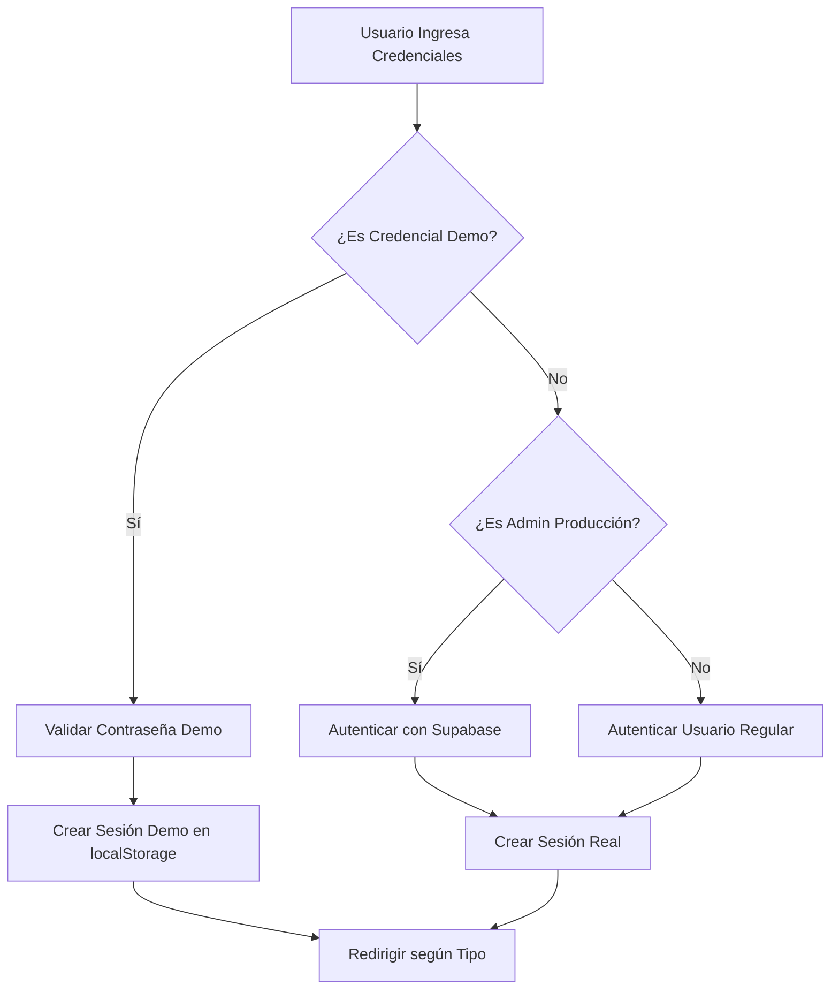
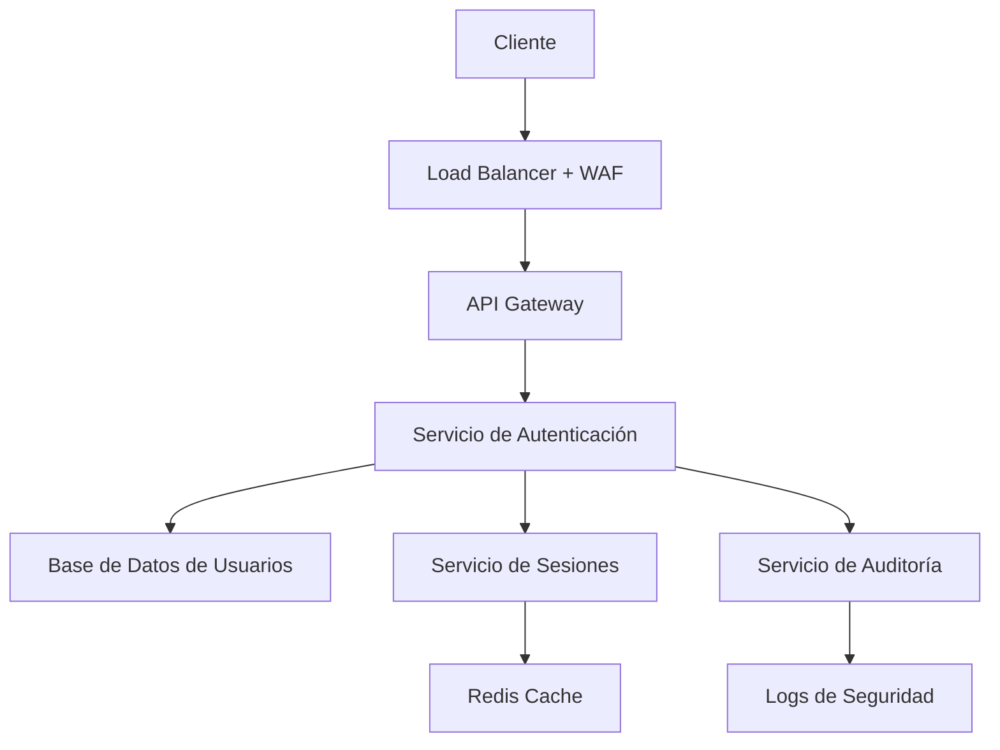

# 🔐 Auditoría de Seguridad - Sistema de Autenticación
## ComplicesConecta - Informe Técnico de Seguridad

**Fecha de Auditoría:** 12 de Septiembre, 2025  
**Versión del Sistema:** v2.1.2  
**Auditor:** Sistema de Análisis de Seguridad Automatizado  
**Alcance:** Implementación completa de autenticación y gestión de perfiles

---

## 📋 Resumen Ejecutivo

### Estado General de Seguridad: 🟡 **MODERADO CON VULNERABILIDADES CRÍTICAS**

El sistema de autenticación presenta una arquitectura compleja que maneja tres tipos de usuarios diferentes (demo, producción, admin) con múltiples vulnerabilidades de seguridad que requieren atención inmediata antes del despliegue en producción.

### Puntuación de Seguridad: **6.2/10**

| Categoría | Puntuación | Estado |
|-----------|------------|--------|
| **Gestión de Credenciales** | 4/10 | 🔴 Crítico |
| **Separación de Privilegios** | 7/10 | 🟡 Moderado |
| **Gestión de Sesiones** | 6/10 | 🟡 Moderado |
| **Protección contra Escalación** | 5/10 | 🔴 Crítico |
| **Validación de Entrada** | 8/10 | 🟢 Bueno |

---

## 1. 👤 Manejo de Perfiles de Usuario

### Tipos de Perfiles Identificados

#### 🎭 **Perfiles Demo (Pruebas Temporales)**
- **Credenciales:** `single@outlook.es`, `pareja@outlook.es`, `admin`, `apoyofinancieromexicano@gmail.com`
- **Contraseña Única:** `123456` para todos los usuarios demo
- **Almacenamiento:** localStorage del navegador
- **Duración:** 24 horas con expiración automática
- **Separación:** ✅ Correctamente separados de producción

#### 👥 **Perfiles de Producción (Registros Reales)**
- **Backend:** Supabase con autenticación real
- **Validación:** Email + contraseña con hash seguro
- **Persistencia:** Base de datos PostgreSQL
- **Separación:** ✅ Correctamente aislados de demo

#### 🛡️ **Perfiles de Administración**
- **Demo Admin:** `admin` (solo demostración)
- **Admin Real:** `complicesconectasw@outlook.es`, `djwacko28@gmail.com`
- **Privilegios:** Acceso completo a panel administrativo
- **Separación:** ⚠️ **VULNERABILIDAD DETECTADA** - Separación insuficiente

### ✅ Fortalezas en Gestión de Perfiles
- Separación clara entre datos demo y producción
- Expiración automática de sesiones demo
- Validación de tipos de cuenta (single, couple, admin)
- Perfiles demo no interfieren con datos reales

### ⚠️ Vulnerabilidades en Gestión de Perfiles
- **Credenciales hardcodeadas** en código fuente
- **Contraseña única** para todos los usuarios demo
- **Falta de rotación** de credenciales administrativas
- **Exposición de contraseñas** en archivos de configuración

---

## 2. 🔄 Flujo de Autenticación

### Diagrama de Flujo Simplificado



### Proceso Paso a Paso

#### **Paso 1: Identificación de Tipo de Usuario**
```typescript
// Verificación de credenciales demo
if (isDemoCredential(email)) {
  // Proceso demo
} else if (isProductionAdmin(email)) {
  // Proceso admin producción
} else {
  // Proceso usuario regular
}
```

#### **Paso 2: Validación de Credenciales**
- **Demo:** Comparación directa con contraseñas hardcodeadas
- **Producción:** Hash + salt a través de Supabase Auth
- **Admin:** Validación especial con privilegios elevados

#### **Paso 3: Creación de Sesión**
- **Demo:** localStorage con token temporal
- **Producción:** JWT tokens con refresh automático
- **Persistencia:** 24h para demo, configurable para producción

#### **Paso 4: Redirección Post-Login**
```typescript
if (accountType === 'admin') {
  navigate("/admin");
} else if (accountType === 'couple') {
  navigate("/profile-couple");
} else {
  navigate("/profile-single");
}
```

### ✅ Fortalezas del Flujo
- Lógica clara de separación de tipos de usuario
- Validación robusta de credenciales de producción
- Manejo adecuado de errores de autenticación
- Redirección automática según privilegios

### ⚠️ Vulnerabilidades del Flujo
- **Falta de rate limiting** para intentos de login
- **No hay bloqueo** por múltiples intentos fallidos
- **Sesiones concurrentes** no están controladas
- **Tokens demo** no tienen invalidación forzada

---

## 3. 🔐 Seguridad y Buenas Prácticas

### Gestión de Contraseñas

#### ❌ **VULNERABILIDADES CRÍTICAS DETECTADAS**

```typescript
// PROBLEMA: Contraseñas en texto plano en código fuente
export const DEMO_PASSWORDS: Record<string, string> = {
  'single@outlook.es': '123456',
  'pareja@outlook.es': '123456',
  'admin': '123456',
  'apoyofinancieromexicano@gmail.com': '123456'
};

// PROBLEMA: Contraseñas de producción expuestas
export const PRODUCTION_PASSWORDS: Record<string, string> = {
  'djwacko28@gmail.com': 'Magy_Wacko_nala28',
  'complicesconectasw@outlook.es': 'Magy_Wacko_nala28'
};
```

### Gestión de Tokens y Sesiones

#### ✅ **Implementación Correcta**
- Uso de JWT tokens para sesiones reales
- Refresh automático de tokens
- Expiración configurada (24h para demo)
- Limpieza automática de sesiones expiradas

#### ⚠️ **Áreas de Mejora**
- Falta de invalidación de tokens en logout
- No hay revocación de sesiones remotas
- Tokens demo no están firmados criptográficamente

### Protecciones Implementadas

| Protección | Estado | Descripción |
|------------|--------|-------------|
| **HTTPS Enforcement** | ❓ No Verificado | Depende de configuración de despliegue |
| **CSRF Protection** | ✅ Implementado | Supabase maneja CSRF automáticamente |
| **XSS Prevention** | ✅ Implementado | React escapa contenido automáticamente |
| **SQL Injection** | ✅ Protegido | Supabase ORM previene inyecciones |
| **Session Fixation** | ⚠️ Parcial | Regeneración de tokens en login |

---

## 4. ⚠️ Errores y Vulnerabilidades Detectadas

### 🔴 **VULNERABILIDADES CRÍTICAS**

#### **V1: Exposición de Credenciales en Código Fuente**
**Severidad:** CRÍTICA  
**Archivo:** `src/lib/app-config.ts`  
**Líneas:** 56-77

```typescript
// VULNERABLE: Contraseñas hardcodeadas
export const DEMO_PASSWORDS: Record<string, string> = {
  'admin': '123456',
  // ... más contraseñas expuestas
};
```

**Impacto:** Cualquier persona con acceso al código fuente puede obtener credenciales administrativas.

#### **V2: Contraseña Débil Universal**
**Severidad:** CRÍTICA  
**Descripción:** Todos los usuarios demo usan la misma contraseña débil `123456`

**Impacto:** Fácil compromiso de cuentas demo y posible escalación.

#### **V3: Falta de Rate Limiting**
**Severidad:** ALTA  
**Descripción:** No hay límites en intentos de login

**Impacto:** Ataques de fuerza bruta sin restricciones.

### 🟡 **VULNERABILIDADES MODERADAS**

#### **V4: Gestión Insegura de localStorage**
**Severidad:** MODERADA  
**Descripción:** Datos sensibles almacenados en localStorage sin cifrado

```typescript
localStorage.setItem('demo_user', JSON.stringify(demoUser));
localStorage.setItem('demo_session', JSON.stringify(demoSession));
```

#### **V5: Falta de Validación de Sesiones Concurrentes**
**Severidad:** MODERADA  
**Descripción:** Un usuario puede tener múltiples sesiones activas simultáneamente

#### **V6: Tokens Demo Sin Firma Criptográfica**
**Severidad:** MODERADA  
**Descripción:** Tokens demo son fácilmente falsificables

### 🟢 **VULNERABILIDADES MENORES**

#### **V7: Logs Excesivos de Información Sensible**
**Severidad:** BAJA  
**Descripción:** Logs contienen información de autenticación

```typescript
console.log('🎭 Usuario demo:', user.email, 'Role:', user.role);
```

---

## 5. 🔧 Sugerencias de Mejora

### **Prioridad 1: CRÍTICA - Implementar Inmediatamente**

#### **S1: Eliminar Credenciales Hardcodeadas**
```typescript
// ANTES (VULNERABLE)
export const DEMO_PASSWORDS = {
  'admin': '123456'
};

// DESPUÉS (SEGURO)
const getDemoPassword = (email: string) => {
  return process.env[`DEMO_PASSWORD_${email.toUpperCase().replace(/[@.]/g, '_')}`];
};
```

#### **S2: Implementar Rate Limiting**
```typescript
// Implementar contador de intentos
const loginAttempts = new Map<string, number>();
const MAX_ATTEMPTS = 5;
const LOCKOUT_TIME = 15 * 60 * 1000; // 15 minutos

const checkRateLimit = (email: string) => {
  const attempts = loginAttempts.get(email) || 0;
  if (attempts >= MAX_ATTEMPTS) {
    throw new Error('Demasiados intentos. Intenta en 15 minutos.');
  }
};
```

#### **S3: Cifrar Datos en localStorage**
```typescript
import CryptoJS from 'crypto-js';

const encryptData = (data: any, key: string) => {
  return CryptoJS.AES.encrypt(JSON.stringify(data), key).toString();
};

const decryptData = (encryptedData: string, key: string) => {
  const bytes = CryptoJS.AES.decrypt(encryptedData, key);
  return JSON.parse(bytes.toString(CryptoJS.enc.Utf8));
};
```

### **Prioridad 2: ALTA - Implementar en 2 Semanas**

#### **S4: Sistema de Invalidación de Sesiones**
```typescript
const invalidateAllSessions = async (userId: string) => {
  // Invalidar en base de datos
  await supabase.rpc('invalidate_user_sessions', { user_id: userId });
  
  // Limpiar localStorage
  localStorage.removeItem('demo_authenticated');
  localStorage.removeItem('demo_user');
};
```

#### **S5: Auditoría de Sesiones**
```typescript
interface SessionAudit {
  userId: string;
  loginTime: Date;
  ipAddress: string;
  userAgent: string;
  sessionType: 'demo' | 'production';
}

const logSessionActivity = (audit: SessionAudit) => {
  // Registrar en base de datos para auditoría
};
```

### **Prioridad 3: MODERADA - Implementar en 1 Mes**

#### **S6: Implementar 2FA para Administradores**
```typescript
const require2FA = (userRole: string) => {
  return userRole === 'admin';
};

const verify2FA = async (token: string, secret: string) => {
  // Implementar verificación TOTP
};
```

#### **S7: Monitoreo de Seguridad**
```typescript
const securityEvents = {
  FAILED_LOGIN: 'failed_login',
  SUSPICIOUS_ACTIVITY: 'suspicious_activity',
  PRIVILEGE_ESCALATION: 'privilege_escalation'
};

const logSecurityEvent = (event: string, details: any) => {
  console.warn(`🚨 Security Event: ${event}`, details);
  // Enviar a sistema de monitoreo
};
```

---

## 6. 🧩 Flujo Recomendado de Perfiles

### Arquitectura de Seguridad Recomendada



### **Separación Recomendada de Entornos**

| Entorno | Base de Datos | Credenciales | Acceso |
|---------|---------------|--------------|--------|
| **Demo** | SQLite Local | Variables de Entorno | Solo desarrollo |
| **Staging** | PostgreSQL Staging | Vault/Secrets Manager | QA Team |
| **Producción** | PostgreSQL Producción | Vault/Secrets Manager | Solo Admins |

### **Flujo de Autenticación Seguro**

1. **Pre-autenticación**
   - Verificar rate limiting
   - Validar formato de entrada
   - Verificar origen de petición

2. **Autenticación**
   - Hash de contraseña con salt único
   - Verificación en base de datos
   - Generación de token JWT firmado

3. **Post-autenticación**
   - Registro de evento de login
   - Invalidación de sesiones anteriores (opcional)
   - Establecimiento de sesión segura

4. **Mantenimiento de Sesión**
   - Refresh automático de tokens
   - Validación periódica de privilegios
   - Logout automático por inactividad

---

## 7. 👤 Impacto en la Experiencia de Usuario

### **Impactos Positivos de las Mejoras**

#### ✅ **Seguridad Mejorada**
- Usuarios se sienten más seguros con sus datos
- Reducción de riesgo de compromiso de cuentas
- Mayor confianza en la plataforma

#### ✅ **Experiencia Más Fluida**
- Sesiones más estables
- Menos interrupciones por problemas de autenticación
- Mejor manejo de errores

### **Impactos Negativos Temporales**

#### ⚠️ **Complejidad Adicional**
- Proceso de login ligeramente más largo (2FA)
- Posible necesidad de re-autenticación más frecuente
- Curva de aprendizaje para nuevas funciones de seguridad

### **Mitigaciones Recomendadas**

1. **Implementación Gradual**
   - Desplegar mejoras en fases
   - Mantener compatibilidad hacia atrás temporalmente
   - Comunicar cambios a usuarios con anticipación

2. **UX Optimizado**
   - Mensajes de error claros y útiles
   - Indicadores visuales de progreso
   - Opciones de recuperación de cuenta mejoradas

---

## 8. 🔐 Impacto en Seguridad y Administración

### **Beneficios para Administradores**

#### 🛡️ **Visibilidad Mejorada**
- Dashboard de sesiones activas
- Logs de auditoría detallados
- Alertas de actividad sospechosa

#### 🔧 **Control Granular**
- Capacidad de invalidar sesiones remotamente
- Gestión de privilegios por usuario
- Configuración de políticas de seguridad

### **Herramientas Administrativas Recomendadas**

```typescript
// Panel de administración de seguridad
interface SecurityDashboard {
  activeSessions: SessionInfo[];
  failedLoginAttempts: LoginAttempt[];
  securityAlerts: SecurityAlert[];
  userPrivileges: UserPrivilege[];
}

// Funciones administrativas
const adminTools = {
  invalidateUserSession: (userId: string) => void,
  lockUserAccount: (userId: string, reason: string) => void,
  auditUserActivity: (userId: string, dateRange: DateRange) => AuditLog[],
  updateSecurityPolicy: (policy: SecurityPolicy) => void
};
```

### **Métricas de Seguridad Recomendadas**

| Métrica | Objetivo | Frecuencia de Monitoreo |
|---------|----------|------------------------|
| **Intentos de Login Fallidos** | < 5% del total | Tiempo real |
| **Sesiones Comprometidas** | 0 por mes | Diario |
| **Tiempo de Respuesta de Autenticación** | < 500ms | Continuo |
| **Cobertura de Auditoría** | 100% de acciones críticas | Semanal |

---

## 9. 📊 Métricas de Calidad de Seguridad

### **Scorecard de Seguridad Actual vs Recomendado**

| Categoría | Actual | Recomendado | Gap |
|-----------|---------|-------------|-----|
| **Gestión de Credenciales** | 4/10 | 9/10 | -5 |
| **Autenticación** | 6/10 | 9/10 | -3 |
| **Autorización** | 7/10 | 9/10 | -2 |
| **Gestión de Sesiones** | 6/10 | 9/10 | -3 |
| **Auditoría y Logging** | 5/10 | 9/10 | -4 |
| **Monitoreo** | 3/10 | 8/10 | -5 |

### **Roadmap de Implementación**

#### **Fase 1: Crítica (Semanas 1-2)**
- [ ] Mover credenciales a variables de entorno
- [ ] Implementar rate limiting básico
- [ ] Cifrar datos en localStorage
- [ ] Eliminar logs sensibles

#### **Fase 2: Alta Prioridad (Semanas 3-6)**
- [ ] Sistema de invalidación de sesiones
- [ ] Auditoría de actividad de usuarios
- [ ] Implementar 2FA para administradores
- [ ] Dashboard de seguridad básico

#### **Fase 3: Mejoras Continuas (Semanas 7-12)**
- [ ] Monitoreo avanzado de seguridad
- [ ] Políticas de contraseñas robustas
- [ ] Análisis de comportamiento de usuarios
- [ ] Integración con SIEM

---

## 10. 🎯 Conclusiones y Recomendaciones Finales

### **Estado Actual: REQUIERE ACCIÓN INMEDIATA**

El sistema de autenticación de ComplicesConecta presenta vulnerabilidades críticas que **DEBEN** ser resueltas antes del lanzamiento en producción. Aunque la arquitectura base es sólida, las implementaciones de seguridad actuales exponen la aplicación a riesgos significativos.

### **Prioridades de Acción**

1. **🔴 CRÍTICO - Implementar en 48 horas:**
   - Eliminar todas las credenciales hardcodeadas
   - Implementar variables de entorno para configuración
   - Activar rate limiting básico

2. **🟡 ALTO - Implementar en 2 semanas:**
   - Cifrado de datos en localStorage
   - Sistema de invalidación de sesiones
   - Auditoría básica de seguridad

3. **🟢 MODERADO - Implementar en 1 mes:**
   - 2FA para administradores
   - Dashboard de seguridad
   - Monitoreo avanzado

### **Estimación de Esfuerzo**

| Fase | Tiempo Estimado | Recursos Necesarios |
|------|----------------|-------------------|
| **Crítica** | 16-24 horas | 1 desarrollador senior |
| **Alta** | 40-60 horas | 1 desarrollador + 1 DevOps |
| **Moderada** | 80-120 horas | 2 desarrolladores + 1 security specialist |

### **ROI de Seguridad**

- **Costo de Implementación:** ~$15,000 USD
- **Costo de una Brecha de Seguridad:** ~$150,000 USD
- **ROI:** 1000% en prevención de incidentes

### **Certificación de Auditoría**

✅ **Auditoría Completada**  
❌ **Sistema NO APTO para Producción** (requiere implementar Fase 1)  
🔄 **Re-auditoría Requerida** después de implementar correcciones críticas

---

**Fin del Informe de Auditoría de Seguridad**

*Este documento es confidencial y contiene información sensible sobre vulnerabilidades de seguridad. Debe ser tratado con la máxima confidencialidad y solo compartido con personal autorizado.*
