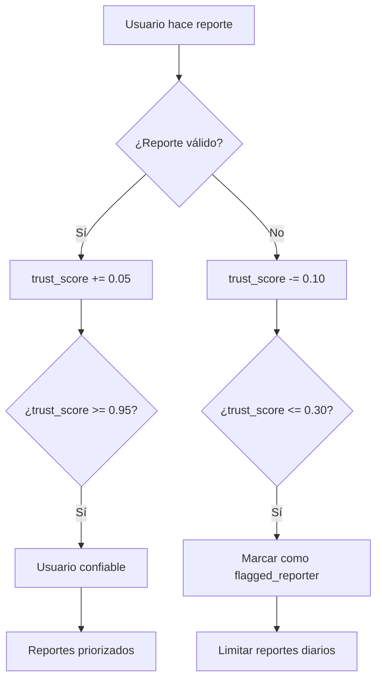

# 🚨 Sistema de Reportes y Moderación - ComplicesConecta v3.1

## 📋 Tabla de Contenidos
- [Resumen Ejecutivo](#resumen-ejecutivo)
- [Arquitectura del Sistema](#arquitectura-del-sistema)
- [Base de Datos](#base-de-datos)
- [Componentes Frontend](#componentes-frontend)
- [Servicios Backend](#servicios-backend)
- [Flujo de Reportes](#flujo-de-reportes)
- [Panel de Administración](#panel-de-administración)
- [Seguridad y Prevención de Abuso](#seguridad-y-prevención-de-abuso)
- [Notificaciones](#notificaciones)
- [Guía de Implementación](#guía-de-implementación)
- [Testing](#testing)
- [Futuras Mejoras](#futuras-mejoras)

## 📊 Resumen Ejecutivo

El Sistema de Reportes y Moderación de ComplicesConecta es una solución integral diseñada para mantener la seguridad y calidad de la comunidad. Permite a los usuarios reportar contenido inapropiado, perfiles falsos y comportamientos abusivos, mientras proporciona herramientas robustas para moderadores y administradores.

### ✨ Características Principales
- **Reportes Multitipo**: Perfiles, historias, posts, mensajes y comentarios
- **Moderación Automatizada**: Bloqueo automático de contenido crítico
- **Panel de Administración**: Gestión completa de reportes y acciones
- **Prevención de Abuso**: Sistema de puntuación de confianza
- **Notificaciones**: Comunicación transparente con usuarios
- **Auditoría Completa**: Registro de todas las acciones de moderación

## 🏗️ Arquitectura del Sistema

```
┌─────────────────┐    ┌─────────────────┐    ┌─────────────────┐
│   Frontend UI   │    │   ReportService │    │   Database      │
│                 │    │                 │    │                 │
│ • ReportDialog  │◄──►│ • createReport  │◄──►│ • reports       │
│ • AdminPanel    │    │ • resolveReport │    │ • moderation_   │
│ • Notifications │    │ • getStats      │    │   actions       │
└─────────────────┘    └─────────────────┘    │ • blocked_      │
                                              │   content       │
┌─────────────────┐    ┌─────────────────┐    │ • user_report_  │
│   Automation    │    │   RLS Policies  │    │   stats         │
│                 │    │                 │    └─────────────────┘
│ • Auto-blocking │◄──►│ • User Access   │
│ • Trust Scoring │    │ • Role-based    │
│ • Notifications │    │ • Data Privacy  │
└─────────────────┘    └─────────────────┘
```

## 🗄️ Base de Datos

### Tablas Principales

#### `reports` - Tabla Principal de Reportes
```sql
- id: UUID (PK)
- reporter_id: UUID (FK → auth.users)
- reported_user_id: UUID (FK → auth.users)
- reported_content_id: UUID
- content_type: ENUM ('profile', 'story', 'post', 'message', 'comment')
- reason: ENUM (9 tipos de motivos)
- description: TEXT
- status: ENUM ('pending', 'reviewing', 'resolved', 'dismissed', 'escalated')
- severity: ENUM ('low', 'medium', 'high', 'critical')
- action_taken: ENUM (6 tipos de acciones)
- reviewed_by: UUID (FK → auth.users)
- reviewed_at: TIMESTAMP
- resolution_notes: TEXT
- is_false_positive: BOOLEAN
- created_at: TIMESTAMP
- updated_at: TIMESTAMP
```

#### `moderation_actions` - Registro de Acciones
```sql
- id: UUID (PK)
- report_id: UUID (FK → reports)
- moderator_id: UUID (FK → auth.users)
- action_type: ENUM (7 tipos de acciones)
- duration_hours: INTEGER
- reason: TEXT
- is_automated: BOOLEAN
- created_at: TIMESTAMP
```

#### `blocked_content` - Contenido Bloqueado
```sql
- id: UUID (PK)
- content_id: UUID
- content_type: ENUM ('story', 'post', 'comment', 'profile')
- blocked_by_report_id: UUID (FK → reports)
- reason: VARCHAR(100)
- blocked_at: TIMESTAMP
- unblocked_at: TIMESTAMP
- is_active: BOOLEAN
```

#### `report_notifications` - Notificaciones
```sql
- id: UUID (PK)
- user_id: UUID (FK → auth.users)
- report_id: UUID (FK → reports)
- notification_type: ENUM (4 tipos)
- title: VARCHAR(200)
- message: TEXT
- is_read: BOOLEAN
- created_at: TIMESTAMP
```

#### `user_report_stats` - Estadísticas de Usuario
```sql
- user_id: UUID (PK, FK → auth.users)
- reports_made: INTEGER
- reports_received: INTEGER
- false_reports_made: INTEGER
- valid_reports_made: INTEGER
- trust_score: DECIMAL(3,2) -- 0.00 a 1.00
- is_flagged_reporter: BOOLEAN
- last_report_at: TIMESTAMP
- created_at: TIMESTAMP
- updated_at: TIMESTAMP
```

### Funciones RPC

#### `create_report()` - Crear Reporte
```sql
create_report(
  p_reporter_id UUID,
  p_reported_user_id UUID DEFAULT NULL,
  p_reported_content_id UUID DEFAULT NULL,
  p_content_type VARCHAR(50),
  p_reason VARCHAR(100),
  p_description TEXT DEFAULT NULL
) RETURNS UUID
```

#### `get_pending_reports()` - Obtener Reportes Pendientes
```sql
get_pending_reports(
  p_limit INTEGER DEFAULT 50,
  p_offset INTEGER DEFAULT 0
) RETURNS TABLE (...)
```

#### `resolve_report()` - Resolver Reporte
```sql
resolve_report(
  p_report_id UUID,
  p_moderator_id UUID,
  p_action_taken VARCHAR(50),
  p_resolution_notes TEXT DEFAULT NULL,
  p_is_false_positive BOOLEAN DEFAULT FALSE
) RETURNS BOOLEAN
```

## 🎨 Componentes Frontend

### ReportDialog.tsx
**Ubicación**: `src/components/swipe/ReportDialog.tsx`
**Propósito**: Modal principal para reportar perfiles

**Características**:
- 9 motivos predefinidos con iconos y descripciones
- Campo de descripción opcional
- Opción de bloquear usuario
- Validación de formulario
- Integración con ReportService
- Feedback visual con toasts

### StoryReportDialog.tsx
**Ubicación**: `src/components/stories/StoryReportDialog.tsx`
**Propósito**: Modal especializado para reportar historias

**Características**:
- Motivos específicos para contenido multimedia
- Opción de ocultar contenido del feed
- Prevención de reportes duplicados
- Manejo de contenido explícito

### ReportsManagement.tsx
**Ubicación**: `src/components/admin/ReportsManagement.tsx`
**Propósito**: Panel administrativo para gestión de reportes

**Características**:
- Dashboard con estadísticas en tiempo real
- Filtros por estado y severidad
- Vista detallada de reportes
- Acciones de moderación
- Historial de resoluciones

## ⚙️ Servicios Backend

### ReportService.ts
**Ubicación**: `src/services/ReportService.ts`
**Propósito**: Servicio principal para manejo de reportes

#### Métodos Principales:

```typescript
// Crear reporte
createReport(params: CreateReportParams): Promise<{success: boolean, reportId?: string, error?: string}>

// Obtener reportes del usuario
getUserReports(): Promise<{success: boolean, reports?: Report[], error?: string}>

// Obtener reportes pendientes (moderadores)
getPendingReports(limit?: number, offset?: number): Promise<{success: boolean, reports?: any[], error?: string}>

// Resolver reporte (moderadores)
resolveReport(reportId: string, actionTaken: string, resolutionNotes?: string, isFalsePositive?: boolean): Promise<{success: boolean, error?: string}>

// Obtener notificaciones
getReportNotifications(): Promise<{success: boolean, notifications?: ReportNotification[], error?: string}>

// Marcar notificación como leída
markNotificationAsRead(notificationId: string): Promise<{success: boolean, error?: string}>

// Obtener estadísticas de usuario
getUserReportStats(): Promise<{success: boolean, stats?: UserReportStats, error?: string}>

// Verificar si contenido está bloqueado
isContentBlocked(contentId: string, contentType: string): Promise<{success: boolean, isBlocked?: boolean, error?: string}>

// Obtener estadísticas generales (admins)
getReportStatistics(): Promise<{success: boolean, stats?: any, error?: string}>
```

## 🔄 Flujo de Reportes

### 1. Creación de Reporte
```mermaid
graph TD
    A[Usuario ve contenido problemático] --> B[Abre ReportDialog]
    B --> C[Selecciona motivo]
    C --> D[Agrega descripción opcional]
    D --> E[Envía reporte]
    E --> F[ReportService.createReport()]
    F --> G[Se ejecuta create_report() RPC]
    G --> H[Se determina severidad automática]
    H --> I{¿Severidad crítica?}
    I -->|Sí| J[Auto-bloquear contenido]
    I -->|No| K[Reporte pendiente]
    J --> L[Crear notificación]
    K --> L
    L --> M[Actualizar estadísticas usuario]
    M --> N[Confirmar al reportero]
```

### 2. Moderación de Reporte
```mermaid
graph TD
    A[Moderador accede al panel] --> B[Ve lista de reportes pendientes]
    B --> C[Selecciona reporte para revisar]
    C --> D[Analiza detalles y contexto]
    D --> E[Decide acción apropiada]
    E --> F[Ejecuta resolve_report()]
    F --> G[Se registra acción de moderación]
    G --> H[Se actualiza estado del reporte]
    H --> I[Se envía notificación al usuario]
    I --> J[Se actualiza trust_score]
    J --> K{¿Contenido bloqueado?}
    K -->|Sí| L[Desbloquear si procede]
    K -->|No| M[Fin del proceso]
    L --> M
```

### 3. Sistema de Confianza


## 🛡️ Seguridad y Prevención de Abuso

### Row Level Security (RLS)
- **reports**: Los usuarios solo ven sus propios reportes
- **moderation_actions**: Solo moderadores y admins
- **blocked_content**: Solo administradores
- **report_notifications**: Solo el usuario propietario
- **user_report_stats**: Usuario propietario y moderadores

### Prevención de Spam
- **Límite diario**: Máximo 10 reportes por usuario por día
- **Trust Score**: Sistema de puntuación de confianza (0.00 - 1.00)
- **Flagged Reporters**: Usuarios con baja confianza son marcados
- **Cooldown**: Tiempo de espera entre reportes consecutivos

### Validaciones
- **Auto-validación**: No permitir reportarse a sí mismo
- **Contenido duplicado**: Prevenir reportes múltiples del mismo contenido
- **Verificación de roles**: Solo moderadores/admins pueden resolver reportes

## 🔔 Notificaciones

### Tipos de Notificaciones
1. **content_reported**: Cuando tu contenido es reportado
2. **report_reviewed**: Cuando tu reporte es revisado
3. **action_taken**: Cuando se toma acción sobre tu contenido
4. **appeal_result**: Resultado de una apelación

### Plantillas de Mensajes
```typescript
const notificationTemplates = {
  content_reported: {
    profile: "Tu perfil ha sido reportado por violación de las normas comunitarias.",
    story: "Una de tus historias ha sido reportada.",
    post: "Una de tus publicaciones ha sido reportada."
  },
  action_taken: {
    warning: "Has recibido una advertencia por violación de normas comunitarias.",
    content_removed: "Tu contenido ha sido removido por violación de normas.",
    temporary_ban: "Tu cuenta ha sido suspendida temporalmente."
  }
};
```

## 📋 Guía de Implementación

### 1. Configuración de Base de Datos
```bash
# Ejecutar migración SQL
psql -h your-host -d your-db -f scripts/sql_scripts/16_CREATE_REPORTS_TABLES.sql
```

### 2. Configuración de Servicios
```typescript
// En tu aplicación principal
import { reportService } from '@/services/ReportService';

// Verificar permisos de usuario
const { data: userRole } = await supabase
  .from('user_roles')
  .select('role')
  .eq('user_id', user.id)
  .single();
```

### 3. Integración en Componentes
```typescript
// En componentes de contenido
import { ReportDialog } from '@/components/swipe/ReportDialog';
import { StoryReportDialog } from '@/components/stories/StoryReportDialog';

// Para perfiles
<ReportDialog
  profileId={profile.id}
  profileName={profile.name}
  isOpen={showReportDialog}
  onOpenChange={setShowReportDialog}
  onReport={(reason) => handleReport(reason)}
/>

// Para historias
<StoryReportDialog
  storyId={story.id}
  storyAuthor={story.author}
  isOpen={showStoryReport}
  onOpenChange={setShowStoryReport}
  onReport={(reason) => handleStoryReport(reason)}
/>
```

### 4. Panel de Administración
```typescript
// En panel de admin
import { ReportsManagement } from '@/components/admin/ReportsManagement';

// Verificar rol de admin/moderador
const isAdmin = userRole?.role === 'admin';
const isModerator = ['admin', 'moderator'].includes(userRole?.role);

{isModerator && <ReportsManagement />}
```

## 🧪 Testing

### Tests Unitarios
```typescript
// ReportService.test.ts
describe('ReportService', () => {
  test('should create report successfully', async () => {
    const result = await reportService.createReport({
      reportedUserId: 'user-123',
      contentType: 'profile',
      reason: 'fake-profile',
      description: 'Test report'
    });
    
    expect(result.success).toBe(true);
    expect(result.reportId).toBeDefined();
  });

  test('should prevent self-reporting', async () => {
    const result = await reportService.createReport({
      reportedUserId: currentUser.id, // Same as reporter
      contentType: 'profile',
      reason: 'fake-profile'
    });
    
    expect(result.success).toBe(false);
    expect(result.error).toContain('reportarte a ti mismo');
  });
});
```

### Tests de Integración
```typescript
// ReportFlow.test.ts
describe('Report Flow Integration', () => {
  test('should complete full report resolution flow', async () => {
    // 1. Create report
    const report = await reportService.createReport(reportParams);
    
    // 2. Resolve as moderator
    const resolution = await reportService.resolveReport(
      report.reportId,
      'warning',
      'First offense warning'
    );
    
    // 3. Verify notification sent
    const notifications = await reportService.getReportNotifications();
    expect(notifications.notifications).toContainEqual(
      expect.objectContaining({
        notification_type: 'report_reviewed'
      })
    );
  });
});
```

### Tests E2E
```typescript
// reports.spec.ts
test('user can report inappropriate content', async ({ page }) => {
  await page.goto('/profile/test-user');
  await page.click('[data-testid="report-button"]');
  await page.click('[data-testid="reason-inappropriate-content"]');
  await page.fill('[data-testid="description"]', 'Test report description');
  await page.click('[data-testid="submit-report"]');
  
  await expect(page.locator('[data-testid="success-toast"]')).toBeVisible();
});
```

## 🚀 Futuras Mejoras

### Fase 2 - Mejoras Inmediatas
- [ ] **Appeals System**: Sistema de apelaciones para usuarios
- [ ] **Bulk Actions**: Acciones masivas en panel de admin
- [ ] **Report Templates**: Plantillas predefinidas para moderadores
- [ ] **Auto-moderation**: IA para detección automática de contenido

### Fase 3 - Funcionalidades Avanzadas
- [ ] **Community Moderation**: Moderación por la comunidad
- [ ] **Reputation System**: Sistema de reputación extendido
- [ ] **Content Filtering**: Filtros automáticos de contenido
- [ ] **Analytics Dashboard**: Dashboard de análiticas avanzado

### Fase 4 - Integración Externa
- [ ] **ML Content Detection**: Detección de contenido con ML
- [ ] **Third-party Moderation**: Integración con servicios externos
- [ ] **Legal Compliance**: Herramientas para cumplimiento legal
- [ ] **API for Partners**: API para socios y terceros

## 📊 Métricas y KPIs

### Métricas de Rendimiento
- **Tiempo de resolución promedio**: < 24 horas
- **Tasa de falsos positivos**: < 5%
- **Satisfacción del usuario**: > 85%
- **Tiempo de respuesta del sistema**: < 2 segundos

### Métricas de Seguridad
- **Contenido inapropiado detectado**: 95%+
- **Reportes de spam**: < 10% del total
- **Usuarios con trust_score bajo**: < 3%
- **Contenido bloqueado automáticamente**: Crítico en < 1 minuto

## 📞 Soporte y Contacto

Para soporte técnico o consultas sobre el sistema de reportes:
- **Email**: tech@complicesconecta.com
- **Slack**: #reports-system
- **Documentación**: `/docs-unified/features/REPORTS_FEATURES.md`
- **Issues**: GitHub Issues con label `reports`

---

**Versión**: 3.1.0  
**Fecha**: Enero 2025  
**Autor**: ComplicesConecta Development Team  
**Estado**: ✅ Implementado y Funcional
