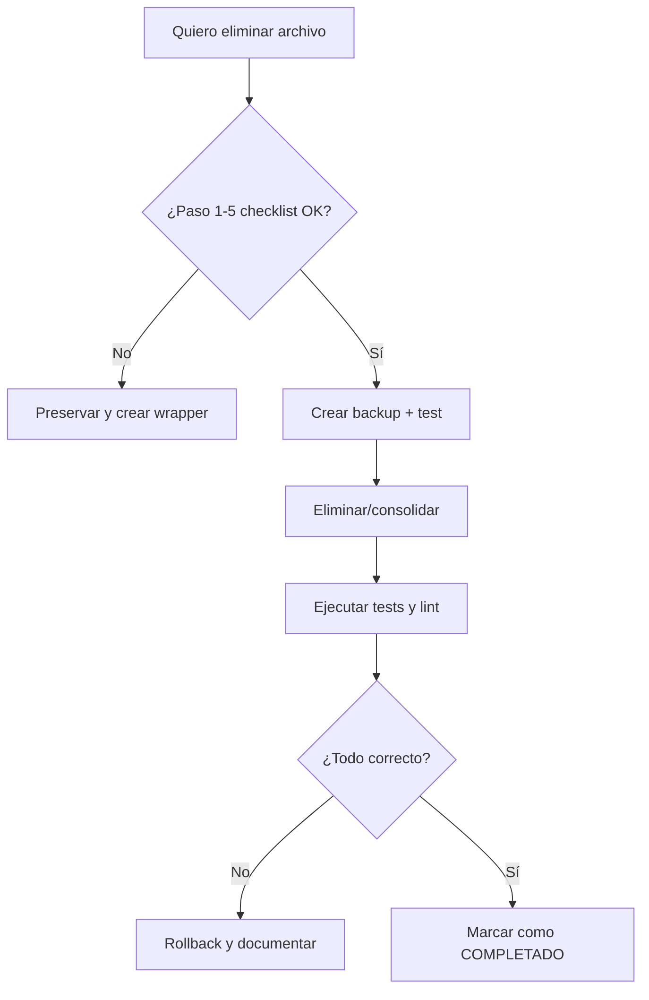

# 🛠️ Super Prompt Maestro – Auditoría & Validación Integral (ComplicesConecta v2.9.3)

**Versión:** v1  
**Fecha de generación:** 20 de Septiembre, 2025  
**Rama objetivo:** `fix/auditoria-2025`  

---

## Objetivo general (resumido)
Realizar una auditoría **profesional, exhaustiva y minuciosa** del proyecto `ComplicesConecta`, desde la raíz hasta cada subdirectorio (excluyendo `/android` y `node_modules`), con énfasis en:
- Validaciones de datos (tipos, formatos, límites, obligatoriedad).
- Reglas de negocio y coherencia lógica.
- Detección y reparación de fallas silenciosas (errores que no generan log o feedback).
- Separación clara y segura entre **demo** y **real**.
- No crear/eliminar archivos o directorios sin previa verificación.
- Reporte detallado, reproducible y rastreable.

> **Regla inquebrantable:** Antes de *crear* o *eliminar* cualquier archivo/directorio, verifica exhaustivamente si existe o si debe consolidarse. Si existe, **actualiza** o **consolida**; **no dupliques**.

---

## I. Reglas operativas (siempre)
1. **Verificar existencia:**  
   - Antes de crear: `if exists -> update; else -> create`.
   - Antes de eliminar: ejecutar checklist de 5 pasos (ver sección V).
2. **Safe-mode por defecto:** jamás ejecutar `rm` o `git rm` sin un wrapper que cree un backup o wrapper de compatibilidad.
3. **Guardar progreso:** cada cambio importante debe registrarse en `reports/PROGRESS_TRACKER.md` con timestamp y autor (auto).
4. **Retomar al fallar:** si una tarea falla, registrar, revertir si hay daño parcial, y **retomar** desde la última subtarea completada verificando que esté aplicada.
5. **No romper**: no tocar lógica de negocio crítica (tokens, auth, matching, pagos, geolocalización, realtime) sin pruebas unitarias y E2E que pasen antes y después.
6. **Wrappers de compatibilidad:** cuando consolides un archivo movido/eliminado, crea re-export wrappers en la antigua ruta para evitar romper imports existentes.

---

## II. Comprobaciones de validación por campo (la "checklist técnica")
Para cada endpoint, form, hook, servicio o migration revisa:

- ✔️ **¿El tipo de dato es correcto?** (TypeScript interfaces / Zod / DB types)  
  - Comando recomendado: `rg "type .* =|interface .* =" -n src || true`
- ✔️ **¿El valor es válido?** (no `null`/`undefined` cuando es obligatorio)  
- ✔️ **¿Cumple límites de longitud?** (username, bio, message, token)  
  - Ejemplo: bio ≤ 2000 chars, username 3..30 chars
- ✔️ **¿El formato es válido?** (email regex, ISO dates, UUIDs, coordenadas lat/lng)  
  - Regex sugerido email: `^[^@\s]+@[^@\s]+\.[^@\s]+$`
- ✔️ **¿El campo es obligatorio?** (form validations y backend checks)  
- ✔️ **¿Encaja con reglas del negocio?** (edad ≥ 18, profile_type ∈ {single,couple}, interests ∈ catalogo)  
- ✔️ **¿Se valida en frontend y backend?** (doble capa)
- ✔️ **¿Hay tests para estas validaciones?** (unit & e2e)

---

## III. Validaciones y verificaciones automáticas sugeridas (comandos)
> Ejecuta manualmente si prefieres precisión absoluta (aunque tardado). Aquí hay comandos útiles:

- Buscar posibles campos sin validación (uso de `any`, ausencia de Zod):
```bash
rg "\bany\b" src | wc -l
rg "zod|Zod" -n src || true
rg "schema\.|z\.object" -n src || true
```

- Buscar campos email / date / uuid usages:
```bash
rg "email\b|@?isoDate|toISOString|\busuid\b|uuid" -n src || true
```

- Buscar creación/eliminación de archivos en scripts:
```bash
rg "fs\.writeFile|fs\.rm|fs\.unlink|rimraf|rm -rf" -n || true
```

- Rastrear imports y duplicados:
```bash
# archivos con mismo nombre
find src -type f -name "*.tsx" -or -name "*.ts" | sed 's#.*/##' | sort | uniq -d
# imports hacia ruta consolidada
rg "from '\@/components/.+/(ChatBubble|ProfileCard)'" -n || true
```

---

## IV. Proceso de auditoría paso a paso (manual + seguro)
Sigue este procedimiento por cada directorio (recorre manualmente si quieres máxima exactitud):

1. **Arranque**
   - Checkout a `fix/auditoria-2025`.
   - `git status`, `git pull origin fix/auditoria-2025`.
   - Crear rama de trabajo local: `git checkout -b fix/audit-step-<NN>`.

2. **Mapeo del directorio**
   - Entra en el directorio: `cd src/<subdir>`.
   - Listar archivos: `ls -la`.
   - Abrir `README.md` si existe.

3. **Inspección archivo por archivo**
   Para cada archivo `.ts/.tsx/.js/.md/.sql`:
   - Revisar si tiene validaciones (Zod/Yup/interface).
   - Checar uso de `any`, `// TODO`, `console.log`.
   - Revisar imports (si es wrapper o canonical).
   - Revisar tests asociados.
   - Registrar hallazgos en `reports/AUDIT_VALIDATION_REPORT.md` y `reports/PROGRESS_TRACKER.md`.

4. **Aplicación de correcciones (si procede)**
   - **Antes de crear**: `rg -n "NombreArchivo"` en repo para verificar existencia en otras rutas.
   - **Antes de eliminar**: ejecutar Checklist (ver V).
   - Comitear los cambios en pequeños commits atómicos con mensaje claro.
   - Ejecutar `npx tsc --noEmit` y `npm run test` (o `pnpm`)—si falla, revertir y documentar.
   - Subir `git push origin <branch>` y abrir PR si aplica.

5. **Validación final en directorio**
   - Ejecutar `npx tsc --noEmit`, `npm run lint`, `npm run test`.
   - Registrar resultado y marcar casilla en `reports/PROGRESS_TRACKER.md`.

6. **Iterar** en todos los subdirectorios hasta la raíz.

---

## V. Checklist OBLIGATORIO ANTES DE ELIMINAR (5 pasos)
1. **Referencias directas e indirectas** (`rg "<ComponentName|/old/path"`).  
2. **Funcionalidad única** (¿maneja estado crítico, auth, geo, realtime?).  
3. **Dependencias** (hooks, servicios, types).  
4. **Futuro / roadmap** (comentarios TODO, issues, PRs relacionados).  
5. **Consolidación** (migrar código al canonical component + crear wrapper de compatibilidad).

Si alguna de estas respuestas es **Sí (crítica)** → **NO eliminar**. Documentar y marcar `PRESERVE` en el reporte.

---

## VI. Manejo de errores y reanudación (resume-on-error)
- **Regla:** Si una tarea falla, no avanzar—registrar, revertir cambios parciales y reintentar tras corrección.
- **Protocolo:**
  1. Registrar error con `reports/ERRORS_LOG.md` y timestamp.
  2. Identificar última subtarea completada (`reports/PROGRESS_TRACKER.md`).
  3. Verificar que esa subtarea esté realmente aplicada (re-run checks).
  4. Si aplicada → continuar a la siguiente subtarea.
  5. Si no aplicada → aplicar o explicar porqué no pudo completarse y detener.

---

## VII. Diagramas de flujo (repetir ante inconsistencia)
> Cada inconsistencia detectada debe generar automáticamente un diagrama de flujo (Mermaid) que muestre: causa → efecto → solución propuesta.

**Diagrama general de resolución de inconsistencia**
```mermaid
flowchart TD
  A[Detecta inconsistencia] --> B{¿Es validación de datos?}
  B -->|Sí| C[Registrar hallazgo en Reporte]
  B -->|No| D{¿Es lógica de negocio?}
  D -->|Sí| C
  D -->|No| E[Revisar imports/duplicados]
  C --> F[Analizar causa raíz]
  F --> G[Proponer solución (code + tests)]
  G --> H[Aplicar cambio en branch seguro]
  H --> I[Ejecutar tests unit/e2e]
  I --> J{¿Tests OK?}
  J -->|No| K[Registrar fallo, revertir, regresar a F]
  J -->|Sí| L[Documentar y cerrar hallazgo]
```

**Diagrama de "antes de eliminar"**


---

## VIII. Formato del hallazgo (plantilla)
Añade cada hallazgo en `reports/AUDIT_VALIDATION_REPORT.md` con esta tabla Markdown:

| ID | Area | Archivo | Severidad | Descripción | Causa raíz | Solución propuesta | Estado |
|----|------|---------|-----------|-------------|-----------|--------------------|--------|
| A-001 | Profile | src/pages/EditProfileSingle.tsx | Alta | Campo `email` no validado en backend | Falta check en API de registro | Agregar check en API y Zod schema, test unit | Pendiente |

---

## IX. Consolidación de docs (`/docs`) y reubicar .md
Proceso manual y seguro para `/docs`:
1. Recorrer `docs/` y todos los subdirectorios.
2. Para cada `.md`, verificar tema (chat, profile, db, migrations, devops).
3. Consolidar duplicados: comparar contenido (dif -u). Mantener la versión más actual; si hay partes únicas, combinar en un solo archivo.
4. Reubicar archivos resultantes en subdirs:
   - `/docs/chat/`
   - `/docs/profile/`
   - `/docs/db/`
   - `/docs/devops/`
   - `/docs/auditoria/`
5. Mantener un `CHANGELOG_DOCS.md` con lista de archivos movidos/concatenados y por qué.
6. No borrar documentación antigua sin backup (`docs/archive/`).

Comandos útiles:
```bash
# encontrar md duplicados
rg --hidden --glob '!node_modules' -n ".*" docs | sed -n '1,200p'
# comparar
diff -u fileA.md fileB.md | less
```

---

## X. Plantillas añadidas automáticamente (en /reports)
- `AUDIT_VALIDATION_REPORT.md` → tabla de hallazgos + métricas.
- `PROGRESS_TRACKER.md` → checklist global con casillas.
- `ERRORS_LOG.md` → registro con timestamps.
- `CHANGELOG_DOCS.md` → movimientos y consolidaciones en `/docs`.

---

## XI. Ejemplo de "reanudación" (caso práctico)
1. Tarea: Consolidar `ChatBubble` duplicado.
2. Estado: Falló tests de estilo tras mover.
3. Acción:
   - Registrar fallo en `ERRORS_LOG.md`.
   - Comprobar `PROGRESS_TRACKER.md` → `ChatBubble: moved` pendiente confirmación.
   - Revertir cambios parciales si corrompieron imports (`git restore --staged ...`).
   - Aplicar wrapper `src/components/chat/ChatBubble.tsx` que reexporte desde canonical.
   - Ejecutar `npx tsc --noEmit` y `npm run test`.
   - Si OK → marcar completado; si no → documentar y parar.

---

## XII. Recomendación sobre ejecución (manual recomendada)
- Ejecutar los pasos **manuales y lentos** (inspección archivo a archivo) si buscas *máxima exactitud*.
- Para acelerar mantén scripts de validación automáticos (linters, tests, `rg` checks).
- Siempre realiza PRs pequeños y revisables.

---

## XIII. Entregables dentro del ZIP
- `docs/SuperPrompt.md` ← este archivo (actúa como guía).
- `ci/SuperPrompt.json` ← pipeline config (ejecutable en CI).
- `reports/README.md` ← instrucciones de uso y cómo marcar progreso.
- `reports/AUDIT_VALIDATION_REPORT_TEMPLATE.md`
- `reports/PROGRESS_TRACKER.md` ← plantilla con checkboxes.
- `reports/ERRORS_LOG.md` ← plantilla.
- `reports/CHANGELOG_DOCS.md` ← plantilla.

**FIN del Super Prompt Maestro**  
Sigue estrictamente las reglas y no avances hasta comprobar la subtarea anterior. Mantén todo versionado y con backups antes de cualquier eliminación. Buena auditoría: lenta, segura y documentada.

---
🛠️ SUPER PROMPT MAESTRO – CORRECCIÓN TEST INTEGRAL DE PERFILES

Eres un arquitecto fullstack senior y tu tarea es corregir los fallos en los tests de perfiles reales y demo del proyecto ComplicesConecta v2.9.x.
No alteres la lógica de negocio, no dupliques perfiles, no elimines funcionalidades existentes. Solo corrige lo necesario para que todos los tests pasen ✅.

📌 Instrucciones

Perfiles Demo

Verifica que los perfiles single@outlook.es y pareja@outlook.es existen en src/demo/demoData.ts.

Si falta el archivo o el alias @/demo/demoData, créalo o corrige el import.

Deben incluir todos los campos obligatorios:

id, first_name, last_name (si aplica), age, email, profile_type, gender, relationship_status, location, is_demo, is_verified o is_premium, e interests.

Registro de Usuario Real – Single

Corrige el flujo de registro para que al crear un usuario real en Supabase se guarde el email y se retorne correctamente al frontend.

El objeto devuelto debe incluir email, id, y datos de perfil.

Los tests deben dejar de mostrar expected undefined.

Registro de Usuario Real – Pareja

Ajusta el registro de pareja para que retorne:

primary_email (ej. test-couple-{timestamp}@test.com)

IDs de ambos perfiles vinculados.

Garantiza que la inserción en Supabase se hace correctamente y el test no reciba undefined.

Auth Demo

Corrige el error Cannot find module '@/demo/demoData'.

Verifica que el import funcione tanto en app-config.ts como en cualquier otro archivo.

handleDemoAuth debe crear sesiones válidas usando los perfiles demo.

Tests

Ejecuta nuevamente los tests unitarios y E2E:

npx vitest run tests/unit/profile-flow-integral.test.ts

npx playwright test tests/e2e/profile-flow-e2e.spec.ts

Asegúrate que todos los 12 tests unitarios y los 2 E2E pasen en verde.

✅ Condiciones de éxito

Registro Single retorna email válido → test pasa.

Registro Pareja retorna primary_email y perfiles vinculados → test pasa.

Auth Demo encuentra @/demo/demoData → test pasa.

Perfiles Demo cargan completos (sin errores de “perfil no encontrado”).

Todos los tests pasan en verde (unitarios + E2E).

No se rompe la lógica de negocio ni los componentes UI.

🔒 Reglas

No crear perfiles adicionales.

No eliminar los perfiles demo existentes.

Mantener compatibilidad con MainProfileCard, CoupleProfileCard, useAuth, y demás hooks.

Mantener TypeScript strict y coherencia en Supabase.

Guardar en memoria cada acción aplicada, si falla un cambio, revertirlo y continuar.

📢 Tu meta: Entregar el sistema de perfiles (reales + demo) funcionando al 100%, con todos los tests pasando, sin alterar la lógica central.

**FIN del Super Prompt Maestro**  
Sigue estrictamente las reglas y no avances hasta comprobar la subtarea anterior. Mantén todo versionado y con backups antes de cualquier eliminación. Buena auditoría: lenta, segura y documentada.
