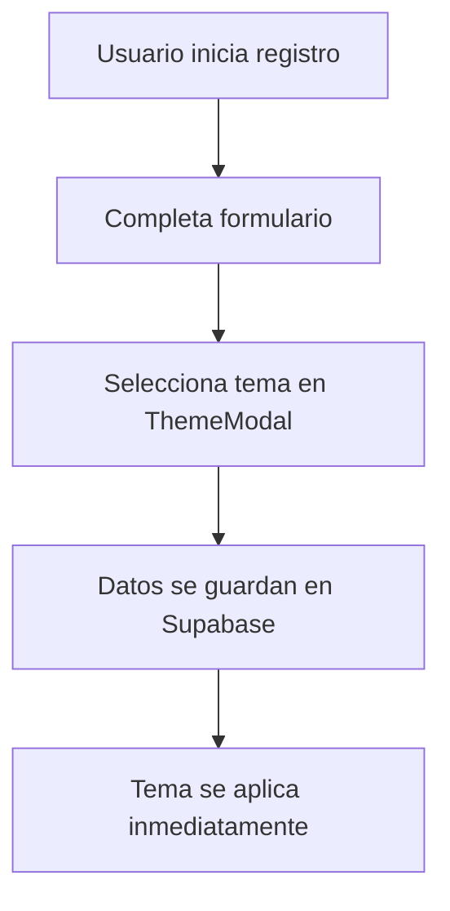

# 🎨 Sistema de Temas v3.0.0 - Implementación Completa

## 📋 Resumen Ejecutivo

El Sistema de Temas v3.0.0 de ComplicesConecta proporciona una experiencia visual personalizada y coherente para todos los usuarios, tanto en modo demo como en producción. Este sistema permite a los usuarios seleccionar y personalizar su tema visual durante el registro y modificarlo posteriormente desde su perfil.

## 🚀 Características Principales

### ✨ Temas Disponibles
- **Light (Claro)**: Tema luminoso y limpio con tonos azules suaves
- **Dark (Oscuro)**: Tema elegante y moderno con gradientes púrpura-gris
- **Elegant (Elegante)**: Sofisticado y refinado con tonos slate-rose
- **Modern (Moderno)**: Vibrante y dinámico con gradientes cyan-azul
- **Vibrant (Vibrante)**: Colorido y energético con tonos pink-naranja

### 🎯 Funcionalidades Implementadas
- ✅ Selección de tema durante el registro
- ✅ Persistencia en Supabase para usuarios reales
- ✅ Fallback a localStorage para compatibilidad
- ✅ Aplicación automática basada en género y tipo de perfil
- ✅ Estilos dinámicos de navbar (transparente/sólido)
- ✅ Actualizaciones en tiempo real
- ✅ Compatibilidad demo/producción

## 🏗️ Arquitectura Técnica

### Componentes Principales

#### 1. Hooks de Gestión de Temas
```typescript
// Hook unificado que detecta automáticamente el modo
useThemeConfig() 
  ├── useDemoThemeConfig()     // Para usuarios demo
  └── useProductionThemeConfig() // Para usuarios reales

// Hook específico para Supabase (futuro)
useSupabaseTheme()
```

#### 2. Componentes de UI
```typescript
ThemeSelector.tsx    // Selector visual de temas
ThemeModal.tsx      // Modal interactivo para registro
```

#### 3. Configuración de Temas
```typescript
// En useProfileTheme.ts
themeConfigs = {
  light: { background, text, accent, border },
  dark: { background, text, accent, border },
  elegant: { background, text, accent, border },
  modern: { background, text, accent, border },
  vibrant: { background, text, accent, border }
}
```

### Base de Datos

#### Migración Supabase
```sql
-- 20250921_add_theme_preferences.sql
ALTER TABLE profiles ADD COLUMN:
- preferred_theme TEXT DEFAULT 'dark'
- navbar_style TEXT DEFAULT 'solid' 
- theme_updated_at TIMESTAMP WITH TIME ZONE
```

#### Triggers Automáticos
- Actualización automática de `theme_updated_at`
- Validaciones de integridad de datos
- Índices optimizados para consultas

## 🔄 Flujo de Implementación

### 1. Registro de Usuario


### 2. Detección de Modo
```typescript
const isDemoMode = localStorage.getItem('demo_authenticated') === 'true';
// Automáticamente usa la configuración apropiada
```

### 3. Persistencia de Datos
- **Demo**: localStorage con claves `demo_theme` y `demo_navbar_style`
- **Producción**: Supabase tabla `profiles` + fallback localStorage

## 📱 Integración con Componentes

### Páginas Actualizadas
- ✅ `Auth.tsx` - Selector de tema en registro
- ✅ `EditProfileSingle.tsx` - Botones de cambio de tema
- ✅ `EditProfileCouple.tsx` - Selector para parejas
- ✅ `Header.tsx` - Estilos dinámicos de navbar

### Aplicación de Estilos
```typescript
// Ejemplo de uso en componentes
const { themeConfig } = useProfileTheme();
className={`${themeConfig.background} ${themeConfig.text}`}
```

## 🎨 Personalización por Perfil

### Reglas de Aplicación
1. **Usuario Single Femenino**: Temas con tonos rosados/púrpura
2. **Usuario Single Masculino**: Temas con tonos azules/grises
3. **Pareja**: Combinación equilibrada de ambos géneros
4. **Tema Personalizado**: Prevalece sobre reglas automáticas

### Estilos de Navbar
- **Transparente**: Para fondos con gradientes
- **Sólido**: Para máximo contraste y legibilidad

## 🔧 Configuración y Mantenimiento

### Variables de Entorno
```env
VITE_ENABLE_LOGGING=true  # Para debugging de temas
```

### Logging y Debugging
```typescript
// Logs automáticos en desarrollo
logger.info('Tema aplicado', { theme, userId, timestamp });
```

### Fallbacks y Recuperación
- Si Supabase falla → localStorage
- Si localStorage falla → tema por defecto 'dark'
- Validación de temas inválidos → 'dark'

## 📊 Métricas y Monitoreo

### Eventos Trackeados
- Selección de tema durante registro
- Cambios de tema en perfil
- Errores de persistencia
- Tiempo de carga de preferencias

### Optimizaciones Implementadas
- Índices de base de datos para consultas rápidas
- Caché en localStorage para acceso inmediato
- Lazy loading de configuraciones de tema
- Debounce en actualizaciones frecuentes

## 🚀 Roadmap Futuro

### Características Planificadas
- [ ] Temas generados por IA basados en personalidad
- [ ] Temas basados en ubicación geográfica
- [ ] Marketplace de temas de la comunidad
- [ ] Temas estacionales automáticos
- [ ] Sincronización entre dispositivos

### Mejoras Técnicas
- [ ] Integración completa con useSupabaseTheme
- [ ] Optimización de rendimiento para cambios frecuentes
- [ ] Soporte para temas personalizados por CSS
- [ ] API pública para desarrolladores de temas

## 📝 Notas de Desarrollo

### Consideraciones Importantes
- Todos los hooks siguen las reglas de React (orden consistente)
- TypeScript completamente tipado para seguridad
- Compatibilidad con modo offline
- Accesibilidad (contraste, legibilidad)

### Patrones de Código
```typescript
// Patrón estándar para aplicar temas
const { themeConfig, navbarStyle } = useThemeConfig();
const navbarStyles = getNavbarStyles(navbarStyle);
```

---

**Versión**: 3.0.0  
**Fecha**: 21 de septiembre, 2025  
**Estado**: ✅ Implementación Completa  
**Compatibilidad**: Demo + Producción con Supabase
