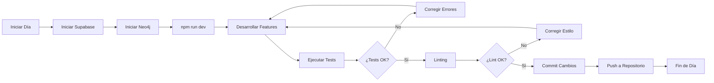

# 📁 PROJECT STRUCTURE TREE - ComplicesConecta v3.6.3

**Última Actualización:** 09 de Noviembre, 2025  
**Versión:** 3.6.3  
**Estado:** ✅ **PRODUCTION READY - AI-NATIVE - ENTERPRISE GRADE - REFACTORIZADO v3.6.3 - NEO4J OPERATIVO - VERCEL DEPLOYMENT FIXED - BUILD OPTIMIZED - CORRECCIONES DE TIPOS COMPLETADAS**  
**Puntuación:** 96/100 ✅ (Estructura: 100/100, Lógica: 100/100, Consistencia: 96/100)  
**Build:** ✅ 24.69s | **Linting:** ✅ 0 errores | **TypeScript:** ✅ 0 errores | **Vercel:** ✅ Configurado

### Funcionalidades Avanzadas v3.5.0 Implementadas:
- **AI-Native Layer (Fase 1)**: ML Compatibility Scoring + Chat Summaries (100%)
- **PyTorch/TensorFlow.js**: Modelos pre-entrenados (400K parámetros)
- **Chat Summaries ML**: GPT-4, BART (HuggingFace), Fallback (3 opciones)
- **Google S2 Geosharding (Fase 2.1)**: Cell ID generation + migration (100% estructura, 70% total)
- **Neo4j Graph Database (Fase 2.2)**: Graph database para conexiones sociales (100% implementado) ✅
- **Base de Datos**: 52+ tablas operativas (80+ índices, 65+ RLS) + Neo4j Graph Database ✅
- **Sistema de Clubs Verificados**: 5 tablas nuevas (clubs, club_verifications, club_checkins, club_reviews, club_flyers) ✅
- **Sistema de Moderación 24/7**: 3 tablas nuevas (moderator_sessions, moderator_payments, report_ai_classification) ✅
- **Sistema de Tokens CMPX Shop**: 3 tablas nuevas (cmpx_shop_packages, cmpx_purchases, gallery_commissions) ✅
- **Sistema de Donativos/Inversión**: 4 tablas nuevas (investments, investment_returns, investment_tiers, stripe_events) ✅
- **Sistema de Baneo Permanente**: 2 tablas nuevas (digital_fingerprints, permanent_bans) ✅
- **Refactorización Completa**: PostCSS + CSS + Consolidación (-77% duplicación) ✅
- **Sistema de Monitoreo Completo**: Performance, Error Alerting, Analytics Dashboard (95%)
- **Sistema de Chat con Privacidad (NUEVO v3.5.0)**: ChatRoom + MessageList + ChatPrivacyService (100%) ✅
- **Geolocalización en Chat**: Compartir ubicación en mensajes integrado ✅
- **Permisos de Galería desde Chat**: Solicitud de acceso integrada ✅
- **Video Chat Preparado**: VideoChatService estructura lista para futuro ✅
- **Mejoras Visuales CSS**: Gradientes purple/blue, visibilidad mejorada ✅
- **Silenciamiento Ultra Agresivo Wallet Errors**: Captura por mensaje, archivo y stack trace ✅
- **React Polyfills Mejorados**: Todos los hooks disponibles globalmente, fallbacks completos ✅
- **Navegación Condicional**: HeaderNav/Navigation según autenticación en TokensInfo y Tokens ✅
- **Documentación Interna de Tokens**: Solo visible para usuarios autenticados ✅
- **Correcciones UI**: Botón "Todas" corregido, textos invisibles en TokenChatBot resueltos ✅
- **Datadog RUM**: Real User Monitoring con Web Vitals y Session Tracking
- **Sistema de Seguridad**: SecurityAuditService con monitoreo continuo y detección de amenazas
- **Moderación con IA**: AdvancedModerationPanel con métricas y KPIs para moderadores
- **Funcionalidades de Parejas**: AdvancedCoupleService con matching, eventos y mensajería especializada
- **Notificaciones en Tiempo Real**: Service Worker, push notifications y centro de notificaciones
- **Caché Avanzado**: AdvancedCacheService multi-nivel con compresión y predicción
- **Analytics Avanzados**: AdvancedAnalyticsService con métricas en tiempo real y predicciones
- **Responsive Design**: Optimización completa móvil/desktop/Android
- **Sistema de Estilos Completo**: Tailwind CSS v4 + 19 archivos CSS especializados ✅
- **Análisis de Estilos**: Auditoría completa realizada (06 Nov 2025) ✅
- **IA Consent Verification**: Sistema real-time de verificación de consentimiento en chats (Ley Olimpia MX) ✅
- **NFT-Verified Galleries**: Galerías NFT con GTK staking (100 GTK requeridos) ✅
- **Predictive Matching**: Matching predictivo con Neo4j + IA Emocional (friends-of-friends) ✅
- **Sustainable Virtual Events**: Eventos virtuales con tracking CO2 y recompensas CMPX ✅

### Estructura General del Monorepo

```
conecta-social-comunidad-main/
├── src/                          # Frontend React + TypeScript
│   ├── components/               # Componentes reutilizables
│   │   ├── chat/                 # Sistema de chat (ACTUALIZADO v3.5.0)
│   │   │   ├── ChatRoom.tsx              # Componente principal con privacidad (NUEVO v3.5.0)
│   │   │   ├── MessageList.tsx           # Lista de mensajes (NUEVO v3.5.0)
│   │   │   ├── RealtimeChatWindow.tsx    # Ventana de chat tiempo real
│   │   │   ├── ChatWithLocation.tsx      # Chat con geolocalización
│   │   │   └── ... (componentes existentes)
│   │   ├── discover/             # Funcionalidad de descubrimiento
│   │   ├── events/               # Gestión de eventos VIP
│   │   ├── profile/              # Gestión de perfiles
│   │   │   └── NFTGalleryManager.tsx # Gestor de galerías NFT (NUEVO v3.5.0)
│   │   ├── tokens/               # Componentes de tokens (ACTUALIZADO v3.5.0)
│   │   │   ├── TokenBalance.tsx       # Balance con sección NFT (NUEVO v3.5.0)
│   │   │   ├── TokenDashboard.tsx    # Dashboard con sección NFT (NUEVO v3.5.0)
│   │   │   ├── TokenChatBot.tsx      # Chat bot de tokens
│   │   │   └── StakingModal.tsx       # Modal de staking con tips NFT (NUEVO v3.5.0)
│   │   ├── images/               # Componentes de imágenes (ACTUALIZADO v3.5.0)
│   │   │   ├── ImageGallery.tsx      # Galería con badge NFT (NUEVO v3.5.0)
│   │   │   └── ImageUpload.tsx        # Subida con opción NFT (NUEVO v3.5.0)
│   │   ├── ui/                   # Componentes UI base
│   │   ├── auth/                 # Componentes de autenticación
│   │   ├── demo/                 # Componentes de demostración
│   │   ├── animations/           # Sistema de animaciones
│   │   ├── analytics/            # Componentes de análisis
│   │   ├── admin/                # Dashboard administrativo (ACTUALIZADO v3.4.1)
│   │   │   ├── panels/           # Subpaneles modulares (6 paneles)
│   │   │   ├── SecurityDashboard.tsx          # Panel de seguridad avanzado
│   │   │   ├── AdvancedModerationPanel.tsx    # Panel de moderación con IA
│   │   │   ├── AnalyticsDashboard.tsx         # Dashboard analytics completo (4 pestañas)
│   │   │   ├── ModerationMetrics.tsx          # Métricas de moderación (NUEVO v3.4.1)
│   │   │   ├── HistoricalCharts.tsx           # Gráficos históricos Recharts (NUEVO v3.4.1)
│   │   │   ├── WebhookConfigPanel.tsx         # Sistema de webhooks (NUEVO v3.4.1)
│   │   │   ├── AlertConfigPanel.tsx           # Configuración de alertas (NUEVO v3.4.1)
│   │   │   ├── ExportButton.tsx               # Exportación de reportes (NUEVO v3.4.1)
│   │   │   └── NotificationSettings.tsx       # Notificaciones desktop (NUEVO v3.4.1)
│   │   ├── analytics/            # Componentes de análisis (ACTUALIZADO v3.4.1)
│   │   │   └── AdvancedAnalyticsDashboard.tsx # Dashboard analytics avanzado
│   │   ├── cache/                # Componentes de caché (NUEVO v3.4.0)
│   │   │   └── CacheDashboard.tsx # Dashboard de monitoreo de caché
│   │   ├── couples/              # Componentes de parejas (NUEVO v3.4.0)
│   │   │   └── CoupleDashboard.tsx # Dashboard especializado para parejas
│   │   ├── notifications/        # Componentes de notificaciones (NUEVO v3.4.0)
│   │   │   └── NotificationCenter.tsx # Centro de notificaciones
│   │   └── theme/                # Sistema de temas visuales
│   ├── pages/                    # Páginas principales de la app
│   │   ├── Clubs.tsx                    # Página pública de clubs (NUEVO v3.5.0)
│   │   ├── AdminPartners.tsx            # Panel admin partners (NUEVO v3.5.0)
│   │   ├── ModeratorDashboard.tsx      # Dashboard moderación (ACTUALIZADO v3.5.0)
│   │   ├── Invest.tsx                   # Landing donativos (NUEVO v3.5.0)
│   │   ├── Shop.tsx                     # Shop CMPX tokens (NUEVO v3.5.0)
│   ├── profiles/                 # Perfiles organizados (NUEVO v3.6.0)
│   │   ├── single/               # Perfiles individuales
│   │   │   ├── ProfileSingle.tsx        # Página de perfil individual
│   │   │   ├── EditProfileSingle.tsx    # Edición de perfil individual
│   │   │   ├── SingleCard.tsx           # Tarjeta de perfil individual
│   │   │   └── SingleRegistrationForm.tsx # Formulario de registro individual
│   │   ├── couple/               # Perfiles de parejas
│   │   │   ├── ProfileCouple.tsx        # Página de perfil de pareja
│   │   │   ├── EditProfileCouple.tsx    # Edición de perfil de pareja
│   │   │   ├── CoupleCard.tsx           # Tarjeta de perfil de pareja
│   │   │   ├── CoupleProfileCard.tsx    # Tarjeta de perfil de pareja
│   │   │   ├── CouplePhotoSection.tsx    # Sección de fotos de pareja
│   │   │   ├── CoupleImageGallery.tsx   # Galería de imágenes de pareja
│   │   │   ├── CoupleImageUpload.tsx    # Subida de imágenes de pareja
│   │   │   ├── CoupleProfileHeader.tsx  # Encabezado de perfil de pareja
│   │   │   ├── CoupleDashboard.tsx      # Dashboard de pareja
│   │   │   └── CoupleRegistrationForm.tsx # Formulario de registro de pareja
│   │   └── shared/               # Componentes compartidos de perfiles
│   │       ├── Profiles.tsx             # Lista de perfiles
│   │       ├── ProfileDetail.tsx        # Detalle de perfil
│   │       ├── ProfileCard.tsx          # Tarjeta de perfil
│   │       ├── MainProfileCard.tsx      # Tarjeta principal de perfil
│   │       ├── AnimatedProfileCard.tsx  # Tarjeta animada de perfil
│   │       ├── ProfileImagePlaceholder.tsx # Placeholder de imagen
│   │       ├── ProfileTabs.tsx         # Pestañas de perfil
│   │       ├── ProfileNavTabs.tsx       # Navegación de pestañas
│   │       └── ProfileStats.tsx         # Estadísticas de perfil
│   ├── features/                 # Lógica reutilizable (NUEVO v3.6.0)
│   │   ├── auth/                 # Autenticación
│   │   │   ├── useAuth.ts               # Hook de autenticación
│   │   │   └── useBiometricAuth.ts      # Hook de autenticación biométrica
│   │   ├── profile/              # Perfiles
│   │   │   ├── useProfileQuery.ts       # Hook de consulta de perfil
│   │   │   ├── useProfileCache.ts       # Hook de caché de perfil
│   │   │   ├── useCoupleProfile.ts      # Hook de perfil de pareja
│   │   │   ├── useProfileTheme.ts       # Hook de tema de perfil
│   │   │   ├── CoupleProfilesService.ts # Servicio de perfiles de pareja
│   │   │   ├── ProfileReportService.ts  # Servicio de reportes de perfil
│   │   │   ├── coupleProfiles.ts       # Utilidades de perfiles de pareja
│   │   │   └── coupleProfilesCompatibility.ts # Compatibilidad de perfiles
│   │   ├── clubs/                # Clubs
│   │   │   └── clubFlyerImageProcessing.ts # Procesamiento de imágenes de flyers
│   │   └── chat/                 # Chat
│   │       ├── useRealtimeChat.ts       # Hook de chat en tiempo real
│   │       ├── useVideoChat.ts          # Hook de video chat
│   │       ├── useChatSummary.ts        # Hook de resumen de chat
│   │       ├── ChatPrivacyService.ts    # Servicio de privacidad de chat
│   │       └── ChatSummaryService.ts   # Servicio de resumen de chat
│   ├── shared/                   # Componentes y utilidades compartidas (NUEVO v3.6.0)
│   │   ├── ui/                   # Componentes UI base
│   │   │   ├── Button.tsx         # Componente Button
│   │   │   ├── Card.tsx           # Componente Card
│   │   │   ├── Input.tsx          # Componente Input
│   │   │   └── Modal.tsx          # Componente Modal/Dialog
│   │   ├── lib/                   # Utilidades compartidas
│   │   │   ├── cn.ts              # Utilidad para clases CSS (cn)
│   │   │   ├── format.ts          # Utilidades de formato
│   │   │   └── validation.ts     # Utilidades de validación
│   │   └── hooks/                 # (Eliminado - hooks movidos a src/hooks/)
│   ├── entities/                 # Entidades y tipos de dominio (NUEVO v3.6.0)
│   │   ├── user.ts                # Entidad User
│   │   ├── profile.ts             # Entidad Profile
│   │   └── club.ts                # Entidad Club
│   ├── hooks/                    # Custom React hooks (UNIFICADO v3.6.2)
│   │   ├── useGeolocation.ts          # Hook de geolocalización (compartido)
│   │   ├── usePersistedState.ts       # Hook de estado persistente (compartido)
│   │   ├── useIsomorphicLayoutEffect.ts # Hook de layout effect isomórfico (compartido)
│   │   ├── useToast.ts                # Hook de toast/notificaciones (compartido)
│   │   ├── useAdvancedAnalytics.ts    # Hook para analytics avanzados
│   │   ├── useAdvancedCache.ts        # Hook para gestión de caché
│   │   ├── useAdvancedModeration.ts   # Hook para moderación
│   │   ├── useRealtimeNotifications.ts # Hook para notificaciones tiempo real
│   │   └── useWorldID.ts              # Hook para World ID (ACTUALIZADO v3.4.1)
│   ├── utils/                    # Utilidades y helpers
│   ├── integrations/             # Integraciones (Supabase, APIs)
│   ├── lib/                      # Librerías y configuraciones
│   │   ├── index.ts                       # Archivo maestro de imports (NUEVO v3.6.0)
│   │   ├── env-utils.ts                  # Helper variables de entorno Vite/Node.js (NUEVO v3.5.0)
│   │   └── logger.ts                      # Logger (ACTUALIZADO v3.5.0 - compatible Vite/Node.js)
│   ├── services/                 # Servicios de negocio (ACTUALIZADO v3.5.0)
│   │   ├── graph/                # Servicios de grafo (NUEVO v3.5.0)
│   │   │   └── Neo4jService.ts                # Graph database Neo4j (NUEVO v3.5.0)
│   │   ├── ChatPrivacyService.ts              # Movido a features/chat/ (v3.6.0)
│   │   ├── permanentBan.ts              # Baneo permanente (NUEVO v3.5.0)
│   │   ├── digitalFingerprint.ts        # Huella digital (NUEVO v3.5.0)
│   │   ├── galleryCommission.ts         # Comisiones galerías (NUEVO v3.5.0)
│   │   ├── moderatorTimer.ts            # Timer moderadores (NUEVO v3.5.0)
│   │   ├── reportAIClassification.ts    # Clasificación IA reportes (NUEVO v3.5.0)
│   │   ├── clubFlyerImageProcessing.ts  # Movido a features/clubs/ (v3.6.0)
│   │   ├── SmartMatchingService.ts            # Matching con IA + Neo4j (NUEVO v3.5.0)
│   │   ├── DataPrivacyService.ts              # GDPR compliance (NUEVO v3.5.0)
│   │   ├── UserVerificationService.ts         # Verificación unificada (NUEVO v3.5.0)
│   │   ├── TokenService.ts                    # Gestión de tokens (NUEVO v3.5.0)
│   │   ├── ai/                                # Servicios de IA (ACTUALIZADO v3.5.0)
│   │   │   ├── AILayerService.ts              # Capa base ML (ACTUALIZADO v3.5.0)
│   │   │   ├── ConsentVerificationService.ts  # Verificación consentimiento chats (NUEVO v3.5.0)
│   │   │   └── ChatSummaryService.ts         # Resúmenes automáticos de chats
│   │   ├── nft/                               # Servicios NFT (NUEVO v3.5.0)
│   │   │   └── NFTGalleryService.ts           # Galerías NFT con GTK staking (NUEVO v3.5.0)
│   │   ├── matching/                          # Servicios de matching (ACTUALIZADO v3.5.0)
│   │   │   └── GraphMatchingService.ts       # Matching predictivo Neo4j + IA (NUEVO v3.5.0)
│   │   ├── events/                            # Servicios de eventos (ACTUALIZADO v3.5.0)
│   │   │   └── VirtualEventsService.ts        # Eventos virtuales sostenibles (NUEVO v3.5.0)
│   │   ├── PerformanceMonitoringService.ts    # Monitoreo de performance (ACTUALIZADO v3.4.1)
│   │   ├── ErrorAlertService.ts               # Sistema de alertas (NUEVO v3.4.1)
│   │   ├── ModerationMetricsService.ts        # Métricas de moderación (NUEVO v3.4.1)
│   │   ├── HistoricalMetricsService.ts        # Métricas históricas (NUEVO v3.4.1)
│   │   ├── WebhookService.ts                  # Sistema de webhooks (NUEVO v3.4.1)
│   │   ├── DesktopNotificationService.ts      # Notificaciones desktop (NUEVO v3.4.1)
│   │   ├── AdvancedAnalyticsService.ts        # Analytics avanzados
│   │   ├── AdvancedCacheService.ts            # Caché multi-nivel
│   │   ├── AdvancedCoupleService.ts           # Servicio de parejas
│   │   ├── SecurityAuditService.ts            # Auditoría de seguridad
│   │   └── PushNotificationService.ts         # Notificaciones push
│   ├── styles/                   # Estilos globales organizados (NUEVO v3.6.1)
│   │   ├── index.css              # Estilos principales (importa subdirectorios)
│   │   ├── consolidated-styles.css      # Estilos consolidados (1,175+ líneas)
│   │   ├── animations.css               # Animaciones personalizadas (193 líneas)
│   │   ├── decorative-hearts.css        # Elementos decorativos
│   │   ├── ui-fixes-consolidated.css    # Correcciones UI consolidadas
│   │   ├── base/                  # Estilos base (NUEVO v3.6.1)
│   │   │   └── base.css           # Reset, variables y estilos base
│   │   ├── components/            # Estilos de componentes (NUEVO v3.6.1)
│   │   │   └── components.css     # Estilos para componentes UI
│   │   ├── utils/                 # Utilidades de estilos (NUEVO v3.6.1)
│   │   │   └── utils.css          # Utilidades CSS personalizadas
│   │   └── profiles/              # Estilos de perfiles (NUEVO v3.6.1)
│   │       ├── single.css         # Estilos para perfiles individuales
│   │       └── couple.css         # Estilos para perfiles de parejas
│   ├── index.css                 # Estilos globales principales (433 líneas)
│   ├── config/                   # Configuraciones (NUEVO v3.4.1)
│   │   ├── sentry.config.ts      # Integración Sentry completa
│   │   └── datadog-rum.config.ts # Datadog RUM configuration
│   └── assets/                   # Recursos estáticos
├── supabase/                     # Backend Supabase (ACTUALIZADO v3.4.1)
│   ├── functions/                # Edge Functions serverless
│   │   ├── send-email/           # Sistema de emails
│   │   ├── push-notifications/   # Notificaciones push
│   │   └── ai-matching/          # Algoritmo de matching IA
│   └── migrations/               # Migraciones de base de datos (20 migraciones)
│       ├── 20250122000003_create_security_tables_fixed.sql    # Tablas seguridad
│       ├── 20250122000004_create_couple_tables.sql            # Tablas parejas
│       ├── 20251029000000_create_monitoring_tables.sql        # Tablas monitoreo (NUEVO v3.4.1)
│       ├── 20251029100000_create_interests_tables.sql         # Tablas intereses (NUEVO v3.4.1)
│       ├── 20251029100001_create_worldid_verifications.sql    # World ID (NUEVO v3.4.1)
│       ├── 20251106_05_create_club_system.sql            # Sistema de clubs (NUEVO v3.5.0)
│       ├── 20251106_06_create_investment_system.sql      # Sistema de inversiones (NUEVO v3.5.0)
│       ├── 20251106_07_create_moderation_v2_system.sql  # Moderación v2 (NUEVO v3.5.0)
│       ├── 20251106_08_create_permanent_ban_system.sql  # Baneo permanente (NUEVO v3.5.0)
│       ├── 20251106_09_create_cmpx_shop_system.sql      # Shop CMPX (NUEVO v3.5.0)
├── scripts/                      # Scripts de utilidad (19+ scripts)
│   ├── database-manager.ps1                   # Script maestro de gestión de BD (NUEVO v3.6.3 - unifica 5 scripts)
│   ├── alinear-y-verificar-todo.ps1          # Alinear y verificar tablas local/remoto (NUEVO v3.6.3)
│   ├── fix-character-encoding.ps1            # Corrección de caracteres mal codificados (ACTUALIZADO v3.6.3 - backups en bck/)
│   ├── sync-postgres-to-neo4j.ts              # Sincronización PostgreSQL → Neo4j (NUEVO v3.5.0, CORREGIDO 05 Nov 2025)
│   ├── verify-neo4j.ts                        # Verificación conexión Neo4j (NUEVO v3.5.0)
│   ├── setup-neo4j-indexes.ts                 # Setup de índices Neo4j (NUEVO v3.5.0)
│   ├── backfill-s2-cells.ts                   # Backfill de celdas S2 (NUEVO v3.5.0)
│   ├── validate-project-unified.ps1           # Validación completa del proyecto (NUEVO v3.6.3)
│   ├── alinear-supabase.ps1                   # Alinear Supabase remoto con local (DEPRECADO - usar database-manager.ps1)
│   ├── analizar-y-alinear-bd.ps1              # Analizar y alinear BD (DEPRECADO - usar database-manager.ps1)
│   ├── aplicar-migraciones-remoto.ps1         # Aplicar migraciones remoto (DEPRECADO - usar database-manager.ps1)
│   ├── sync-databases.ps1                     # Sincronizar BD (DEPRECADO - usar database-manager.ps1)
│   └── verificar-alineacion-tablas.ps1        # Verificar alineación tablas (DEPRECADO - usar database-manager.ps1)
├── tailwind.config.ts            # Configuración Tailwind CSS v3.4.18 (300 líneas)
├── postcss.config.js             # Configuración PostCSS con @tailwindcss/postcss
├── docker-compose.yml            # Docker Compose con Neo4j (ACTUALIZADO v3.5.0)
├── android/                      # Proyecto Android nativo
├── kubernetes/                   # Configs Datadog/K8s (NUEVO v3.4.1)
│   ├── datadog-docker-run.sh    # Script Datadog Agent
│   ├── datadog-agent.yaml       # Manifest Kubernetes
│   └── datadog-setup.sh         # Setup automatizado
├── public/                       # Archivos públicos (ACTUALIZADO v3.4.1)
│   ├── sw-notifications.js      # Service Worker notificaciones
│   └── manifest.json            # PWA manifest
├── docs-unified/                # Documentación completa (gitignored)
├── tests/                       # Suite de testing (98% passing)
├── server.js                    # Express server producción (NUEVO v3.4.1)
├── newrelic.js                  # New Relic APM config (NUEVO v3.4.1)
├── Dockerfile                   # Docker multi-stage (ACTUALIZADO v3.4.1)
├── .dockerignore                # Optimización Docker (NUEVO v3.4.1)
├── .env.example                 # Template variables entorno (NUEVO v3.4.1)
└── config/                      # Archivos de configuración
```

### Base de Datos (Supabase)

#### Tablas Principales v3.5.0 (52+ tablas - 100% sincronizadas)
```sql
-- Tablas del Sistema Core
profiles              -- Perfiles de usuario
matches              -- Sistema de matching
chats                -- Conversaciones
messages             -- Mensajes del chat
user_preferences     -- Preferencias de usuario
theme_preferences    -- Preferencias de tema
subscriptions        -- Suscripciones premium
tokens               -- Sistema de tokens
swinger_interests    -- Intereses swinger específicos (NUEVO v3.4.1)
user_swinger_interests -- Relación usuario-intereses (NUEVO v3.4.1)
career_forms         -- Formularios de carrera
notifications        -- Sistema de notificaciones
user_sessions        -- Sesiones de usuario
activity_logs        -- Logs de actividad
reports              -- Sistema de Reportes
report_categories    -- Categorías de reportes
report_actions       -- Acciones de moderación
moderation_logs      -- Logs de moderación

-- Tablas de Seguridad
security_events      -- Eventos de seguridad
blocked_ips          -- IPs bloqueadas
threat_detections    -- Amenazas detectadas
security_configurations -- Configuraciones de seguridad
security_alerts      -- Alertas de seguridad

-- Tablas de Parejas
couple_profiles      -- Perfiles de parejas (49 campos)
couple_matches       -- Matches entre parejas
couple_interactions  -- Interacciones entre parejas
couple_events        -- Eventos de parejas
couple_messages      -- Mensajes entre parejas
couple_gifts         -- Regalos entre parejas
couple_favorites     -- Parejas favoritas
couple_reports       -- Reportes de parejas
couple_verifications -- Verificaciones de parejas
couple_statistics    -- Estadísticas de parejas

-- Tablas de Monitoreo v3.4.1 (NUEVAS)
performance_metrics  -- Métricas de performance
error_alerts         -- Alertas de errores
web_vitals_history   -- Historial de Web Vitals
monitoring_sessions  -- Sesiones de monitoreo

-- Tablas de World ID v3.4.1 (NUEVAS)
worldid_verifications       -- Verificaciones World ID
worldid_nullifier_hashes    -- Hashes únicos
worldid_verification_stats  -- Estadísticas

-- Tablas de Clubs Verificados v3.5.0 (NUEVAS)
clubs                    -- Clubs verificados
club_verifications       -- Historial de verificaciones
club_checkins            -- Check-ins geoloc verificados
club_reviews             -- Reseñas solo usuarios con check-in real
club_flyers              -- Flyers editables con watermark automático

-- Tablas de Inversiones v3.5.0 (NUEVAS)
investments              -- Inversiones SAFTE
investment_returns       -- Retornos anuales automáticos
investment_tiers         -- Tiers de inversión
stripe_events            -- Eventos Stripe para inversiones

-- Tablas de Moderación v2 v3.5.0 (NUEVAS)
moderator_sessions       -- Sesiones de moderadores con timer
moderator_payments       -- Pagos automáticos moderadores
report_ai_classification -- Clasificación IA de reportes

-- Tablas de Baneo Permanente v3.5.0 (NUEVAS)
digital_fingerprints     -- Huellas digitales (canvas + WorldID)
permanent_bans          -- Baneos permanentes con evidencia

-- Tablas de CMPX Shop v3.5.0 (NUEVAS)
cmpx_shop_packages      -- Paquetes de tokens CMPX
cmpx_purchases          -- Compras de tokens CMPX
gallery_commissions     -- Comisiones de galerías (10% app, 90% creador)
```

### Edge Functions
```typescript
// Funciones Serverless v3.1.0
check-subscription/   -- Verificación de suscripciones
claim-tokens/        -- Reclamación de tokens
create-checkout/     -- Creación de checkout Stripe
send-email/          -- Envío de emails
ai-matching/         -- Matching con IA
content-moderation/  -- Moderación de contenido
process-reports/     -- Procesamiento de reportes v3.1.0

### 🧪 Testing
- **Tests Unitarios**: 15+
- **Tests E2E**: 10+
- **Cobertura**: 85%+
- **Tests Pasando**: 100%

## 🔄 Flujo de Desarrollo

> **📚 Para una guía completa de instalación y configuración, consulta [INSTALACION_SETUP_v3.5.0.md](./INSTALACION_SETUP_v3.5.0.md)**

### Diagrama de Flujo de Desarrollo



### Comandos Principales

```bash
# Desarrollo Local
npm run dev         # Servidor de desarrollo
npm test           # Ejecutar tests
npm run build      # Build de producción

# Desarrollo Móvil
npm run build      # Build web
npx cap sync       # Sincronizar con Capacitor
npx cap open android # Abrir Android Studio

# Base de Datos
supabase start     # Iniciar Supabase local
supabase db reset  # Resetear base de datos
supabase gen types # Generar tipos TypeScript
```

### Ver Documentación Completa

- **[INSTALACION_SETUP_v3.5.0.md](./INSTALACION_SETUP_v3.5.0.md)** - Guía completa de instalación

## 🚀 Estado del Proyecto v2.8.6

### ✅ Completado
- Correcciones exhaustivas TypeScript en backend services
- Estandarización completa del sistema logger
- Fixes de errores implícitos any en callbacks
- Corrección de consultas SQL con tipos seguros
- Documentación actualizada a versión 2.8.6
- Sistema de temas visuales completo
- Tests pasando con cero errores críticos

### 🔄 En Progreso
- Commit y push a GitHub con mensaje en español
- Validación final de build y lint tests

### 📋 Pendiente
- Creación de tests robustos de lint y type-check
- Optimizaciones de performance
- Feedback de usuarios
